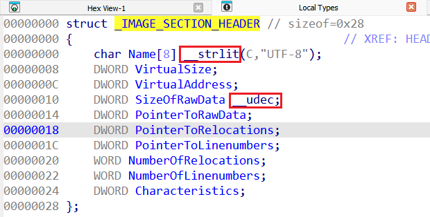
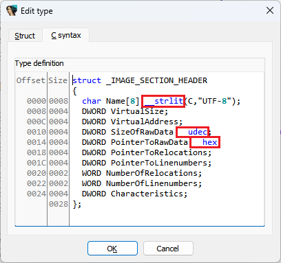

 
过去，我们已经看到，可以通过在 `Structures`（结构）窗口中[编辑结构体](https://hex-rays.com/blog/igors-tip-of-the-week-125-structure-fields-representation/)，来更改结构实例的显示方式。 在 IDA 8.4 中，引入了一个用于 `Local Types`（本地类型）的统一视图，同样的操作现在也可以（并且应该）在该窗口中完成。现在，IDA 不再使用注释来显示额外信息，而是会直接打印额外的自定义属性：



除了快捷键（如 `H`、`A` 等）和 `Field type` 子菜单中的操作外，你还可以使用 `C syntax`（C 语法）编辑器来添加或编辑这些属性：



有些属性的作用可能一目了然，但具体有哪些可用选项呢？ 截至 IDA 8.4，支持以下格式化属性：

```c
  __bin         unsigned binary number
  __oct         unsigned octal number
  __hex         unsigned hexadecimal number
  __dec         signed decimal number
  __sbin        signed binary number
  __soct        signed octal number
  __shex        signed hexadecimal number
  __udec        unsigned decimal number
  __float       floating point
  __char        character
  __segm        segment name
  __enum()      enumeration member (symbolic constant)
  __off         offset expression (a simpler version of __offset)
  __offset()    offset expression
  __strlit()    string
  __stroff()    structure offset
  __custom()    custom data type and format
  __invsign     inverted sign
  __invbits     inverted bitwise
  __lzero       add leading zeroes
  __tabform()   tabular form (formatted array)
```

这些新属性提供了以前无法实现的功能； 例如，过去并不显式支持有符号字段，只能显示为始终为正或始终取反的值。

另请参见：

[Igor’s Tip of the Week #125: Structure field representation](https://hex-rays.com/blog/igors-tip-of-the-week-125-structure-fields-representation/)

[IDA Help: Set function/item type](https://hex-rays.com//products/ida/support/idadoc/1361.shtml)