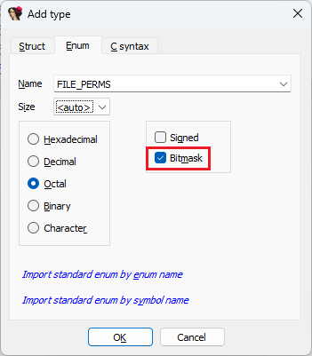
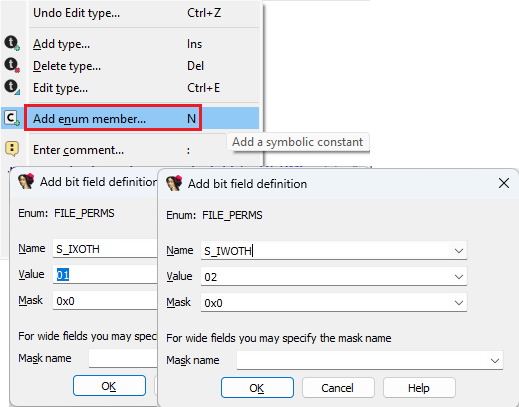
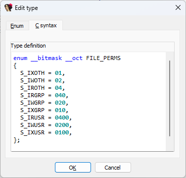
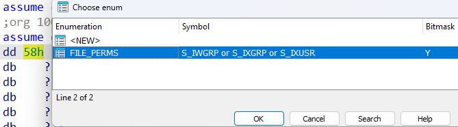

我们之前已经介绍过[简单枚举](https://hex-rays.com/blog/igors-tip-of-the-week-99-enums/)（simple enums），但有一种不同的枚举类型，你有时可能会遇到，或者需要手动创建。 它们用于表示整数值中可能被设置的各种位（bits）或标志（flags）。

例如，Unix 文件系统中的文件模式（file mode）包含访问权限位（Access Permission bits）（你可以在 `ls` 命令的输出中看到类似 `-rwxr-xr-x` 的字符串），每一位都有对应的[常量定义](https://www.gnu.org/software/libc/manual/html_node/Permission-Bits.html)：

```c
#define S_IRWXU 00700
#define S_IRUSR 00400
#define S_IWUSR 00200
#define S_IXUSR 00100

#define S_IRWXG 00070
#define S_IRGRP 00040
#define S_IWGRP 00020
#define S_IXGRP 00010

#define S_IRWXO 00007
#define S_IROTH 00004
#define S_IWOTH 00002
#define S_IXOTH 00001
```

每当你有一个值可以用位值的组合来表示时，你就可以使用位掩码枚举（bitmask enums）（在 8.4 版本之前曾被称为 `bitfields`，但为了减少与结构体中的 `bitfields` 混淆而改名）。

要创建位掩码枚举，请在 `Add type` 对话框的 `Enum` 选项卡中勾选 `Bitmask` ：



新枚举会获得 IDA 特有的 `__bitmask` 属性，例如：

```c
FFFFFFFF enum __bitmask __oct FILE_PERMS // 4 bytes
FFFFFFFF {
FFFFFFFF };
```

当你添加新成员（快捷键 `N`）时，IDA 会自动提供下一个空闲的位作为值：



你也可以使用 `C syntax` 选项卡编辑器，但需要自己确保没有位重叠。



要将枚举应用到反汇编或伪代码中的整数值，你可能需要显式调用 `Edit > Operand type > Enum member…` 操作（或使用快捷键 `M`），因为位掩码枚举并不总会出现在右键菜单中。




IDA 随后会将该值显示为枚举成员的组合，例如：

```c
.data:00001000 dd S_IWGRP or S_IXGRP or S_IXUSR
```

另请参见：

[Igor’s tip of the week #99: Enums](https://hex-rays.com/blog/igors-tip-of-the-week-99-enums/)

[IDA Help: Set function/item type](https://hex-rays.com//products/ida/support/idadoc/1361.shtml)

[Hex-Rays interactive operation: Set Number Representation](https://hex-rays.com/products/decompiler/manual/cmd_numform.shtml)

