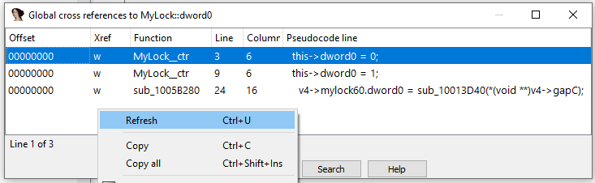

Previously we’ve covered [cross-references](https://hex-rays.com/blog/igor-tip-of-the-week-16-cross-references/) in the disassembly view but in fact you can also consult them in the decompiler (pseudocode) view.  
前面我们介绍了反汇编视图中的交叉引用，但事实上，你也可以在反编译器（伪代码）视图中查阅交叉引用。

### Local cross-references 本地交叉引用

The most common shortcut (X) works similarly to disassembly: you can use it on labels, variables (local and global), function names, but there are some differences and additions:  
最常用的快捷键 ( X ) 与反汇编的作用类似：可以在标签、变量（局部和全局）、函数名上使用，但也有一些区别和补充：

### Global cross-references 全局交叉引用

If you have a well-analyzed database with custom types used by the program and properly set up function prototypes, you can ask the decompiler to analyze all functions and build a list of cross-references to a structure field, an enum member or a whole local type. The default hotkey is Ctrl–Alt–X.  
如果您有一个经过良好分析的数据库，其中包含程序使用的自定义类型，并正确设置了函数原型，那么您可以要求反编译器分析所有函数，并建立与结构字段、枚举成员或整个本地类型的交叉引用列表。默认热键为 Ctrl - Alt - X 。

When you use it for the first time, the list may be empty or include only recently decompiled functions.  
第一次使用时，列表可能是空的，或者只包括最近反编译的函数。

To cover all functions, refresh the list from the context menu or by pressing Ctrl–U. This will decompile _all_ functions in the database and gather the complete list. The decompilation results are cached so next time you use the feature it will be faster.  
要覆盖所有函数，可通过上下文菜单或按 Ctrl - U 刷新列表。这将反编译数据库中的所有函数并收集完整列表。反编译结果会被缓存，因此下次使用该功能时速度会更快。

