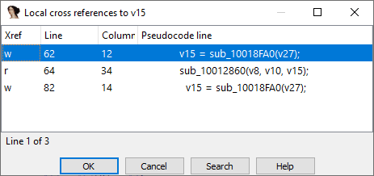
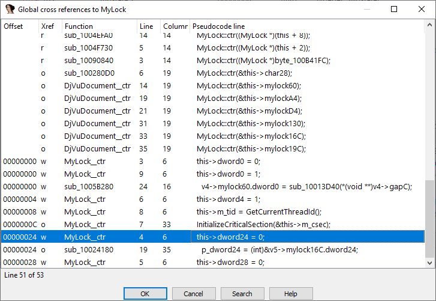

Previously we’ve covered [cross-references](https://hex-rays.com/blog/igor-tip-of-the-week-16-cross-references/) in the disassembly view but in fact you can also consult them in the decompiler (pseudocode) view.

在之前的文章中，我们讨论了反汇编视图中的[交叉引用](https://hex-rays.com/blog/igor-tip-of-the-week-16-cross-references/) 。事实上，在 反编译器（伪代码）视图 中同样可以使用交叉引用。

### 局部交叉引用

最常用的快捷键 `X` 在伪代码中与反汇编类似：

- 可以用于标签、变量（局部和全局）、函数名。
- 不同之处在于：对局部变量，交叉引用列表显示的是 伪代码行，而不是反汇编片段。
  

如果在 C 语句关键字上按 `X`（例如 if、while、return），会列出当前函数中所有相同类型的语句。

### 全局交叉引用

如果数据库分析得比较完整，程序中使用了自定义类型，并且函数原型设置正确，就可以让反编译器分析所有函数，并生成以下对象的交叉引用列表：

- 结构体字段
- 枚举成员
- 整个本地类型

默认快捷键：`Ctrl–Alt–X`，第一次使用时，列表可能为空，或只包含最近反编译过的函数。

要覆盖所有函数，可以在右键菜单中选择刷新，或按 `Ctrl–U`。这会触发数据库中所有函数的反编译，并收集完整的交叉引用列表。反编译结果会被缓存，下次使用时速度会更快。

👉 总结：在 IDA 的反编译器中，交叉引用功能不仅能帮助你快速定位局部变量和语句，还能在全局范围内追踪结构体字段、枚举成员等类型的使用情况。结合 `X` / `Ctrl–Alt–X` / `Ctrl–U`，可以极大提升代码理解效率。

原文地址：https://hex-rays.com/blog/igors-tip-of-the-week-18-decompiler-and-global-cross-references
