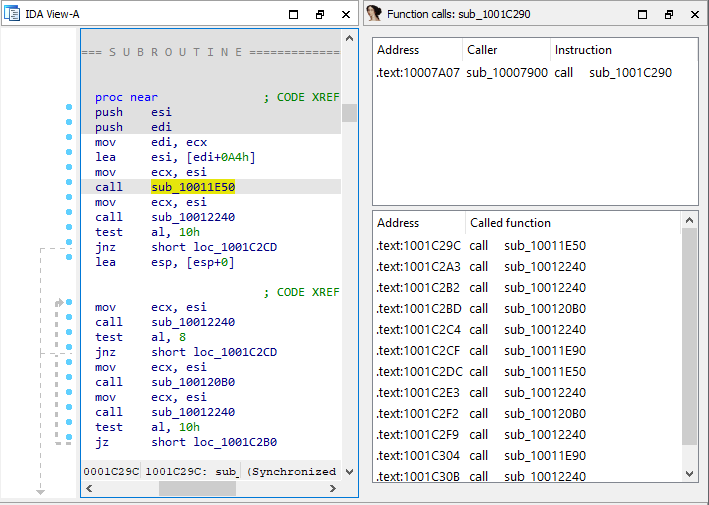

When dealing with big programs or huge functions, you may want to know how various functions interact, for example where the current function is called from and what other functions it calls itself. While for the former you can use “Cross-references to”, for the latter you have to go through all instructions of the function and look for calls to other functions. Is there a better way?  
在处理大型程序或庞大函数时，您可能想知道各种函数是如何交互的，例如当前函数是从哪里调用的，以及它本身还调用了哪些其他函数。对于前者，您可以使用 "交叉引用"（Cross-references to），而对于后者，您必须查看函数的所有指令并查找对其他函数的调用。有没有更好的方法？

### Function calls view 函数调用视图

This view, available via View > Open subviews > Function calls, offers a quick overview of calls to and from the current function. It is dynamic and updates as you navigate to different functions so it can be useful to dock it next to the listing to be always visible. Double-click any line in the caller or called list to jump to the corresponding address.  
该视图可通过 "视图">"打开子视图">"函数调用 "查看，可快速浏览当前函数的调用情况。该视图是动态的，在您导航到不同函数时会更新，因此将其停靠在列表旁边，使其始终可见可能会很有用。双击调用者或被调用列表中的任何一行，即可跳转到相应的地址。

