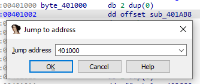
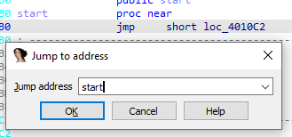
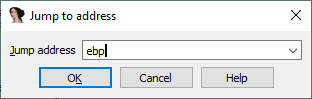

即使你更喜欢用鼠标点击在 IDA 中移动，快捷键 G 也是必须记住的。 它背后的动作叫做 “Jump to address（跳转到地址）”，但它能做的远不止名字所暗示的那样。

### 跳转到地址

- 输入一个地址值即可跳转。
- 可以加 0x 前缀表示十六进制，但不是必须的；没有前缀时默认解析为十六进制。
- 在分段架构（如 16 位 x86）中，可以使用 段:偏移 语法。
  - 段可以是符号名（如 seg001、dseg）或十六进制数（如 F000）。
  - 偏移必须是十六进制。

如果数据库同时包含分段和线性地址（例如：16 位引导加载器 + 32 位保护模式 OS 映像），可以用 `0:` 强制使用线性地址（如 `0:1000000`）。

### 相对跳转

如果输入值以 `+` 或 `-` 开头，则被视为相对偏移。

例如：

- `+100` → 向前跳 256 字节
- `-10000` → 向后跳 64KB (65536 字节)

### 跳转到名字

可以直接输入程序中的符号名（函数名、全局变量名或标签）。

必须输入原始名字，包括特殊符号，例如：

- `_main` 对应 `main()`
- `??2@YAPEAX_K@Z` 对应 `operator new()`

### 跳转到表达式

- 可以输入 C 语法的表达式，而不仅仅是地址或名字。
- 十六进制数必须带 0x 前缀，否则按十进制解析。
- 可以使用符号名或关键字 here（表示当前位置）。

示例：

- `here + 32*4` → 跳过 32 个 dword，相当于 +80
- `_main - 0x10` → 跳到 main() 前 0x10 字节
- `f2 + (f4 - f3)` → 使用多个符号进行复杂计算

### 使用寄存器（调试时）

在调试过程中，可以像变量一样使用寄存器名。

示例：

- `EAX`、`RSP`
- `ds:si`（16 位 x86）
- `X0+0x20`（ARM64）
  

这在反汇编视图和十六进制视图中都有效。

👉 总结： 快捷键 G 是 IDA 中最强大的导航工具之一。它不仅能跳转到地址，还能解析名字、表达式，甚至在调试时直接用寄存器。熟练掌握它，可以让你在大规模二进制中快速穿梭。

原文地址：https://hex-rays.com/blog/igors-tip-of-the-week-20-going-places
