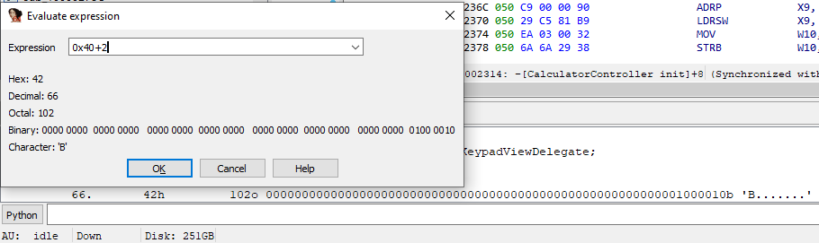
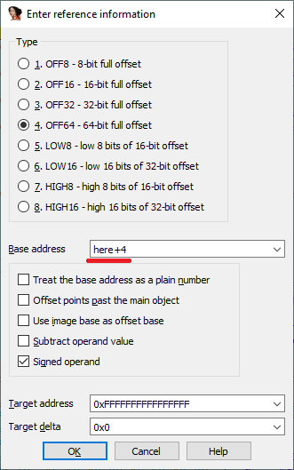

When reverse-engineering, sometimes you need to perform some simple calculations. While you can always use an external calculator program, IDA has a built-in one. You can invoke it by pressing ? or via View > Calculator.  
在逆向工程中，有时您需要执行一些简单的计算。虽然你可以随时使用外部计算器程序，但 IDA 有一个内置计算器。您可以按 ? 或通过 "视图">"计算器 "调用它。

The calculator shows the result in hex, decimal, octal, binary and as a character constant. This information is also duplicated in the Output window in case you need to copy it to somewhere else.  
计算器以十六进制、十进制、八进制、二进制和字符常数显示结果。这些信息也会复制到 "输出 "窗口，以备复制到其他地方。



In addition to plain numbers, you can use names from the database, as well as register values during debugging similarly to the “Jump to address” dialog from [the previous tip](https://www.hex-rays.com/blog/igors-tip-of-the-week-20-going-places/).  
除纯数字外，在调试过程中还可以使用数据库中的名称和寄存器值，与上一条提示中的 "跳转到地址 "对话框类似。

By the way, the number, address, or identifier under cursor is picked up automatically when you press ? so there’s no need to copy or type it manually.  
顺便说一句，当你按下 ? 时，光标下的数字、地址或标识符会被自动拾取，因此无需手动复制或输入。

In fact, the expression evaluation feature is provided by the [IDC language](https://www.hex-rays.com/products/ida/support/idadoc/157.shtml) interpreter built-in into IDA. You can use expressions in almost any place in IDA that accepts numbers: Jump to address, Make array, User-defined offset and so on.  
事实上，表达式评估功能是由 IDA 内置的 IDC 语言解释器提供的。您可以在 IDA 中几乎所有接受数字的地方使用表达式：跳转到地址、制作数组、用户定义偏移量等。



You can also use any of the available [IDC functions](https://www.hex-rays.com/products/ida/support/idadoc/162.shtml). For example, expressions like the following are possible during debugging:  
您还可以使用任何可用的 IDC 函数。例如，在调试过程中可以使用以下表达式：

```
get_qword(__security_cookie)^RSP
```