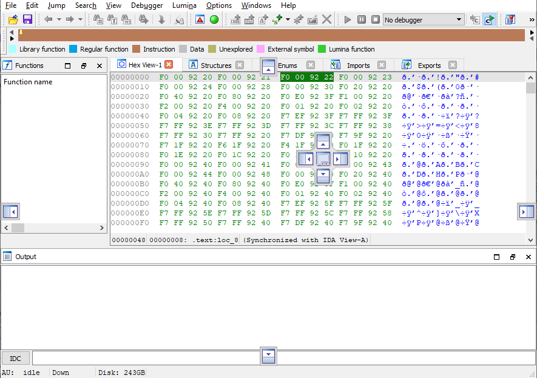
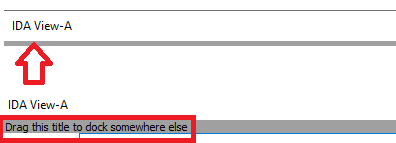
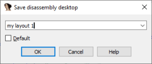
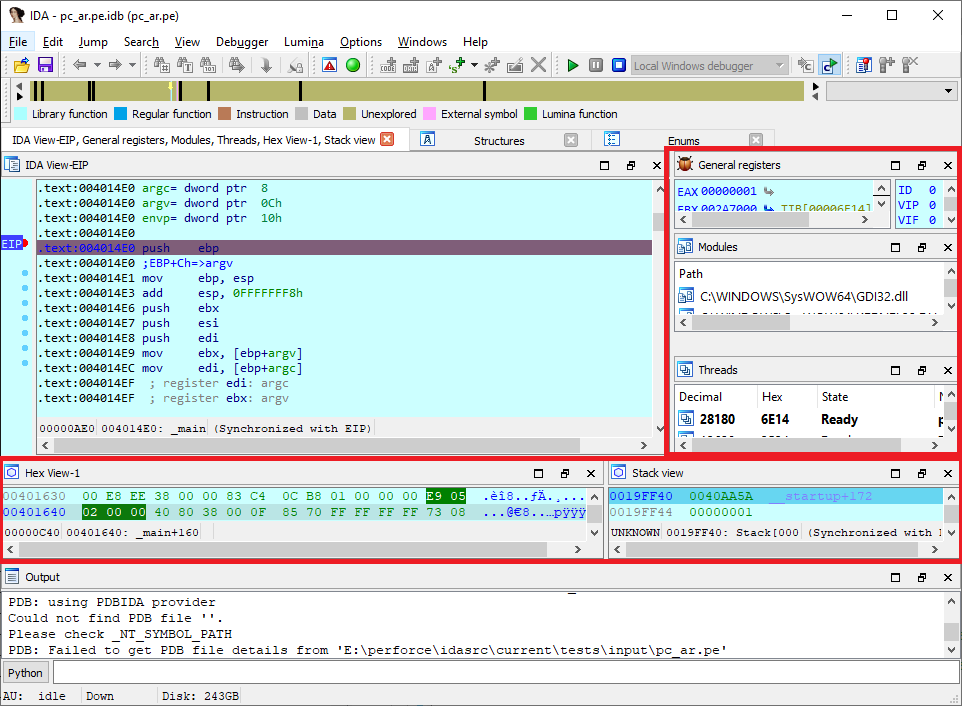
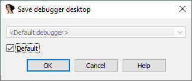

IDA 的默认窗口布局足以完成大多数标准分析任务，但并不总是最适合所有情况。 例如，你可能会根据显示器大小、具体任务或正在分析的二进制文件，选择打开额外的视图或调整现有窗口。

### 窗口重新排列

操作方式直观：点击并拖动窗口标题即可将其停靠到其他位置。

拖动时会出现“停靠标记”，可以选择将窗口停靠在另一窗口旁边，或作为标签页。

如果释放鼠标时没有选择标记，窗口会变为浮动状态。

### 停靠浮动窗口

当窗口处于浮动状态时，不能直接通过拖动标题来重新停靠。

需要将鼠标悬停在标题下方，显示出“拖动手柄”，再通过它来重新停靠。

### 重置布局

如果想恢复默认布局，可以使用 `Windows > Reset desktop`。

### 保存与使用自定义布局

布局会自动保存在数据库中。

如果想在其他数据库或会话中复用，可以使用 `Windows > Save desktop…` 保存为自定义名称，然后通过 `Windows > Load desktop…` 加载。

也可以勾选 `Default` 复选框，将该布局设为所有新数据库的默认布局。

### 调试器布局

在调试时，IDA 会自动切换到调试专用布局，增加一些调试相关的视图（如调试寄存器、模块、线程）。

在小屏幕上可能会显得拥挤，因此经常需要重新调整。

调试器布局与反汇编时的布局是分开的，如果想保存自定义调试布局，需要在调试会话中保存。

👉 总结：IDA 的桌面布局功能非常灵活。你可以根据任务需求快速调整、保存和切换布局，从而在不同分析场景（普通反汇编 vs 调试）下保持高效。

更多信息：[IDA 帮助中的桌面](https://hex-rays.com/products/ida/support/idadoc/1418.shtml)。

原文地址：https://hex-rays.com/blog/igors-tip-of-the-week-22-ida-desktop-layouts
