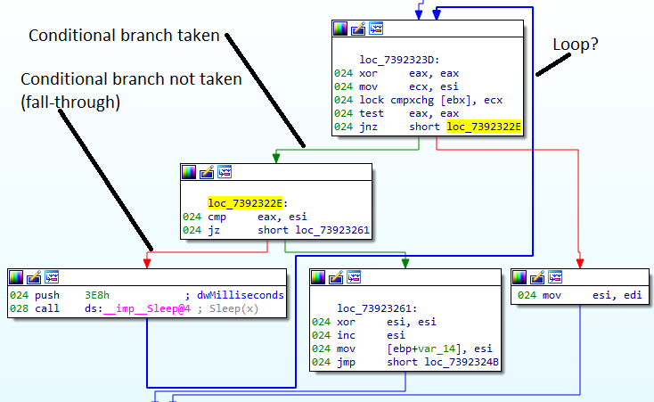
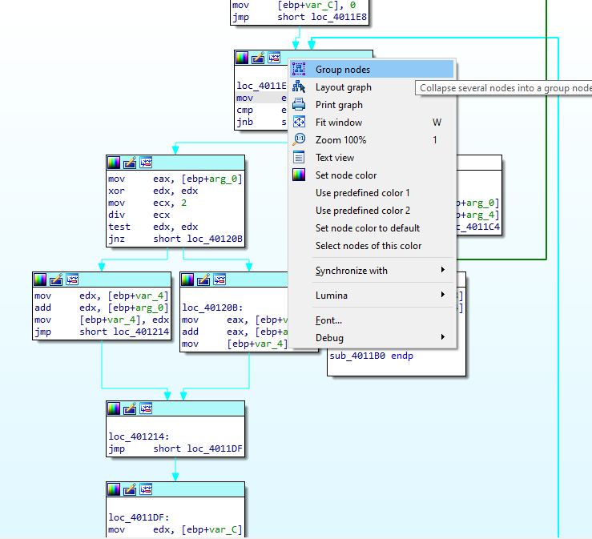
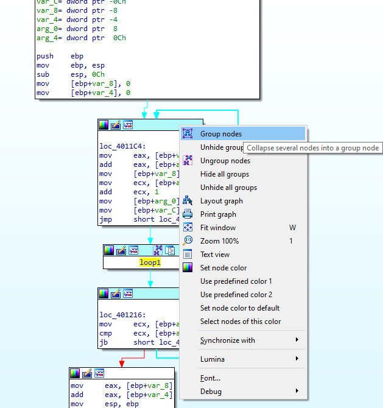
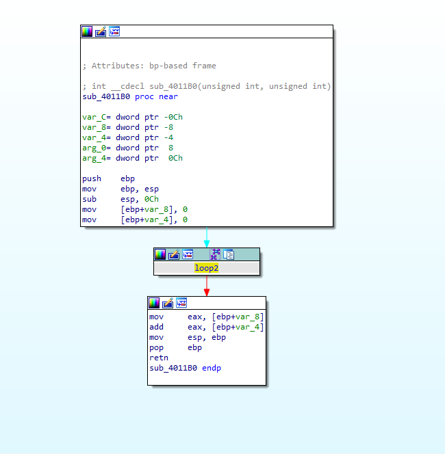

Graph view is the default disassembly representation in IDA GUI and is probably what most IDA users use every day. However, it has some lesser-known features that can improve your workflow.  
图形视图是 IDA GUI 中默认的反汇编表示法，可能是大多数 IDA 用户每天都在使用的。然而，它还有一些鲜为人知的功能，可以改善你的工作流程。

### Parts of the graph  
图形的各个部分

The graph consists of _nodes_ (blocks) and _edges_ (arrows between blocks). Each node roughly corresponds to a basic block.  
图形由节点（图块）和边（图块之间的箭头）组成。每个节点大致对应一个基本程序块。

a **basic block** is a straight-line code sequence with no branches in except to the entry and no branches out except at the exit.  
基本代码块是一个直线代码序列，除了入口处没有分支，除了出口处没有分支。  
(from [Wikipedia](https://en.wikipedia.org/wiki/Basic_block)) (摘自维基百科）

Edges indicate code flow between nodes and their color changes depending on the type of code flow:  
边表示节点之间的代码流，其颜色根据代码流的类型而变化：

-   conditional jumps/branches have two outgoing edges: green for branch taken and red for branch not taken (i.e. fall through to next address);  
    有条件的跳转/分支有两条外向边：绿色代表分支已执行，红色代表分支未执行（即跳转到下一个地址）；
-   other kind of edges are blue;  
    其他类型的边为蓝色；
-   edges which go backwards in the graph (which usually means they’re part of a loop) are thicker in width.   
    在图形中向后走的边（通常意味着它们是循环的一部分）宽度较粗。

### Keyboard controls 键盘控制

Even though the graph is best suited to mouse, you can still do some things using keyboard:  
尽管图形最适合鼠标操作，但您仍然可以使用键盘来完成一些操作：

-   -   W to zoom out so the whole graph fits in the visible window area;  
        W 放大图表，使整个图表显示在可视窗口区域内；
    -   1 to zoom back to 100%;  
        1 放大到 100%；
    -   Ctrl–Up moves to the parent node;  
        Ctrl - Up 移动到父节点；
    -   Ctrl–Down moves to the child node  
        Ctrl - Down 移动到子节点  
        (if there are several candidates in either case, a selector is displayed)  
        (如果在这两种情况下都有多个候选节点，则会显示一个选择器）

### Mouse controls 鼠标控制

Besides the usual clicking around, a few less obvious mouse actions are possible:  
除了常规的点击外，还可以进行一些不太明显的鼠标操作：

-   double-click an edge to jump to the other side of it or hover to preview the target (source) node;  
    双击边缘可跳转到边缘的另一侧，悬停可预览目标（源）节点；
-   click and drag the background to pan the whole graph in any directions;  
    单击并拖动背景，可在任意方向平移整个图表；
-   use the mouse wheel to scroll the graph vertically (up/down);  
    使用鼠标滚轮垂直（上/下）滚动图表；
-   Alt+wheel to scroll horizontally (left/right);  
    +wheel 水平滚动（左/右）；
-   Ctrl+wheel to zoom in/out  
    Ctrl +滚轮放大/缩小

### Rearranging and grouping the nodes  
重新排列和分组节点

If necessary, you can move some nodes around by dragging their titles. Edges can also be moved by dragging their bending points. Use “Layout graph” from the context menu to go back to the initial layout.   
如有必要，您可以通过拖动标题来移动一些节点。也可以通过拖动弯曲点来移动边。使用右键菜单中的 "布局图 "返回初始布局。

Big graphs can be simplified by grouping:  
大图形可以通过分组来简化：

1.  Select several nodes by holding down Ctrl and clicking the titles of multiple nodes or by click-dragging a selection box. The selected nodes will have a different color from others (cyan in default color scheme);  
    按住 Ctrl 并单击多个节点的标题或单击拖动选择框，即可选择多个节点。所选节点的颜色将与其他节点不同（默认配色方案为青色）；
2.  Select “Group nodes” from the context menu and enter the text for the new node. IDA will replace selected nodes with the new one and rearrange the graph;  
    从上下文菜单中选择 "分组节点"，然后输入新节点的文本。IDA 将用新节点替换选中的节点，并重新排列图形；
3.  You can repeat the process as many times as necessary, including grouping already-grouped nodes;  
    您可以根据需要多次重复该过程，包括对已分组的节点进行分组；
4.  Created groups can be expanded again temporarily or ungrouped completely, going back to separate nodes. Use the context menu or new icons in the group node’s title bar for this.  
    创建的组可以临时再次展开或完全取消分组，回到独立的节点。为此，请使用右键菜单或组节点标题栏中的新图标。

   
  

****

More info: [_Graph view_ in IDA Help](https://www.hex-rays.com/products/ida/support/idadoc/42.shtml) (also available via F1 in IDA).  
更多信息：IDA 帮助中的图形视图（也可通过 IDA 中的 F1 获取）。