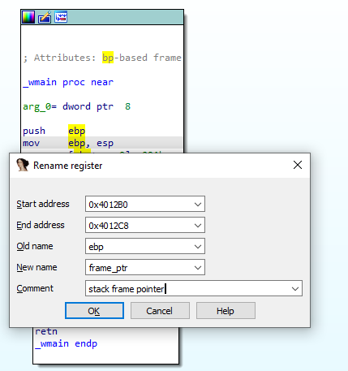
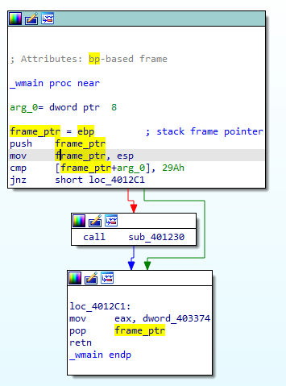
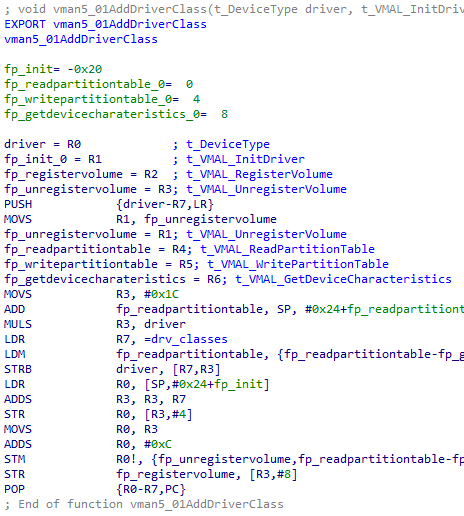

在分析代码时，[寄存器高亮](https://www.hex-rays.com/blog/igor-tip-of-the-week-05-highlight/) 功能可以帮助追踪寄存器的使用情况，但在复杂代码中涉及多个寄存器时，这种方式可能还不够直观。这时，你可以尝试 寄存器重命名。

### 如何重命名寄存器

将光标放在寄存器上，按 `N` 或 `Enter`，或者直接双击寄存器。

会弹出一个对话框，你可以在其中指定：

- 新名字：在反汇编中显示的别名。
- 注释：显示在新名字定义处的说明。
- 地址范围：在哪些地址范围内使用该名字。

默认范围是当前函数的边界。你可以手动修改，或者在重命名前先选择一段范围（注意光标必须在寄存器上）。 范围不能跨越函数边界，也就是说寄存器只能在函数内部被重命名。

新名字和注释会显示在指定范围的起始位置。

### 自动生成的寄存器重命名

即使你自己不手动重命名寄存器，也可能在数据库中遇到它们。 例如：

DWARF 插件 可以利用调试信息（DWARF debug info），自动为用于存储局部变量或函数参数的寄存器添加别名和注释。

### 撤销重命名

如果想恢复寄存器的原始名字，只需将其重命名为空字符串即可。

另请参阅 IDA 帮助中的[重命名寄存器](https://www.hex-rays.com/products/ida/support/idadoc/1346.shtml)。

👉 总结：寄存器重命名是一个非常实用的功能，能让复杂函数的分析更清晰。它既可以手动操作，也能借助调试信息自动生成。

原文地址：https://hex-rays.com/blog/igors-tip-of-the-week-24-renaming-registers
