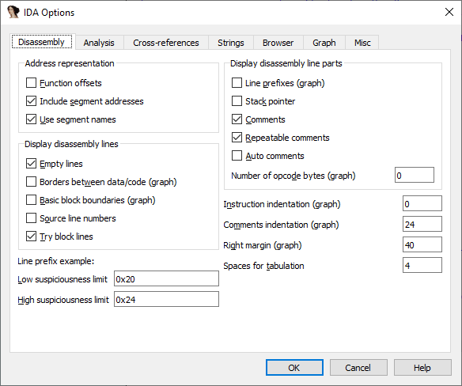
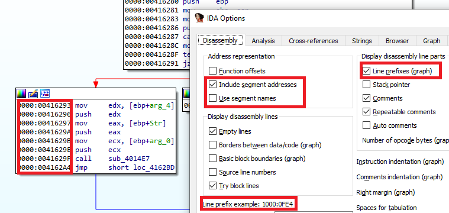
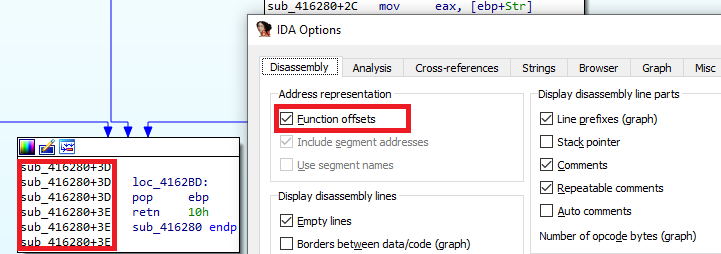

By default IDA’s disassembly listing shows the most essential information: disassembled instructions with operands, comments, labels. However, the layout of this information can be tuned, as well as additional information added. This can be done via the Disassembly Options tab available via Options > General… menu (or Alt–O, G).  
默认情况下，IDA 的反汇编列表显示最基本的信息：带操作数、注释和标签的反汇编指令。不过，这些信息的布局可以调整，也可以添加其他信息。这可以通过 "选项"（Options）>"常规"（General...）菜单中的 "反汇编选项"（Disassembly Options）选项卡（或 Alt - O , G ）来实现。

### Text and Graph views options  
文本和图形视图选项

If you open the options dialog in graph mode, you should have something like the following:  
如果在图形模式下打开选项对话框，应该会出现如下内容：

And if you do it in text mode (use Space to switch), it will be different:  
如果在文本模式下打开（使用 Space 进行切换），情况会有所不同：

As you may notice, some options are annotated with (graph) or (non-graph), denoting the fact that IDA keeps two sets of options for different modes of disassembly. To make the graphs look nicer, the defaults are tuned so that the nodes are relatively narrow, while the text mode can use the full width of the window and is spaced out more. However, you can still tweak the options of either mode to your preference and even save them as a named or default [desktop layout](https://www.hex-rays.com/blog/igors-tip-of-the-week-22-ida-desktop-layouts/).  
正如你可能注意到的，有些选项标注了（图形）或（非图形），表示 IDA 为不同的反汇编模式保留了两套选项。为了使图形看起来更美观，默认值调整为节点相对较窄，而文本模式可以使用窗口的全部宽度，并且间距更大。不过，你仍然可以根据自己的喜好调整任一模式的选项，甚至可以将其保存为已命名或默认的桌面布局。

### Line prefixes 行前缀

One example of a setting which is different in text and graph modes is “Line prefixes” (enabled in text mode, disabled in graph mode). Prefix is the initial part of the disassembly line which indicates its address (e.g. `.text:00416280`). For example, you can enable it in the graph too or disable display of the segment name to save space.  
"行前缀"（在文本模式下启用，在图形模式下禁用）是文本和图形模式下不同设置的一个例子。前缀是反汇编行的开头部分，表示其地址（如 `.text:00416280` ）。例如，您也可以在图形模式下启用或禁用显示线段名称以节省空间。

Or you can show offsets from start of the function instead of full addresses:  
或者，您也可以显示从函数开始的偏移量，而不是完整的地址：

This can be convenient because you always know which function you’re currently analyzing.  
这样做很方便，因为你总能知道当前正在分析哪个函数。