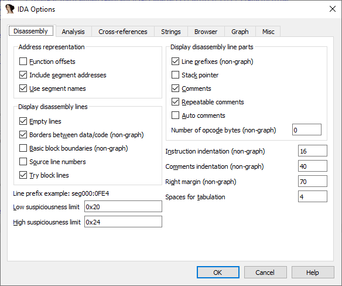
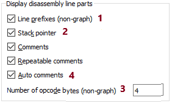
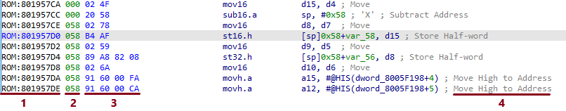
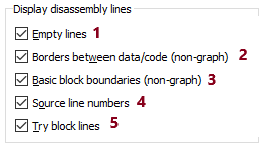
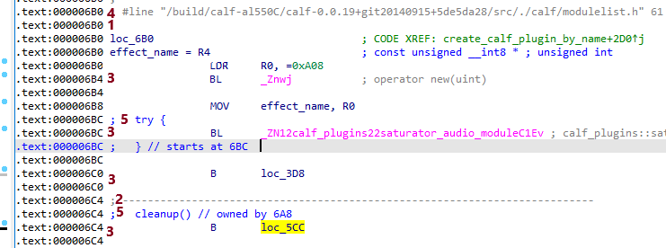

Continuing [from last week](https://www.hex-rays.com/blog/igors-tip-of-the-week-25-disassembly-options/), let’s discuss other disassembly options you may want to change. Here’s the options page again:  
继续上周的话题，我们来讨论一下你可能想更改的其他反汇编选项。下面是选项页面：

### Disassembly line parts 拆卸线部件

  

This group is for options which control the content of the main line itself. Here is an example of a line with all options enabled:  
该组用于控制主线本身内容的选项。下面是一个启用了所有选项的行的示例：

The marked up parts are:  
标记的部分是

1.  The line prefix (address of the line).  
    行前缀（行地址）。
2.  The stack pointer value or delta (relative to the value at the entry point). Enabling this can be useful when debugging problems like “sp-analysis failed”, “positive sp value has been detected”, or “call analysis failed”.  
    堆栈指针值或 delta（相对于入口点的值）。在调试诸如 "sp-分析失败"、"检测到正 sp 值 "或 "调用分析失败 "等问题时，启用该功能非常有用。
3.  Opcode bytes. The number entered in the “Number of opcode bytes” specifies the number displayed on a single line at most. If the instruction is longer, the rest is printed on the second line. If you prefer to truncate the extra bytes, enter a negative number (e.g. -4 will display 4 bytes at most, the rest will be truncated).  
    操作码字节数。在 "操作码字节数 "中输入的数字指定了最多显示在单行上的操作码字节数。如果指令较长，剩余部分将打印在第二行。如果希望截断多余字节，请输入负数（例如，-4 最多显示 4 个字节，其余将被截断）。
4.  Comments for instructions with a short description of what the instruction is doing (may not be available for all processors or all instructions).  
    指令注释，简短说明指令的作用（可能不适用于所有处理器或所有指令）。

### Display disassembly lines  
显示反汇编行

This group of options control display of lines other than the actual line of the disassembly for a given address (_main line_).  
这组选项用于控制显示指定地址（主线）的反汇编实际行以外的行。

1.  Empty lines: this prints additional empty lines to make disassembly more readable, especially in text mode (e.g. between functions or before labels). Turn it off to fit more code on screen.  
    空行：打印额外的空行，使反汇编更具可读性，尤其是在文本模式下（如函数之间或标签之前）。将其关闭可在屏幕上显示更多代码。
2.  Borders between data/code: displays the border line (`;------------`) whenever there is a stop in the execution flow (e.g. after an unconditional jump or a call to a non-returning function).  
    数据/代码之间的边界：每当执行流停止时（如无条件跳转或调用非返回函数后），显示边界线 ( `;------------` )。
3.  Basic block boundaries: adds one more empty line at the end of each basic block (i.e. after a call or a branch).  
    基本程序块边界：在每个基本程序块的末尾（即调用或分支之后）增加一个空行。
4.  Source line numbers: displays source file name and line number if this information is available in the database (e.g. imported from the DWARF debug information).  
    源文件行号：如果数据库中有源文件名和行号（例如从 DWARF 调试信息中导入），则显示该信息。
5.  Try block lines: enables or disables display of information about exception handling recovered by parsing the exception handling metadata in the binary.  
    尝试块行：启用或禁用显示通过解析二进制文件中的异常处理元数据而恢复的异常处理信息。