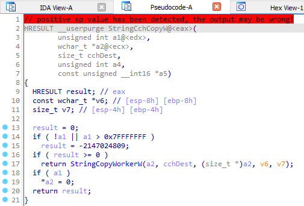
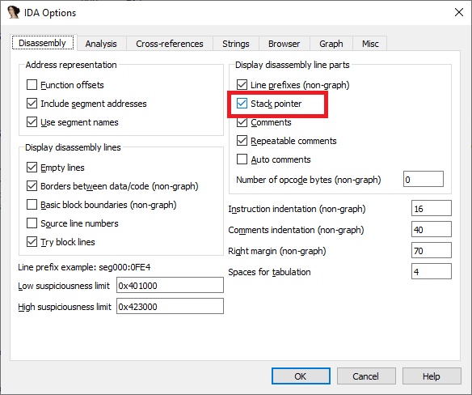
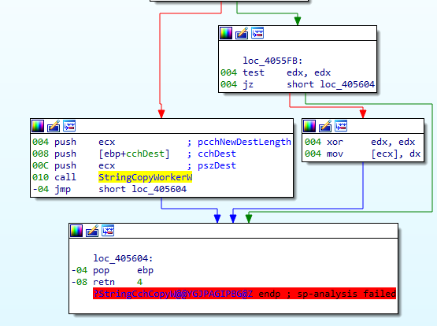
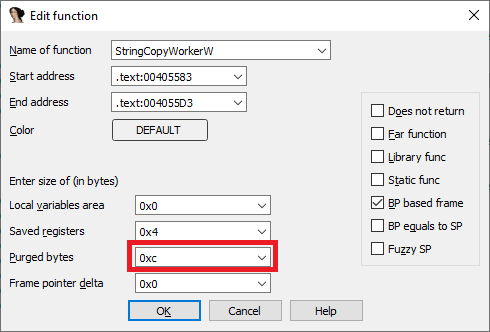

在 IDA 中，正确的 栈变化信息 对于分析至关重要，尤其是反编译时。如果栈指针（SP）的追踪出错，就可能出现提示：

`sp-analysis failed`（栈分析失败）


`positive sp value has been detected`（检测到正的 sp 值）



即使有调试符号，也可能出现这种情况。本文展示了如何检测并修复这些问题。

### 如何检测问题

切换到反汇编视图。

1.  在 `Options > General > Disassembly line parts` 中启用 `Stack pointer` 显示。
    
2.  观察每条指令前的 `SP delta`（栈偏移量）。

正常情况

- `push` 指令：`SP delta` 增加（例如 `push eax` 增加 4）。
- `pop` 指令：`SP delta` 减少相同数值。
- `call` 指令：可能减少 `SP`（如 `__stdcall` 调用），或保持不变，稍后再调整。
- 跳转的两端 `SP delta` 应该一致。
- 函数入口和返回处 `SP delta` 应为 0。
- 在函数体中，`SP delta` 应保持稳定，除了调用前后短暂的变化。

在 `notepad.exe` 的一个例子中，某个块的 `SP delta` 在调用后从 `00C` 变成 `008`。

表面上看合理（`@4` 表示 `__stdcall`，会清理 4 字节参数）。但实际函数使用的是寄存器参数（可能因 链接时代码生成 `LTO` 优化，将 `__stdcall` 转换为 `__fastcall`）。

```asm
00C mov     ecx, offset dword_41D180
00C call    _TraceLoggingRegister@4 ; TraceLoggingRegister(x)
008 push    offset _TraceLogger__GetInstance____2____dynamic_atexit_destructor_for__s_instance__ ; void (__cdecl *)()
00C call    _atexit
00C pop     ecx
008 push    ebx
00C call    __Init_thread_footer
00C pop     ecx
008 jmp     short loc_406F9D
```

在另一个例子中，调用后 `SP delta` 变为负数。



IDA 误判函数消耗了 `0x14` 字节，但实际上只有 3 次 push（12 字节）。进入函数体可见它以 `retn 0Ch` 结束，说明正确的参数大小是 12 字节。

### 修复方法

#### 局部修复

- 在出错的指令上按 `Alt–K`（`Edit > Functions > Change stack pointer…`）。
- 输入正确的 `SP` 变化值。

示例：第一个例子应改为 0，第二个例子应改为 12 (0xC)。

#### 全局修复

- 如果同一个函数在多个调用点都导致栈不平衡，可以修改函数属性。
- 按 `Alt–P`（`Edit > Functions > Edit function…`），调整 `Purged bytes` 值。



👉 总结： 即使有 PDB 符号，也不能保证栈分析完全正确。学会检查 SP delta 并在必要时手动修复，是保证反编译结果可靠的关键。

原文地址：https://hex-rays.com/blog/igors-tip-of-the-week-27-fixing-the-stack-pointer
