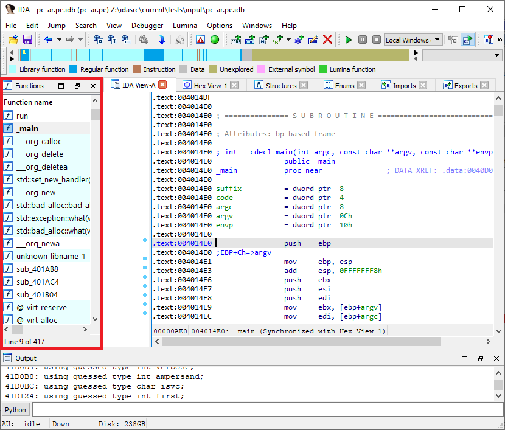
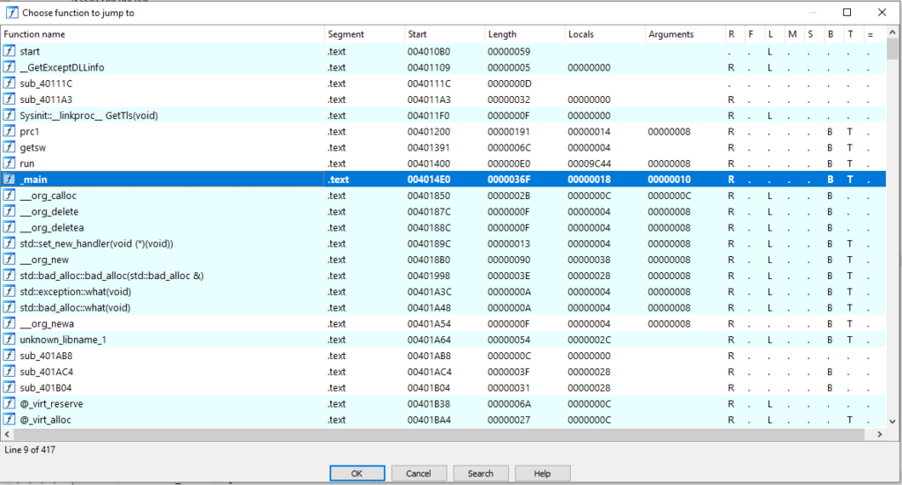
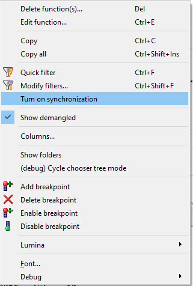

函数列表（Functions list） 是 IDA 默认桌面布局中最常见的功能之一。即使你每天都在用，它也有一些隐藏技巧值得注意。



### 模态版本



可通过 `Jump > Jump to function…` 菜单或快捷键 `Ctrl–P` 打开。

这个对话框能显示完整宽度的函数列表，并支持快速导航：

- 跳转到当前函数开头：`Ctrl–P, Enter`
- 跳转到上一个函数：`Ctrl–P, Up, Enter`（等价于 `JumpPrevFunc`，默认快捷键 `Ctrl–Shift–Up`）
- 跳转到下一个函数：`Ctrl–P, Down, Enter`（等价于 `JumpNextFunc`，默认快捷键 `Ctrl–Shift–Down`）

### 列（Columns）

函数列表不仅有“函数名”一列，还包含许多其他列（详见[帮助文档](https://www.hex-rays.com/products/ida/support/idadoc/586.shtml)）。

点击列标题可以按该列排序。

例如：按函数大小排序，快速找到最大函数（通常更容易包含漏洞）。或者按局部变量区大小排序，寻找可能包含大量栈缓冲区的函数（潜在溢出点）。

排序或过滤时，输出窗口可能显示：

```bash
Caching 'Functions window'... ok
```

因为排序需要重新获取整个函数列表。大数据库上可能会变慢，所以不需要时最好用右键菜单的 `Unsort` 取消排序。

### 同步（Synchronization）

在右键菜单中选择 `Turn on synchronization`，函数列表会随着你在反汇编中导航自动滚动到当前函数。也可以关闭同步，固定显示某个函数。



### 文件夹（Folders）

从 IDA 7.5 开始，可以用文件夹组织函数。

在右键菜单中启用 `Show folders`，然后选择 `Create folder with items…` 将选中函数分组。

### 颜色与样式（Colors & styles）


列表中的函数可能带颜色：

- 青色：库函数（通过 `FLIRT` 签名识别出的编译器运行时库函数）
- 洋红色：外部函数桩（通常在 `DLL` 或共享对象中实现）
- 亮绿色：从 `Lumina` 数据库获取了元数据的函数
- 浅绿色：标记为已反编译的函数
- 其他颜色：用户手动设置（通过 `Edit function…` 或插件/脚本）

加粗：表示该函数有定义的原型（参数类型、返回值、调用约定）。原型可能由用户设置（快捷键 `Y`），也可能由加载器或插件（如 DWARF/PDB 调试信息）提供。

### 多选（Multi-selection）

选中多个函数后，可以批量操作：

- `Delete function(s)…`：删除函数信息（名称、边界），但保留指令。常用于合并被错误拆分的函数。
- `Add breakpoint`：在所有选中函数的首条指令上加断点。调试时可用来发现哪些函数被执行。
- `Lumina`：只对选中函数推送或拉取元数据。

👉 总结： 函数列表不仅是一个导航工具，还能通过排序、分组、颜色标记和批量操作，帮助你快速定位关键函数、组织分析工作，并结合 Lumina 数据库提升效率。

原文地址：https://hex-rays.com/blog/igors-tip-of-the-week-28-functions-list
