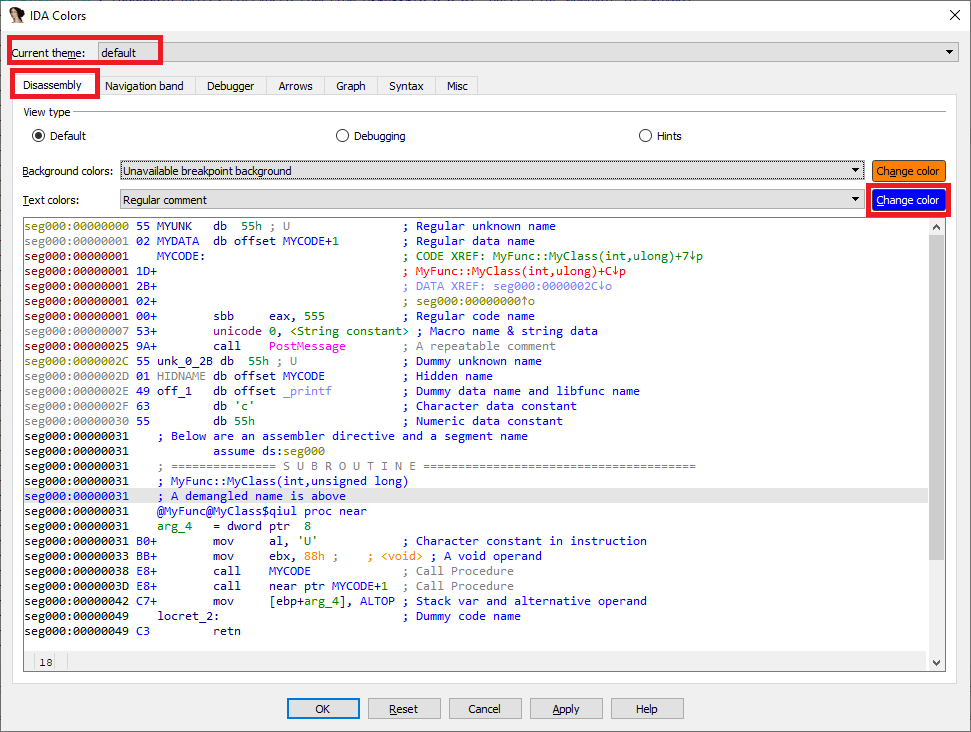
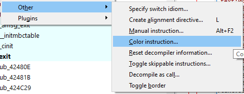
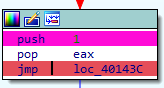
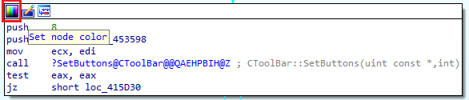
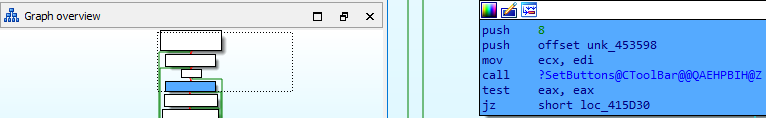
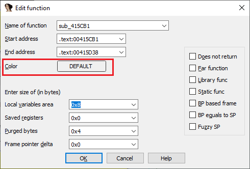
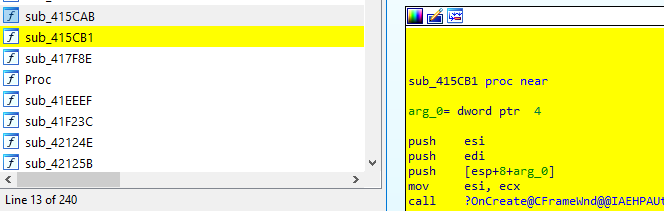

👉 总结： 函数列表不仅是一个导航工具，还能通过排序、分组、颜色标记和批量操作，帮助你快速定位关键函数、组织分析工作，并结合 Lumina 数据库提升效率。

### 主题（Themes）

IDA 支持更换 UI 的配色方案（窗口、控件、视图和反汇编列表）。默认主题是浅色背景，同时还提供两种深色主题。可以通过 `Options > Colors…` 中的 `Current theme` 选择器切换主题。

每个主题都可以进一步自定义：

- 在 `Disassembly` 标签页中，可以从下拉菜单选择项目，或直接点击反汇编中的元素，再修改颜色。
- 如果喜欢直接编辑颜色值，可以一次性修改多个，甚至通过 `CSS-based styling` 创建完整的自定义主题。

### 给反汇编行上色

除了修改整体主题或单个组件的颜色，你还可以给整个反汇编行（指令或数据）上色。

使用菜单 `Edit > Other > Color instruction…`。这会改变当前地址对应行的背景色，也可以一次选择多行一起上色。

### 给图形节点上色

在 图形视图（`Graph View`） 中，可以给整个节点（基本块）上色。

点击节点标题栏中的第一个图标（`Set node color`），选择颜色后：

- 该基本块中的所有指令都会被染色。
- 在图形总览中也会显示对应颜色。

### 给函数上色

除了单条指令或基本块，你还可以给整个函数上色。

打开 `Edit Function` (`Alt + P`) 对话框，点击颜色按钮即可。

修改函数颜色后：

- 函数内所有指令都会被染色（单独上色的指令除外）。
- 在 函数列表（`Functions list`） 中，该函数的条目也会显示对应颜色。

👉 总结：IDA 的配色不仅仅是美观问题，更能帮助你在复杂的反汇编和图形视图中快速定位、分组和区分不同部分。通过主题、行上色、节点上色和函数上色，你可以打造一个更符合自己分析习惯的工作环境。

原文地址：https://hex-rays.com/blog/igors-tip-of-the-week-29-color-up-your-ida
