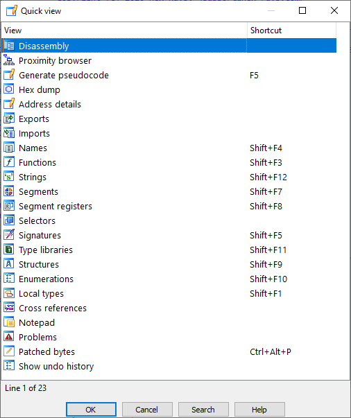
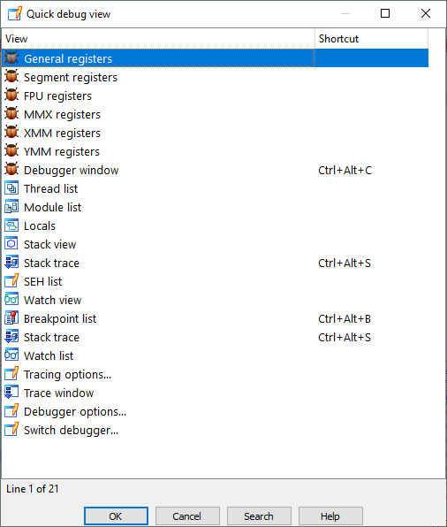
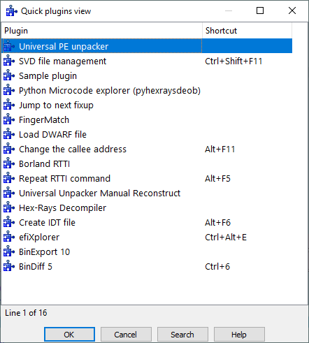

IDA 提供了三个快捷方式，可以替代一些菜单操作，避免繁琐的导航。

### 快速视图（Quick view）

- 快捷键：`Ctrl + 1`

显示 `View > Open subviews` 菜单下的所有子视图。

特别适合打开那些没有专用快捷键的视图，例如 `Notepad`。当然，你也可以通过 快捷键编辑器（`Shortcut editor`） 自定义属于自己的快捷键。

### 快速调试视图（Quick debug view）

- 快捷键：`Ctrl + 2`

在调试会话中最有用。允许你直接打开 `Debugger > Debugger windows` 菜单下的调试窗口，而无需逐级导航。

### 快速插件视图（Quick plugins view）

- 快捷键：`Ctrl + 3`

打开 `Edit > Plugins` 菜单下的插件列表，方便快速调用特定插件。

注意：

- 该列表不一定包含所有已安装插件。
- 有些插件会在其他菜单中添加入口，或者完全没有菜单项，而是自动运行。

👉 总结： 这三个快捷键（Ctrl+1 / Ctrl+2 / Ctrl+3）能显著加快你在 IDA 中的操作效率，避免频繁翻找菜单，尤其在调试和使用插件时非常实用。

原文地址：https://hex-rays.com/blog/igors-tip-of-the-week-30-quick-views
