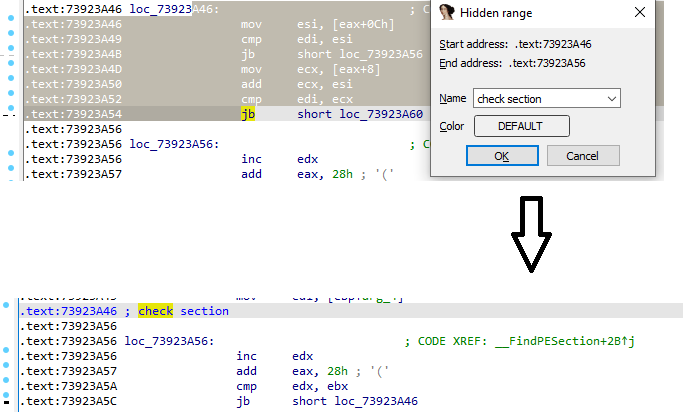
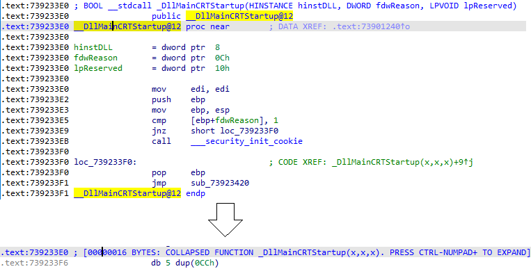
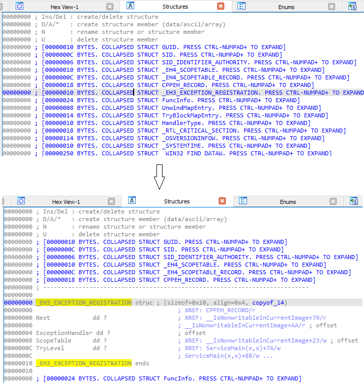
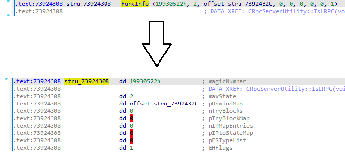

You may have come across the menu items View > Hide, Unhide but possibly never used them.  
您可能接触过菜单项 "查看 > 隐藏"、"取消隐藏"，但可能从未使用过。

These commands allow you to hide, or _collapse_ and unhide/uncollapse parts of IDA’s output. They can be used in the following situations:  
通过这些命令，您可以隐藏或折叠 IDA 的部分输出。它们可用于以下情况：

### Hiding instructions or data items  
隐藏指令或数据项

To make your database more compact and reduce clutter, you can opt to hide or replace some parts of the listing by short text:  
为使数据库更加紧凑，减少杂乱，您可以选择隐藏或用简短的文本替换列表中的某些部分：

1.  1.  Select some instructions or data items  
        选择某些指令或数据项
    2.  Invoke View > Hide (or press Ctrl+Numpad-)  
        调用视图 > 隐藏（或按 Ctrl + Numpad- 键）
    3.  Enter the text with which to replace the selected area (and optionally pick a color)  
        输入要替换所选区域的文本（可选颜色）

The instructions/data are replaced by the entered text but are not removed from the database; you can reveal them using View > Unhide (or Ctrl+Numpad+).  
指令/数据会被输入的文本替换，但不会从数据库中删除；您可以使用 "视图">"取消隐藏"（或 Ctrl + Numpad+ ）来显示它们。

### Hiding whole functions 隐藏整个函数

You can also hide or collapse whole functions by using the Hide command while the cursor is on the function’s name:  
当光标停留在函数名称上时，还可以使用隐藏命令隐藏或折叠整个函数：

You may have already seen the “COLLAPSED FUNCTION” text for library functions detected by the FLIRT signatures (colored cyan in the function list and navigation bar). The actual implementation of library functions is rarely important for analyzing the program’s code so IDA collapses them to not distract the user.   
您可能已经看到了 FLIRT 签名检测到的库函数的 "COLLAPSED FUNCTION（折叠函数）"文本（函数列表和导航栏中的青色）。库函数的实际实现对于分析程序代码来说很少重要，因此 IDA 将其折叠起来，以免分散用户的注意力。

### Hiding structures and enums  
隐藏结构和枚举

Structure or enum definitions can be collapsed and uncollapsed similarly to functions.  
与函数类似，结构或枚举定义也可以折叠或取消折叠。

### Terse struct representation  
简洁的结构表示法

When defining structure instances in data, IDA will by default try to display them in _terse_ form, with everything on one line. By using **Unhide**, you can have it printed in full, or verbose form, with each field on separate line and a comment with the field name.  
在数据中定义结构实例时，IDA 默认会尝试以简洁的形式显示，所有内容都在一行中。通过使用 "隐藏"（Unhide）功能，可以将结构实例打印成完整或冗长的形式，每个字段单独成行，并在注释中注明字段名称。

Conversely, you can use **Hide** to collapse a structure instance into a terse form (this may not work in some cases due to the specific structure’s layout).  
反之，也可以使用隐藏功能将结构实例折叠成简洁的形式（由于特定结构的布局，这在某些情况下可能不起作用）。

### Collapsing blocks in decompiler  
在反编译器中折叠块

The decompiler also has similar but separate pair of actions. They are available in the context menu or via the Numpad- and Numpad+ hotkeys. You can collapse compound operators, as well as the variable declaration block at the start of the function.  
反编译器也有一对类似但独立的操作。这些操作可在上下文菜单中或通过 Numpad- 和 Numpad+ 热键进行。您可以折叠复合运算符以及函数开始处的变量声明块。

### More info: 更多信息

[Hide](https://hex-rays.com/products/ida/support/idadoc/599.shtml) and [Unhide](https://hex-rays.com/products/ida/support/idadoc/600.shtml) (IDA)  
隐藏和解除隐藏 (IDA)

[Collapse/uncollapse item](https://www.hex-rays.com/products/decompiler/manual/cmd_collapse.shtml) (Decompiler)  
折叠/取消折叠项目（反编译器）