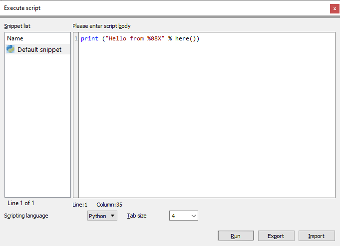
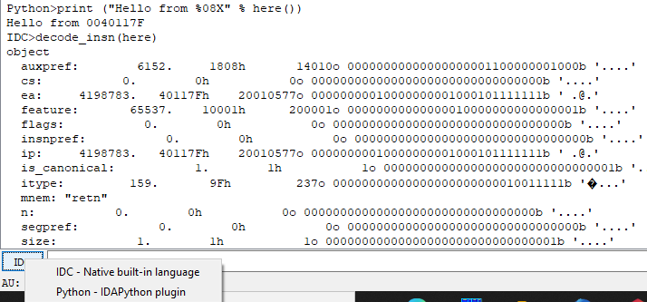
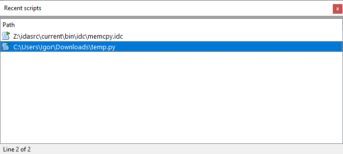

Scripting allows you to automate tasks in IDA which can be repetitive or take a long time to do manually. We [previously covered](https://www.hex-rays.com/blog/igor-tip-of-the-week-08-batch-mode-under-the-hood/) how to run them in batch (headless) mode, but how can they be used interactively?  
脚本允许您在 IDA 中自动执行重复或需要长时间手动完成的任务。我们之前介绍过如何在批处理（无头）模式下运行它们，但如何交互式地使用它们呢？

### Script snippets 脚本片段

File > Script Command… (Shift+F2)  
文件 > 脚本命令... ( Shift + F2 )

Although this dialog is mainly intended for quick prototyping and database-specific snippets, you can save and load scripts from external files via the “Export” and “Import” buttons. There is some basic syntax highlighting but it’s not a replacement for a full-blown IDE. Another useful feature is that the currently selected snippet can be executed using  the Ctrl+Shift+X shortcut (“SnippetsRunCurrent” action) even when the focus is in another widget.  
虽然该对话框主要用于快速原型设计和特定数据库片段，但您也可以通过 "导出 "和 "导入 "按钮从外部文件保存和加载脚本。虽然有一些基本的语法高亮功能，但并不能取代完整的集成开发环境。另一个有用的功能是，使用 Ctrl + Shift + X 快捷键（"SnippetsRunCurrent "操作）可以执行当前选定的片段，即使焦点在其他 widget 上也是如此。

### Command Line Interface (CLI)  
命令行界面（CLI）

The input line at the bottom of IDA’s screen can be used for executing small one-line expressions in IDC or Python (the interpreter can be switched by clicking on the button).  
IDA 屏幕底部的输入行可用于执行 IDC 或 Python 的小型单行表达式（可通过点击按钮切换解释器）。

While somewhat awkward to use for bigger tasks, it has a couple of unique features:  
虽然在执行大型任务时有些笨拙，但它有几个独特的功能：

-   the result of entered expression is printed  in the Output Window (unless inhibited with a semicolon). In case of IDC, values are printed in multiple numeric bases and objects are pretty-printed recursively.  
    输入表达式的结果会打印在输出窗口中（除非用分号禁止）。如果是 IDC，则会以多个数值基数打印数值，并以漂亮的递归方式打印对象。
-   It supports limited [Tab completion](https://www.hex-rays.com/blog/implementing-command-completion-for-idapython/).  
    它支持有限的制表符补全。

### Running script files 运行脚本文件

If you already have a stand-alone script file and simply want to run it, File > Script file.. (Alt+F7) is probably the best and quickest solution. It supports both IDC and Python scripts.  
如果你已经有了一个独立的脚本文件，只想运行它，那么文件 > 脚本文件... ( Alt + F7 ) 可能是最好、最快捷的解决方案。它支持 IDC 和 Python 脚本。

### Recent scripts 最新脚本

The scripts which were executed through the “Script file…” command are remembered by IDA and can be executed again via the Recent Scripts list  (View > Recent scripts, or Alt+F9). You can also invoke an external editor (configured in Options > General…, Misc tab) to edit the script before running.  
通过 "Script file...（脚本文件...）"命令执行的脚本会被 IDA 记住，并可通过最近脚本列表（查看 > 最近脚本，或 Alt + F9 ）再次执行。你还可以调用外部编辑器（在选项 > 常规...，杂项选项卡中配置）在运行前编辑脚本。

### Examples 示例

IDA ships with some example scripts which can be found in “idc” directory for IDC and “python/examples” for IDAPython. There are also some user-contributed scripts in the [download area](https://hex-rays.com/products/ida/support/download/).  
IDA 随附了一些示例脚本，IDC 可以在 "idc "目录下找到，IDAPython 可以在 "python/examples "目录下找到。下载区还有一些用户贡献的脚本。