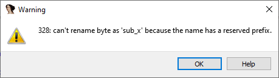
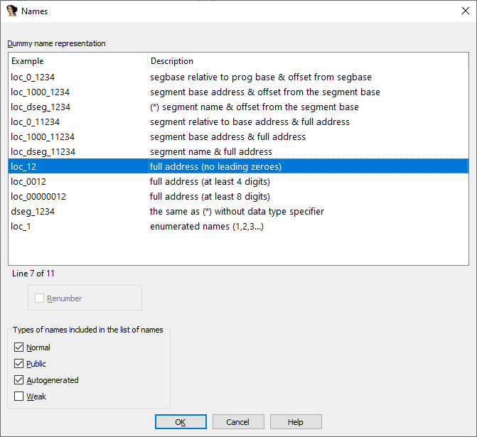
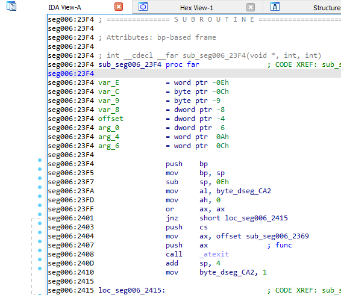
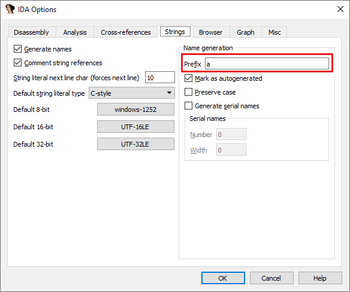

在 IDA 的反汇编中，你可能经常看到一些初看起来奇怪又晦涩的名字，例如： `sub_73906D75`、`loc_40721B`、`off_40A27C` 等。

在 IDA 的术语中，这些被称为 虚拟名称（dummy names）。 它们的作用是在汇编语法需要一个名字但没有合适名字可用时使用，例如：

- 输入文件没有调试信息（已被剥离符号）
- 或引用了调试信息中不存在的位置

这些名字并不会实际存储在数据库中，而是 IDA 在打印列表时即时生成的。

### 虚拟名称前缀

虚拟名称由类型相关的前缀和唯一的后缀组成，后缀通常与地址相关。 IDA 中常见的前缀如下：
| 前缀 | 含义 |
| --------- | -------------------------- |
| `sub_` | 指令，子程序（函数）起始 |
| `locret_` | 返回指令 |
| `loc_` | 其他类型的指令 |
| `off_` | 数据，包含偏移（指针）值 |
| `seg_` | 数据，包含段地址值 |
| `asc_` | 数据，字符串字面量起始 |
| `byte_` | 数据，字节 |
| `word_` | 数据，16 位 |
| `dword_` | 数据，32 位 |
| `qword_` | 数据，64 位 |
| `byte3_` | 数据，3 字节 |
| `xmmword_` | 数据，128 位 |
| `ymmword_` | 数据，256 位 |
| `packreal_` | 数据，打包实数 |
| `flt_` | 浮点数据，32 位 |
| `dbl_` | 浮点数据，64 位 |
| `tbyte_` | 浮点数据，80 位 |
| `stru_` | 结构体 |
| `custdata_` | 自定义数据类型 |
| `algn_` | 对齐指令 |
| `unk_` | 未探索（未定义、未知）字节 |

由于这些前缀在 IDA 中有特殊处理，因此它们是保留的，不能用于用户自定义名称。 如果你尝试使用这些前缀，IDA 会报错，例如：

一种解决方法是在前面加一个下划线 `_` 来改变前缀。

如果你想去掉已有名字并让 IDA 再次使用虚拟名称，只需删除该名字（重命名为空字符串）。

### 名称后缀

默认情况下，虚拟名称的后缀是该项的线性地址（有效地址）。 不过，你可以通过 `Options > Name representation…` 对话框选择其他方式。

在处理分段程序（如 16 位 DOS 软件）时，这个功能尤其有用： 你可以显示段名和段内偏移，而不是全局线性地址，这样可以一眼看出目标是否在另一个段中。

### 其他前缀

除了虚拟名称，IDA 还有两种自动生成的名称：

1. 栈变量（`var_`）和函数参数（`arg_`）
2. 从字符串文本生成的字面量名称（例如 "exception" 生成 `aException`）

栈变量和参数的前缀是硬编码的，不可配置； 字符串字面量的命名规则可在 `Options > General…` 的 `Strings` 标签中配置。

与虚拟名称不同，这些自动生成的名称会存储在数据库中，并标记为自动生成，因此它们的前缀不算保留，你可以在自定义名称中使用它们。

原文地址：https://hex-rays.com/blog/igors-tip-of-the-week-34-dummy-names
