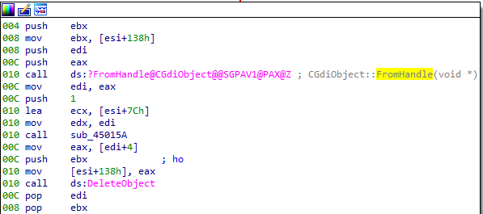
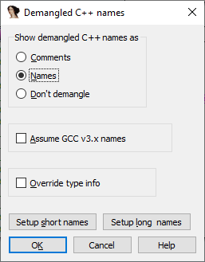
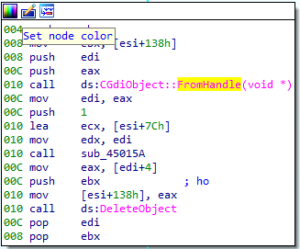

**Name mangling** (also called **name decoration**) is a technique used by compilers to implement some of the features required by the language. For example, in C++ it is used to distinguish functions with the same name but different arguments (_function overloading_), as well as to support namespaces_,_ templates, and other purposes.  
名称混杂（也称名称装饰）是编译器用来实现语言所需某些功能的一种技术。例如，在 C++ 中，它用于区分具有相同名称但不同参数的函数（函数重载），以及支持命名空间模板和其他用途。

Mangled names often end up in the final binary and, depending on the compiler, may be non-trivial to understand for a human (a simple example: “operator new” could be encoded as  `??2@YAPAXI@Z` or `_Znwm`). While these cryptic strings can be decoded by a compiler-provided utility such as `undname` (MSVC) or `c++filt` (GCC/Clang), it’s much better if the disassembler does it for you (especially if you don’t have the compiler installed). This process of decoding back to a human-readable form is called **demangling**. IDA has out-of-box support for demangling names for the following compilers and languages:  
混杂的名称通常会出现在最终的二进制文件中，而且根据编译器的不同，人类可能很难理解（举个简单的例子："操作符 new "可以编码为 `??2@YAPAXI@Z` 或 `_Znwm` ）。虽然编译器提供的工具（如 `undname` (MSVC) 或 `c++filt` (GCC/Clang)）可以解码这些神秘的字符串，但最好还是由反汇编器代劳（尤其是在没有安装编译器的情况下）。这种解码为人类可读形式的过程称为反汇编。IDA 开箱即支持以下编译器和语言的反汇编名称：

-   Microsoft (Visual C++) 微软（Visual C++）
-   Borland (C++, Pascal, C++ Builder, Delphi)
-   Watcom (C++)
-   Visual Age (C++) Visual Age（C++）
-   DMD (D language) DMD（D 语言）
-   GNU mangling (GCC, Clang, some commercial compilers)  
    GNU 处理（GCC、Clang 和一些商业编译器）
-   Swift 快速

You do not need to pick the compiler manually; IDA will detect it from the name format and apply the corresponding demangler automatically.  
您无需手动选择编译器；IDA 会根据名称格式检测编译器，并自动应用相应的解析出器。

### Demangled name options 析构名称选项

By default, IDA uses a comment to show the result of demangling, meaning that every time a mangled name is used, IDA will print a comment with the result of demangling. For example, `?FromHandle@CGdiObject@@SGPAV1@PAX@Z` demangles to `CGdiObject::FromHandle(void *)`, which is printed as a comment:  
默认情况下，IDA 使用注释来显示拆分的结果，这意味着每次使用一个被拆分的名称时，IDA 都会打印一个注释，说明拆分的结果。例如， `?FromHandle@CGdiObject@@SGPAV1@PAX@Z` 会分解为 `CGdiObject::FromHandle(void *)` ，并打印为注释：



If you prefer, you can show the demangled result in place of the mangled name instead of just a comment. This can be done in the Options > Demangled names… dialog:  
如果您愿意，可以在显示析构结果的同时显示析构名称，而不是只显示注释。可以在 "选项">"已分解名称... "对话框中进行操作：





### Short and long names  
短名称和长名称

The buttons “Setup short names” and “Setup long names” allow you to modify the behavior of the built-in demangler in two common situations. The “short” names are used in contexts where space is at premium: references in disassembly, lists of functions and so on. “Long” names are used in other situations, for example when printing a comment at the start of the function. By using the additional options dialog, you can select what parts of the demangled name to show, hide, or shorten to make it either more compact or more verbose.  
通过 "设置短名称 "和 "设置长名称 "按钮，可以在两种常见情况下修改内置解析出器的行为。短 "名称用于空间有限的情况：反汇编中的引用、函数列表等。长 "名称用于其他情况，例如在函数开头打印注释。通过使用附加选项对话框，您可以选择显示、隐藏或缩短拆分后名称的哪些部分，使其更简洁或更冗长。


### Name simplification 名称简化

Some deceptively simple-looking names may end up very complicated after compilation, especially when templates are involved. For example, a simple `[std::string](https://en.cppreference.com/w/cpp/string)` from STL actually expands to   
一些看似简单的名称在编译后可能会变得非常复杂，尤其是涉及模板时。例如，STL 中一个简单的 `[std::string](https://en.cppreference.com/w/cpp/string)` 实际上会扩展为

```
std::basic_string&lt;char,std::char_traits&lt;char&gt;,std::allocator&lt;char&gt;&gt;
```

To ensure interoperability, the compiler has to preserve these details in the mangled name, so they reappear on demangling; however, such implementation details are usually not interesting to a human reader who would prefer to see a simple `std::string` again. This is why IDA implements name simplification as a post-processing step. Using the rules in the file `cfg/goodname.cfg`, IDA applies them to transform a name like   
为了确保互操作性，编译器必须在混杂的名称中保留这些细节，以便它们在拆分时重新出现；然而，对于人类读者来说，这些实现细节通常并不有趣，他们更愿意再次看到一个简单的 `std::string` 。这就是 IDA 将名称简化作为后处理步骤的原因。使用文件 `cfg/goodname.cfg` 中的规则，IDA 应用这些规则将名称如

```
std::basic_string&lt;char,struct std::char_traits&lt;char&gt;,class std::allocator&lt;char&gt; &gt; &amp; __thiscall std::basic_string&lt;char,struct std::char_traits&lt;char&gt;,class std::allocator&lt;char&gt; &gt;::erase(unsigned int,unsigned int)
```

into  这样的名称转化为

```
std::string &amp; std::string::erase(unsigned int,unsigned int)
```

which is much easier to read and understand.  
更容易阅读和理解。

IDA ships with rules for most standard STL classes but you can add custom ones too. Read the comments inside `goodname.cfg` for the description of how to do it.  
IDA 随附了大多数标准 STL 类的规则，但你也可以添加自定义规则。请阅读 `goodname.cfg` 中的注释，了解如何操作。

More info: [Demangled names](https://www.hex-rays.com/products/ida/support/idadoc/611.shtml) in IDA Help.  
更多信息：IDA 帮助中的拆分名称。