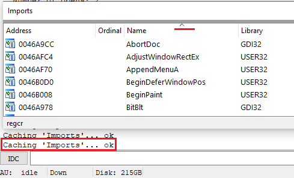

List views (also called _choosers_ or table views) are used in many places in IDA to show lists of different kind of information. For example, the [Function list](https://www.hex-rays.com/blog/igors-tip-of-the-week-28-functions-list/) we’ve covered previously is an example of a list view. Many windows opened via the View > Open subviews menu are list views:  
列表视图（也称为选择器或表格视图）在 IDA 的许多地方都被用来显示不同类型信息的列表。例如，我们之前介绍过的函数列表就是列表视图的一个例子。通过 "视图">"打开子视图 "菜单打开的许多窗口都是列表视图：

-   Exports 出口
-   Imports 进口
-   Names 名称
-   Strings 字符串
-   Segments 段
-   Segment registers 段寄存器
-   Selectors 选择器
-   Signatures 签名
-   Type libraries 类型库
-   Local types 本地类型
-   Problems 问题
-   Patched bytes 补丁字节

Many modal dialogs from the Jump menu (such as those for listing [Cross references](https://www.hex-rays.com/blog/igor-tip-of-the-week-16-cross-references/)) are also examples of list views. Because they are often used to select or choose one entry among many, they may also be called _choosers_.  
跳转菜单中的许多模式对话框（如用于列出交叉引用的对话框）也是列表视图的示例。由于列表视图通常用于从多个条目中选择一个条目，因此也可称为选择器。

List view can also be part of another dialog or widget, for example the shortcut list in the [Shortcut editor](https://www.hex-rays.com/blog/igor-tip-of-the-week-02-ida-ui-actions-and-where-to-find-them/). These are called “embedded choosers” in the IDA SDK.  
列表视图也可以是其他对话框或部件的一部分，例如快捷方式编辑器中的快捷方式列表。这些在 IDA SDK 中称为 "嵌入式选择器"。

All list views share common features which we discuss below.  
所有列表视图都具有共同的功能，我们将在下文中讨论。

### Searching 搜索

#### Text search 文本搜索

You can search for arbitrary text in the contents of the list view by using Alt–T to specify the search string and Ctrl–T to find the next occurrence.  
您可以使用 Alt - T 指定搜索字符串，使用 Ctrl - T 查找列表视图内容中的任意文本。

#### Incremental search 增量搜索

Simply start typing to navigate to the closest item which starts with the typed text. The text will appear in the status bar. Use Backspace to erase incorrectly typed letters and Ctrl–Enter to jump to the next occurrence of the same prefix (if any).  
只需开始键入，即可导航到以键入文本开头的最近项目。文本将显示在状态栏中。使用 Backspace 删除输入错误的字母，使用 Ctrl - Enter 跳转到下一个出现的相同前缀（如果有的话）。

### Columns 栏目

Each list view has column headers at the top. In most (not all) of them, you can hide specific columns by using “Hide column” or “Columns…” from the context menu.  
每个列表视图的顶部都有列头。在大多数（并非全部）列表视图中，你可以通过右键菜单中的 "隐藏列 "或 "列... "来隐藏特定列。

Similarly to the standard list views in most OSes, you can resize columns by dragging the delimiters between them or auto-size the column to fit the longest string in it by double-clicking the right delimiter.  
与大多数操作系统的标准列表视图类似，你可以通过拖动列之间的分隔符来调整列的大小，或者通过双击右侧的分隔符来自动调整列的大小，以适应其中最长的字符串。

### Sorting 排序

The list view can be sorted by clicking on a column’s header. The sorting indicator shows the direction of sorting (click it again to switch the direction). Because IDA needs to fetch the whole list of items to sort them, this can be slow in big lists so a reminder with the text “Caching <window>…” is printed in the Output window each time the list is updated and re-sorted. To improve the performance, you can disable sorting by using “Unsort” from the context menu.  
单击列标题可对列表视图进行排序。排序指示器显示排序方向（再次点击可切换方向）。由于 IDA 需要获取整个列表中的项目才能对其进行排序，这在大列表中可能会比较慢，因此每次更新列表并重新排序时，都会在输出窗口中打印 "缓存 <窗口>... "提示。要提高性能，可以使用右键菜单中的 "取消排序 "来禁用排序。

### Filtering 过滤

A quick filter box can be opened by pressing Ctrl–F. Type some text in it to only show items which include the typed substring. By default it performs case-insensitive match on all columns, however you can modify some options from the context menu, such as:  
按 Ctrl - F 可以打开快速筛选框。在其中键入一些文本，只显示包含键入子字符串的项目。默认情况下，它会对所有列执行大小写不敏感匹配，但你可以从上下文菜单中修改某些选项，例如

-   enable case-sensitive matching  
    启用大小写敏感匹配
-   match only whole words instead of any substring  
    只匹配整个单词，而不是任何子串
-   enable fuzzy matching 启用模糊匹配
-   interpret the entered string as a regular expression  
    将输入的字符串解释为正则表达式
-   pick a column on which to perform the matching  
    选择要执行匹配的列

Instead of a quick filter, you can also use more complicated filtering (“Modify Filters” from context menu, or Ctrl–Shift–F). In this dialog you can not only include matching items, but also exclude or simply highlight them with a custom color.  
您也可以使用更复杂的筛选方法（从上下文菜单中选择 "修改筛选器"，或选择 Ctrl - Shift - F ）来代替快速筛选器。在此对话框中，您不仅可以包含匹配项，还可以将其排除在外或用自定义颜色高亮显示。

Similarly to sorting, filtering requires fetching of the whole list which can slow down IDA, especially during autoanalysis. To remove any filters, choose “Reset filters” from the context menu.  
与排序类似，筛选也需要获取整个列表，这会降低 IDA 的运行速度，尤其是在自动分析过程中。要删除任何筛选器，请从右键菜单中选择 "重置筛选器"。

See also: [How To Use List Viewers in IDA](https://www.hex-rays.com/products/ida/support/idadoc/427.shtml)  
另请参阅：如何在 IDA 中使用列表查看器