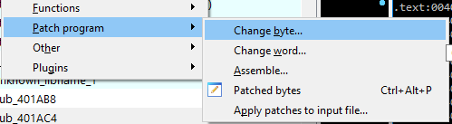
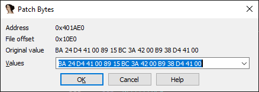
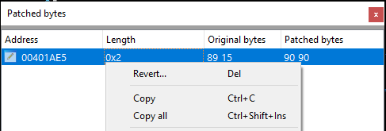
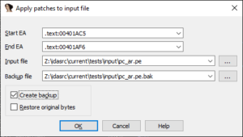
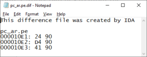

虽然 IDA 主要用于静态分析（即查看未修改的二进制文件），但有时你确实需要对其进行一些更改。 例如，你可以用它修正一些混淆过的指令，以清理代码流或反编译器输出，或者修改程序中使用的某些常量。

### 修改字节（Patching bytes）

可以通过 `Edit > Patch program > Change byte…` 命令修改单个字节值。

一次最多可修改 16 个字节，但不必全部输入——未输入的字节将保持不变。

### 汇编指令（Assembling instructions）

`Edit > Patch program > Assemble…` 仅适用于 x86 处理器，目前只支持 32 位 x86 的一个子集，但在简单场景下仍然有用。 例如，`nop` 指令在所有处理器模式下都是相同的，因此你可以用它来替换掉不必要的指令。

### Patched bytes 视图

可通过 `Edit > Patch program` 或 `View > Open subviews` 子菜单打开。 该列表视图显示数据库中所有已打补丁的位置，并允许你在其中任何位置撤销更改。

### 修改输入文件（Patching the input file）

所有补丁命令只会影响数据库的内容，输入文件本身不会被修改。 但在极少数情况下，如果你确实需要更新磁盘上的输入文件，可以使用： `Edit > Patch program > Apply patches to input file…` 。

### 创建差异文件（Creating a difference file）

`File > Produce file > Create DIF File…` 会将已打补丁的位置输出到一个简单的文本文件中，之后可以用十六进制编辑器或第三方工具手动将这些补丁应用到输入文件。

### 调试期间打补丁（Patching during debugging）

在调试过程中，打补丁同样不会影响输入文件，但如果被修改的位置属于当前映射的内存区域，则会影响程序内存。 因此，你可以修改指令或数据，观察程序在这种情况下的行为。

### 第三方解决方案（Third party solutions）

如果内置的补丁功能不能满足需求，可以尝试以下第三方插件：

- [IDA Patcher](https://github.com/iphelix/ida-patcher)（Peter Kacherginsky 编写，2014 年插件大赛投稿）
- [KeyPatch](https://www.keystone-engine.org/keypatch/)（Keystone Engine 项目，2016 年插件大赛获奖作品）

另请参见 IDA 帮助：[编辑|补丁核心子菜单](https://www.hex-rays.com/products/ida/support/idadoc/526.shtml)

原文地址：https://hex-rays.com/blog/igors-tip-of-the-week-37-patching
