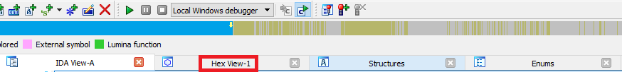
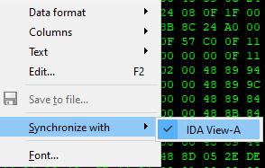
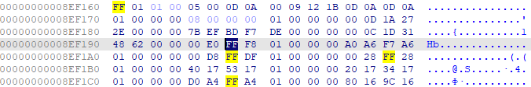
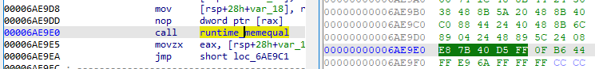
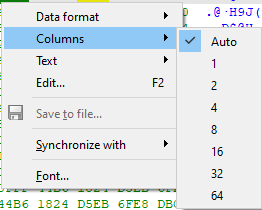
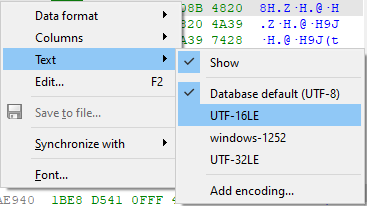
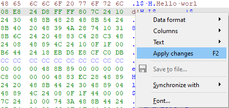
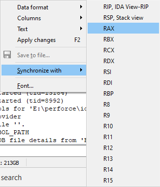
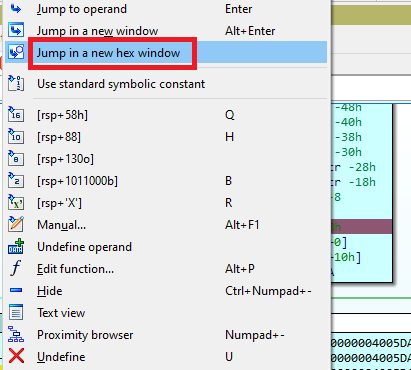

除了反汇编（Disassembly）和反编译（Pseudocode）视图外，IDA 还允许你查看程序指令和数据背后的实际原始字节。 这可以通过 十六进制视图（Hex view） 实现，它是默认打开的视图之一（也可通过 `View > Open subviews` 菜单打开）。

即使你以前用过它，也可能有一些功能你还不了解。

### 同步（Synchronization）

Hex view 可以与反汇编视图（IDA View）或反编译器（Pseudocode）视图同步。 该选项可在右键菜单的 Synchronize with 中找到。

同步也可以反向启用或禁用（即从 IDA View 或 Pseudocode 窗口开始）。 启用后，两个视图的光标会保持同步：在一个视图中改变位置，另一个视图会相应更新。

### 高亮（Highlight）

Hex view 中有两种高亮方式：

1. 文本匹配高亮：类似于反汇编列表中的匹配高亮，会在屏幕上显示所选文本的所有匹配项。

   

2. 当前项高亮：显示构成当前项（指令或数据）的字节组。 这是一种替代方式，可以用来跟踪指令的操作码字节，而不是依赖反汇编视图的显示选项。

   

### 布局与数据格式（Layout and data format）

默认设置使用经典的 每行 16 字节，右侧显示文本。 你可以更改单个项目的显示格式，以及每行显示的项目数量（固定数量或自动适配）。

### 文本选项（Text options）

十六进制转储右侧的文本区域可以隐藏，或在需要时切换到其他编码。

### 编辑（补丁）（Editing / patching）

Hex view 可以作为 [Patch program](https://www.hex-rays.com/blog/igors-tip-of-the-week-37-patching/) 菜单的替代方式。
按 `F2` 开始编辑，输入新值，再按 `F2` 提交更改（按 `Esc` 取消编辑）。

额外优势：你可以用原生格式（如十进制或浮点数）编辑值，或者直接在文本区域输入字符串。

### 调试（Debugging）

默认的调试桌面有两个 Hex view：

- 一个是通用内存视图
- 一个是堆栈视图（与栈指针同步）

它们都是标准 Hex view 的变体，因此具备上述功能，但在调试时还有额外特性：

1. 同步不仅可以与其他视图，还可以与寄存器的值同步。只要寄存器值是有效地址，每次寄存器变化时，Hex view 会自动跳转到对应位置。

   

2. 反汇编视图的右键菜单新增了一个命令，可以在光标所在操作数的地址处打开 Hex view。

   

原文地址：https://hex-rays.com/blog/igors-tip-of-the-week-38-hex-view
