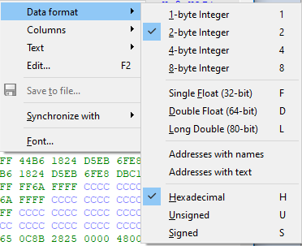

In addition to the disassembly and decompilation (Pseudocode) views, IDA also allows you to see the actual, raw bytes behind the program’s instructions and data. This is possible using the Hex view, one of the views opened by default (or available in the View > Open subviews menu).  Even if you’ve used it before, there may be features you are not aware of.  
除了反汇编和反编译（伪代码）视图，IDA 还允许你查看程序指令和数据背后的实际原始字节。六进制视图是默认打开的视图之一（或在 "视图">"打开子视图 "菜单中可用）。即使你以前用过它，也可能有一些功能是你不知道的。

### Synchronization 同步

Hex view can be synchronized with the disassembly view (IDA View) or Pseudocode (decompiler) view. This option is available in the context menu under “Synchronize with”.  Synchronization can also be enabled or disabled in the opposite direction (i.e. from IDA View or Pseudocode window). When it is on, the views’ cursors move in lockstep: changing the position in one view updates it in the other.  
十六进制视图可与反汇编视图（IDA 视图）或伪代码（反编译器）视图同步。该选项可在上下文菜单中的 "与之同步"（Synchronize with）项下找到。也可反向启用或禁用同步（即从 IDA 视图或伪代码窗口）。打开时，视图中的光标会同步移动：改变一个视图中的位置会更新另一个视图中的位置。

### Highlight  突出显示

There are two types of highlight available in the Hex view.  
十六进制视图中有两种类型的高亮显示。

1.  the text match highlight is similar to the one we’ve seen [in the disassembly listing](https://www.hex-rays.com/blog/igor-tip-of-the-week-05-highlight/) and shows matches of the selected text anywhere on the screen.  
    文本匹配高亮显示与我们在反汇编列表中看到的高亮显示类似，显示屏幕上任何地方所选文本的匹配项。
2.  current item highlight shows the group of bytes that constitutes the current _item_ (i.e. an instruction or a piece of data). This can be an alternative way to track the instruction’s opcode bytes instead of [the disassembly option](https://www.hex-rays.com/blog/igors-tip-of-the-week-26-disassembly-options-2/).  
    当前项目高亮显示构成当前项目（即一条指令或一段数据）的字节组。这是跟踪指令操作码字节而不是反汇编选项的另一种方法。

### Layout and data format  
布局和数据格式

The default settings use the classic 16-byte lines with text on the right. You can change the format of individual items as well as the amount of items per line (either a fixed count or auto-fit).  
默认设置使用传统的 16 字节行，文本位于右侧。您可以更改单个项目的格式以及每行的项目数量（固定计数或自动适应）。

### Text options 文本选项

Text area at the right of the hex dump can be hidden or switched to another encoding if necessary.  
必要时，可以隐藏十六进制转储右侧的文本区域或切换到其他编码。

### Editing (patching) 编辑（修补）

Hex view can be used as an alternative to the [Patch program menu](https://www.hex-rays.com/blog/igors-tip-of-the-week-37-patching/). To start patching, simply press F2, enter new values and press F2 again to commit changes (Esc to cancel editing). An additional advantage is that you can edit values in their native format (e.g. decimal or floating-point), or type text in the text area.  
十六进制视图可作为 "修补程序 "菜单的替代工具。要开始修补，只需按 F2, 键输入新值，再按 F2 键提交更改（按 Esc 键取消编辑）。这样做还有一个好处，那就是可以用原始格式（如十进制或浮点型）编辑数值，或在文本区键入文本。

### Debugging 调试

Default debugging desktop has two Hex Views, one for a generic memory view and one for the stack view (synchronized to the stack pointer). Both are variants of the standard hex view and so the above-described functionality is available but there are a few additional features available only during debugging:  
默认调试桌面有两个十六进制视图，一个是通用内存视图，另一个是堆栈视图（与堆栈指针同步）。这两种视图都是标准十六进制视图的变体，因此都具有上述功能，但还有一些附加功能只有在调试时才能使用：

1.  Synchronization is possible not only with other views but also with a value of a register. Whenever the register changes, the position in the hex view will be updated to match (as long as it is a valid address).  
    不仅可以与其他视图同步，还可以与寄存器的值同步。每当寄存器发生变化时，十六进制视图中的位置也会随之更新（只要是有效地址）。
2.  A new command in the disassembly view’s context menu allows to open a hex view at the address of the operand under cursor.  
    反汇编视图的上下文菜单中新增了一条命令，允许在光标下操作数的地址处打开十六进制视图。