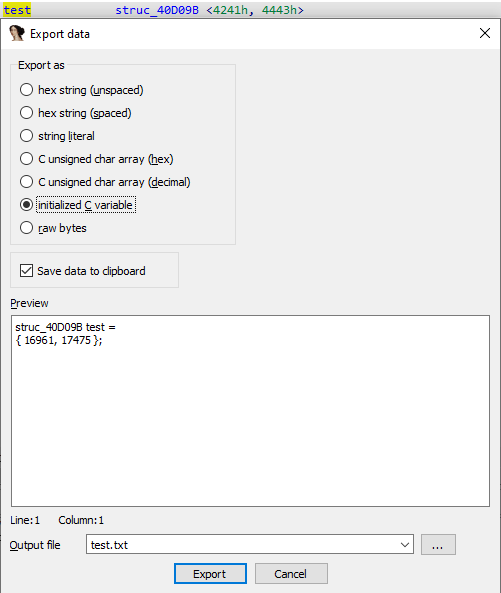

`Edit > Export Data` 命令（`Shift + `E）为你提供了多种格式，用于从数据库中提取所选数据：

- 十六进制字符串（无空格）: `4142434400`
- 十六进制字符串（有空格）: `41 42 43 44 00`
- 字符串字面量：: `ABCD`
- C 无符号字符数组（十六进制）: `unsigned char aAbcd[] = { 0x41, 0x42, 0x43, 0x44, 0x00 };`
- C 无符号字符数组（十进制）: `unsigned char aAbcd[] = { 65, 66, 67, 68, 0 };`
- 已初始化的 C 变量：: `struc_40D09B test = { 16961, 17475 };`
  - 注意：此选项仅在某些情况下有效，例如结构体实例或具有类型信息的项目。
- 原始字节（只能保存到文件）

所选格式的数据会显示在预览文本框中，你可以将其复制到剪贴板，或保存到文件以便后续处理。

原文地址：https://hex-rays.com/blog/igors-tip-of-the-week-39-export-data
