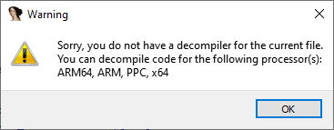
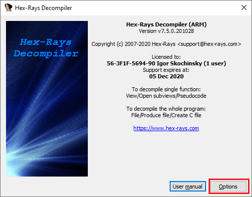
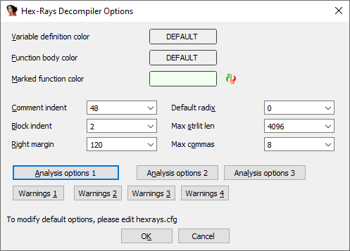
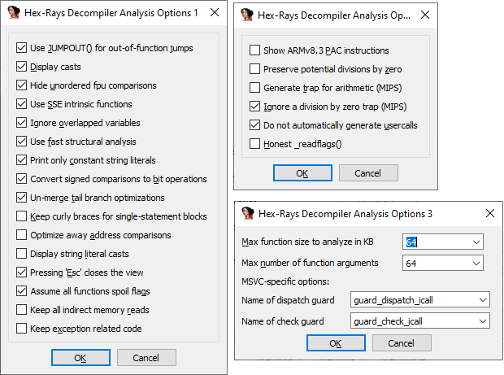

Hex-Rays 反编译器是 IDA 最强大的附加组件之一。 一旦习惯使用，它会非常直观，但刚开始时可能不太清楚如何入手。

### 基本信息

截至本文撰写时（2021 年 5 月），反编译器并未包含在标准的 IDA Pro 许可证中； 部分 IDA Home 和 IDA Free 版本包含云反编译器（cloud decompiler），但离线版本需要 IDA Pro 并单独购买。

当前可用的反编译器有：

- x86（32 位）
- x64（64 位）
- ARM（32 位）
- ARM64（64 位）
- PPC（32 位）
- PPC64（64 位）
- MIPS（32 位）

### 选择匹配的 IDA

反编译器必须与匹配的 IDA 一起使用：

- 32 位反编译器只能与 32 位 IDA（如 `ida.exe`）配合
- 64 位反编译器需要 `ida64`

如果你在 IDA64 中打开一个 32 位二进制文件并按 `F5`，会收到警告。

如果尝试反编译一个没有对应反编译器的文件，则会显示另一种错误。

### 调用反编译器

可以通过以下方式调用反编译器：

1. `View > Open subviews > Generate pseudocode`（或直接按 `F5`）
   - 总是打开一个新的伪代码视图（最多 26 个）
2. `Tab`
   - 切换到上一个活动的伪代码视图并反编译当前函数
   - 如果没有伪代码视图，则与 `F5` 一样新建一个
   - 也可用于在伪代码和反汇编之间切换，并尽可能跳转到对应位置
3. `File > Produce file > Create C file…`（快捷键 `Ctrl + F5`）
   - 对数据库中选定或全部函数（不包括标记为库函数的）进行反编译
   - 将结果写入文本文件

### 更改选项

由于反编译器最初是一个独立插件，因此它的选项目前不在 `Options` 菜单中，而是通过： `Edit > Plugins > Hex-Rays Decompiler` 访问。

该对话框更改的是当前数据库的选项

此对话框可更改当前数据库的选项。若要更改所有未来文件的默认选项，请编辑 `cfg/hexrays.cfg` 。不必直接修改 IDA 安装目录下的文件，可以在用户目录中创建一个只包含更改项的同名文件。

可用选项的详细说明见用户手册。

原文地址：https://hex-rays.com/blog/igors-tip-of-the-week-40-decompiler-basics
