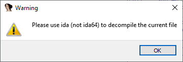

The Hex-Rays decompiler is one of the most powerful add-ons available for IDA. While it’s quite intuitive once you get used to it, it may be non-obvious how to start using it.  
Hex-Rays 反编译器是 IDA 功能最强大的插件之一。虽然使用起来非常直观，但如何开始使用可能并不明显。

### Basic information 基本信息

As of the time of writing (May 2021), the decompiler is _not_ included with the standard IDA Pro license; some editions of IDA Home and IDA Free include a [cloud decompiler](https://www.hex-rays.com/products/idahome/ida-home-cloud-based-decompilers-beta-testing/), but the offline version requires IDA Pro and must be purchased separately.  
截至本文撰写之时（2021 年 5 月），反编译器不包含在标准 IDA Pro 许可中；某些 IDA Home 和 IDA Free 版本包含云反编译器，但离线版本需要 IDA Pro，且必须单独购买。  
The following decompilers are currently available:  
目前可用的反编译器如下

-   x86 (32-bit) x86 (32 位)
-   x64 (64-bit) x64（64 位）
-   ARM (32-bit) ARM（32 位）
-   ARM64 (64-bit) ARM64（64 位）
-   PPC (32-bit) PPC（32 位）
-   PPC64 (64-bit) PPC64（64 位）
-   MIPS (32-bit) MIPS（32 位）

### Pick the matching IDA  
选择匹配的 IDA

The decompiler must be used with the matching IDA: 32-bit decompilers only work with 32-bit IDA (e.g. `ida.exe`) while 64-bit ones require `ida64`. If you open a 32-binary in IDA64 and press F5, you’ll get a warning:  
反编译器必须与相匹配的 IDA 一起使用：32 位的反编译器只能与 32 位的 IDA 一起使用（例如 `ida.exe` ），而 64 位的反编译器则需要 `ida64` 。 如果你在 IDA64 中打开一个 32 位的二进制文件并按 F5 ，你会得到一个警告：

If you try to decompile a file for which you do not have a decompiler, a different error is displayed:  
如果您尝试反编译一个您没有反编译器的文件，则会显示不同的错误：

### Invoking the decompiler 调用反编译器

The decompiler can be invoked in the following ways:  
可以通过以下方式调用反编译器：

1.  View > Open subviews > Generate pseudocode (or simply F5). This always opens a new pseudocode view (up to 26);  
    视图 > 打开子视图 > 生成伪代码（或直接 F5 ）。这总是会打开一个新的伪代码视图（最多 26 个）；
2.  Tab switches to the last active pseudocode view and decompiles current function. If there are none, a new view  is opened just like with F5.  
    Tab 会切换到上一个激活的伪代码视图，并反编译当前函数。如果没有，则会像 F5 一样打开一个新的视图。  
    Tab can also be used to switch from pseudocode back to the disassembly. Whenever possible, it tries to jump to the corresponding location in the other view.  
    Tab 也可用于从伪码切换回反汇编。在可能的情况下，它会尝试跳转到其他视图中的相应位置。
3.  Full decompilation of the whole database can be requested via File > Produce file > Create C file… (hotkey Ctrl+F5). This command decompiles selected or all functions in the database (besides those marked as library functions) and writes the result to a text file.  
    可以通过文件 > 生成文件 > 创建 C 文件...（热键 Ctrl + F5 ）请求对整个数据库进行全面反编译。该命令会反编译数据库中的选定函数或所有函数（除了那些标记为库函数的函数），并将结果写入文本文件。

### Changing options 更改选项

Because of its origins as a standalone plugin, the decompiler’s options are not currently present in the Options menu but are accessed via Edit > Plugins  > Hex-Rays Decompiler.  
由于是独立插件，反编译器的选项目前不在选项菜单中，而是通过编辑 > 插件 > Hex-Rays 反编译器访问。

This dialog changes options for the current database. To change them for all future files, edit `cfg/hexrays.cfg`. Instead of editing the file in IDA’s directory, you can create one with only changed options in the [user directory](https://www.hex-rays.com/blog/igors-tip-of-the-week-33-idas-user-directory-idausr/). The available options are explained [in the manual](https://www.hex-rays.com/products/decompiler/manual/config.shtml).  
此对话框可更改当前数据库的选项。要更改以后所有文件的选项，请编辑 `cfg/hexrays.cfg` 。 与其编辑 IDA 目录中的文件，不如在用户目录中创建一个只包含已更改选项的文件。可用选项在手册中有详细说明。