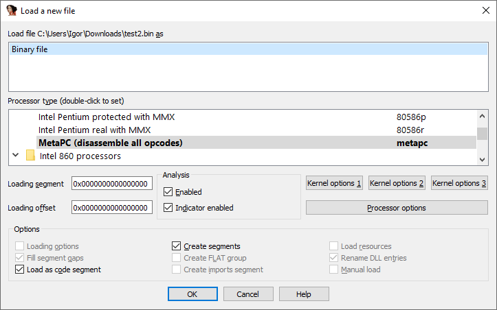
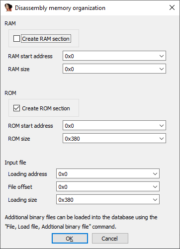
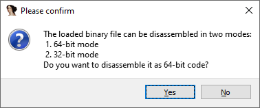
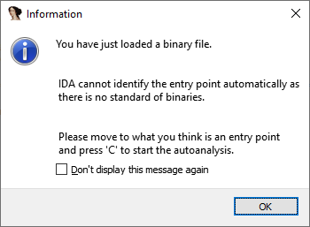
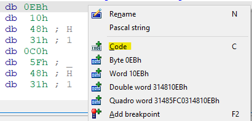
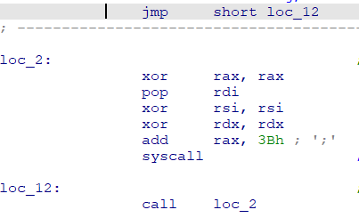
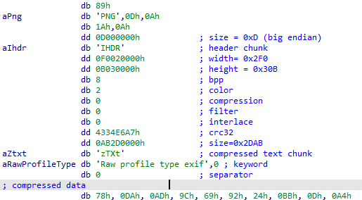

IDA supports more than 40 file formats out of box. Most of them are structured file formats – with defined headers and metadata – so they’re recognized and handled automatically by IDA. However, there are times when all you have is just a piece of a code without any headers (e.g. shellcode or raw firmware) which you want to analyze in IDA. In that case, you can use the binary loader. It is always available even if the file is recognized as another file format.  
IDA 支持 40 多种开箱即用的文件格式。其中大多数都是结构化文件格式--带有定义的标题和元数据--因此 IDA 可以自动识别和处理它们。不过，有时您只拥有一段没有任何头文件的代码（如 shellcode 或原始固件），而您希望在 IDA 中对其进行分析。在这种情况下，您可以使用二进制加载器。即使文件被识别为其他文件格式，它也始终可用。

### Processor selection 处理器选择

Since raw binaries do not have metadata, IDA does not know which processor module to use for it, so you should pick the correct one. By default, the **metapc** (responsible for x86 and x64 disassembly) is selected, but you can choose another one from the list (double-click to change).  
由于原始二进制文件没有元数据，IDA 不知道该使用哪个处理器模块，所以你应该选择正确的处理器模块。默认情况下，会选择 metapc（负责 x86 和 x64 反汇编），但你也可以从列表中选择另一个（双击可更改）。

### Memory loading address 内存加载地址

Without metadata, IDA also does not know at which address to place the loaded data, so you may need to help it. The _Loading segment_ and _Loading offset_ fields are valid for the x86 family only. If the code being loaded uses a flat memory model (such as 32-bit protected mode or 64-bit long mode), Loading segment should be left at 0 and the address specified in the Loading offset field.  
在没有元数据的情况下，IDA 也不知道应将加载的数据放在哪个地址，因此您可能需要帮助它。加载段和加载偏移量字段仅对 x86 系列有效。如果加载的代码使用扁平内存模式（如 32 位保护模式或 64 位长模式），加载段应保持为 0，并在加载偏移量字段中指定地址。

Other processors such as ARM, MIPS, or PPC, do not use these fields but prompt for memory layout after you confirm the initial selection.  
其他处理器（如 ARM、MIPS 或 PPC）不使用这些字段，但会在确认初始选择后提示内存布局。

In this dialog you can specify where to place the data and whether to create an additional RAM section. By default the whole file is placed at address 0 in the ROM segment but you can specify a different one or load only a part of the file by changing the file offset and loading size.  
在此对话框中，您可以指定放置数据的位置以及是否创建额外的 RAM 部分。默认情况下，整个文件放置在 ROM 段的地址 0 处，但您可以指定不同的地址，或通过更改文件偏移和加载大小只加载文件的一部分。

### Code bitness 代码位数

For processors where instruction decoding changes depending on current mode, such as PC (16-bit mode, 32-bit protected mode, or 64-bit long mode)  or ARM (AArch32 or AArch64), you may get one more additional question.  
对于指令解码会根据当前模式而改变的处理器，如 PC（16 位模式、32 位保护模式或 64 位长模式）或 ARM（AArch32 或 AArch64），可能还会遇到一个额外的问题。

### Start disassembling 开始反汇编

Finally, the file is loaded, but IDA can’t decide how to disassemble it on its own.  
最后，文件已加载，但 IDA 无法自行决定如何反汇编。

As suggested by the dialog, you can use C (make code) to try decoding at locations which look like valid instructions. Typically, shellcode will have valid instructions at the beginning, and firmware for most processors either starts at the lowest address or uses a vector table (a list of addresses) pointing to code.  
根据对话框的建议，可以使用 C （make code）在看起来像有效指令的位置尝试解码。通常情况下，shellcode 会在开头包含有效指令，而大多数处理器的固件要么从最低地址开始，要么使用向量表（地址列表）指向代码。

  
 

In addition to shellcode or firmware, the binary file loader can be used to analyze other kinds of files using IDA’s powerful features for marking up and labeling data and code. For example, here’s a PNG file labeled and commented in IDA:  
除了 shellcode 或固件，二进制文件加载器还可用于分析其他类型的文件，使用 IDA 强大的功能来标记和标注数据和代码。例如，下面是一个在 IDA 中标注和注释的 PNG 文件：

