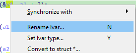
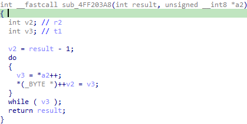
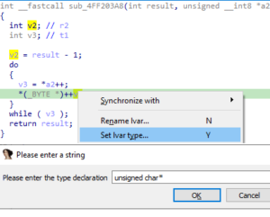
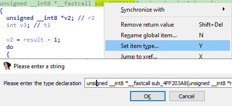
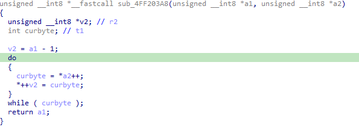

之前我们介绍过如何开始使用反编译器，但未经修改的反编译输出并不总是易于阅读，尤其是在二进制文件没有符号或调试信息的情况下。 不过，只需做一些小的改动，就能显著提升可读性。 下面我们来看一下伪代码视图中可用的一些基本交互操作。

### 重命名（Renaming）

虽然听起来很简单，但重命名可以极大地改善可读性。 即使只是将 `v3` 改成 `counter` 这样简单的操作，也能立刻让函数的逻辑更清晰。 结合 IDA 7.6 引入的自动重命名功能，这可以帮助你在分析过程中将更好的名字传播到整个伪代码中。

在伪代码视图中，可以直接重命名以下项目：

- 局部变量
- 函数参数
- 函数名
- 全局变量（数据项）
- 结构体成员

重命名非常简单：将光标放在要重命名的项目上，按 `N`（与反汇编列表中相同的快捷键）。 当然，该命令也可以在右键菜单中找到。



你也可以选择在反汇编视图中进行重命名，而不是在伪代码中。 如果你打算在一个大型函数中重命名很多项目，并且不想每次都等待反编译完成，这种方法会很有用。 完成重命名后，按 `F5` 刷新伪代码，就能看到所有新名字。

注意：寄存器分配的局部变量不能在反汇编中重命名，只能在伪代码视图中管理。

### 重新定义类型（Retyping）

类型恢复是反编译中最难的问题之一。 一旦代码被转换成机器指令，就不再有类型信息，只有在 CPU 层面被操作的比特。 反编译器可以做一些推测，例如数据大小、是否被当作有符号值处理等，但总体来说，高层类型恢复仍然是一个需要人类参与的挑战。

例如，考虑下面这个小的 ARM 函数：

```asm
sub_4FF203A8
  SUB R2, R0, #1
loc_4FF203AC
  LDRB R3, [R1],#1
  CMP R3, #0
  STRB R3, [R2,#1]!
  BNE loc_4FF203AC
  BX LR
```

它的初始反编译结果大致如下：

- 反编译器能推测出第二个参数（`a2`，在 `R1` 中传递）的类型，因为它在 `LDRB` 指令中被使用（加载字节）。
- 但 `v2` 仍然是一个 `int`，因为它的第一个操作是简单的算术减法（`SUB`）。
- 经过分析，很明显 `v2` 和 `result` 其实也是字节指针，减法只是指针运算（在 CPU 层面，指针就是数字）。



我们可以通过将这两个变量的类型都改为 `unsigned __int8 *`（或等价的 `unsigned char *`）来修正。 方法是将光标放在变量上，按` Y`，或在右键菜单中选择 `Set lvar type`。



另一种方法是直接编辑函数原型（在第一行函数名上使用快捷键）。



这样第一个参数的类型会自动传播到局部变量中，你就不必手动修改它了（用户提供的类型优先于推测类型）。



在最终版本中，不再有类型转换，代码的意图也更清晰了。

原文地址：https://hex-rays.com/blog/igors-tip-of-the-week-42-renaming-and-retyping-in-the-decompiler
