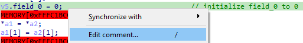
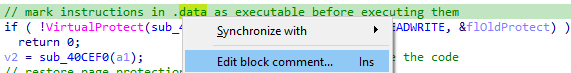
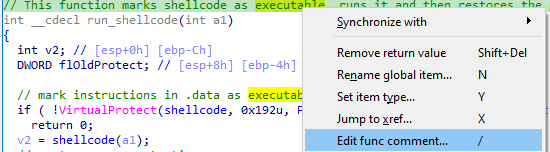
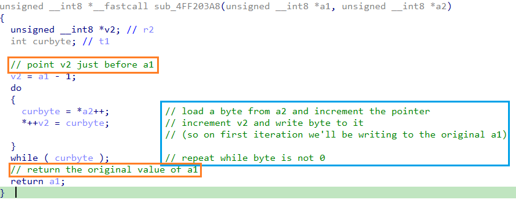
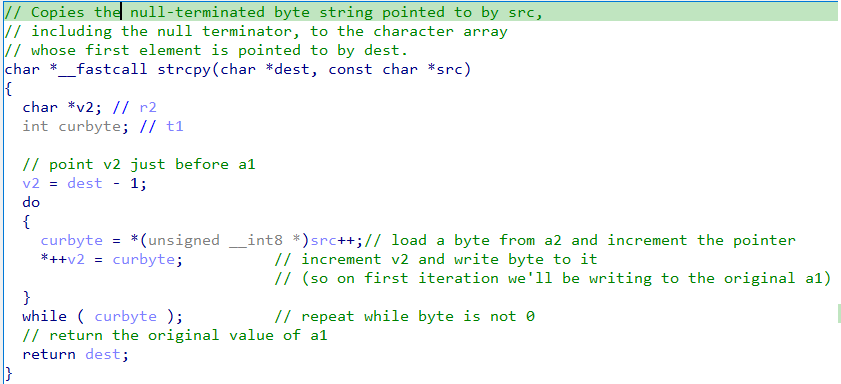
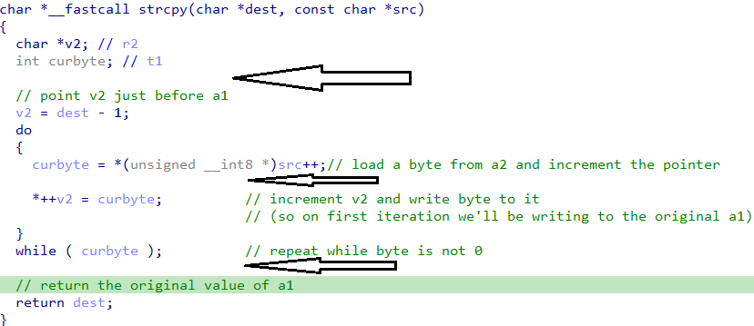
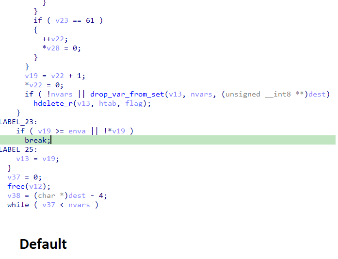
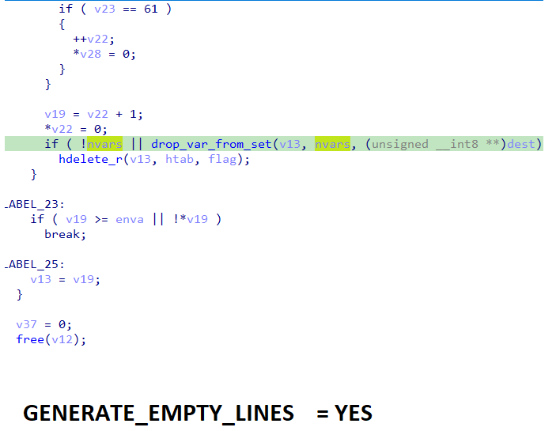

[Last week](https://hex-rays.com/blog/igors-tip-of-the-week-42-renaming-and-retyping-in-the-decompiler/) we started improving decompilation of a simple function. While you can go quite far with renaming and retyping, some things need more explanation than a simple renamng could provide.  
上周，我们开始改进一个简单函数的反编译。虽然重命名和重打可以做得很好，但有些事情需要更多的解释，而不是简单的重命名。

### Comments 注释

When you can’t come up with a good name for a variable or a function, you can add a comment with an explanation or a theory about what’s going on. The following comment types are available in the pseudocode:  
当您无法为变量或函数取一个好名字时，可以添加注释，解释或说明发生了什么。在伪代码中可以使用以下注释类型：

1.  Regular end-of-line comments. Use / to add or edit them (easy to remember because in C++ `//` is used for comments).  
    常规行尾注释。使用 / 添加或编辑它们（很容易记住，因为在 C++ 中 `//` 用于注释）。  
    
2.  Block comments. Similarly to [anterior comments](https://hex-rays.com/blog/igor-tip-of-the-week-14-comments-in-ida/) in the disassembly view, the Ins shortcut is used (I on Mac). The comment is added before the current statement (not necessarily the current line).  
    块注释。与反汇编视图中的前注释类似，使用 Ins 快捷键（Mac 上使用 I ）。注释添加在当前语句（不一定是当前行）之前。  
    
3.  Function comment is added when you use / on the first line of the function.  
    在函数的第一行使用 / 时，将添加函数注释。  
    

Due to limitations of the [implementation](https://hex-rays.com/blog/coordinate-system-for-hex-rays/), the first two types can move around or even end up as orphan comments when the pseudocode changes. The function comment is attached to the function itself and is visible also in the disassembly view.  
由于实现方式的限制，前两种类型的注释可能会移动，甚至在伪代码发生变化时成为无主注释。函数注释附于函数本身，在反汇编视图中也可见。

Using the comments, we can annotate the function [from the previous post](https://hex-rays.com/blog/igors-tip-of-the-week-42-renaming-and-retyping-in-the-decompiler/) to clarify what is going on. On the screenshot below, regular comments are highlighted in blue while block comments are outlined in orange.  
使用注释，我们可以对上一篇文章中的功能进行注释，以说明发生了什么。在下面的截图中，常规注释以蓝色标出，而块注释则以橙色勾勒。

In the end, the function seems to be copying bytes from a2 to a1, stopping at the first zero byte. If you know libc, you’ll quickly realize that it’s actually a trivial implementation of [`strcpy`](https://en.cppreference.com/w/c/string/byte/strcpy). We can now rename the function and arguments to the canonical names and add a function comment explaining the purpose of the function.  
最后，函数似乎在从 a2 复制字节到 a1，并在第一个零字节处停止。如果你了解 libc，就会很快意识到这其实是 `strcpy` 的一个微不足道的实现。现在我们可以将函数和参数重命名为规范名称，并添加一个函数注释来解释函数的目的。

Alas, the existing comments are not updated automatically, so references to `a1` and `a2` would have to be fixed manually.  
可惜的是，现有注释不会自动更新，因此必须手动修复对 `a1` 和 `a2` 的引用。

### Empty lines 空行

 To improve the readability of pseudocode even further, you can add empty lines either manually or automatically. For manual lines, press Enter after or before a statement. For example, here’s the same function with extra empty lines added:  
为了进一步提高伪代码的可读性，您可以手动或自动添加空行。要手动添加空行，请在语句之后或之前按 Enter 。例如，下面是添加了额外空行的同一个函数：

To remove the manual empty lines, edit the anterior comment (Ins or I on Mac) and remove the empty lines from the comment.  
要移除手动添加的空行，请编辑前注释（Mac 上为 Ins 或 I ）并移除注释中的空行。

To add automatic empty lines, set `GENERATE_EMPTY_LINES = YES` in `hexrays.cfg`. This will cause the decompiler to add empty lines between compound statements as well as before labels. This improves readability of long or complex functions. For example, here’s a decompilation of the same function with both settings. You can see that the second one reads easier thanks to extra spacing.  
要自动添加空行，请在 `hexrays.cfg` 中设置 `GENERATE_EMPTY_LINES = YES` 。这将导致反编译器在复合语句之间以及标签之前添加空行。这将提高长函数或复杂函数的可读性。例如，下面是同一函数在两种设置下的反编译结果。可以看到，由于增加了间距，第二个函数更容易阅读。

