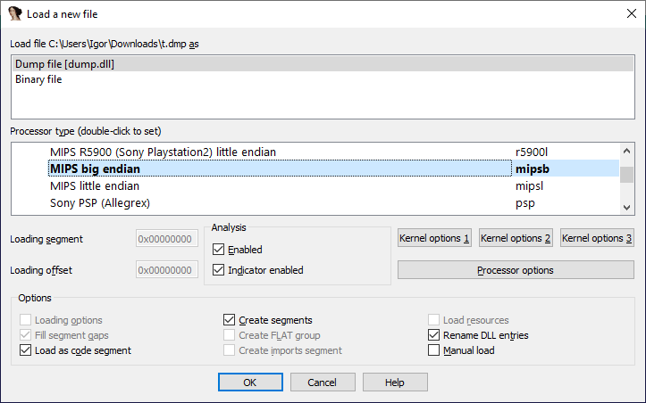
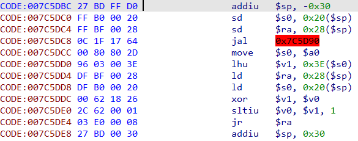

IDA has a file loader named ‘hex’ which mainly supports loading of text-based file formats such as [Intel Hex](https://en.wikipedia.org/wiki/Intel_HEX) or [Motorola S-Record](https://en.wikipedia.org/wiki/SREC_(file_format)). These formats contain records with addresses and data in hexadecimal encoding.  
IDA 有一个名为 "hex "的文件加载器，主要支持加载基于文本的文件格式，如英特尔 Hex 或摩托罗拉 S-Record。这些格式包含十六进制编码的地址和数据记录。

For example, here’s a fragment of an Intel Hex file:  
例如，下面是一个英特尔十六进制文件的片段：

```
:18000000008F9603008FD801008FDC01008FE001008FE401008FE80190
:20004000008FEC01008FF001008FF401008FF801008FFC01008F0002008F0402008F08024D
:20006000008F0C02008F1002008F1402008F1802008F1C02008F2002008F2402008F280228
:14008000008F2C02008F3002008F3402008F3802008F3C0293
:1000A000008F4002008F4402008F4802008F4C02F4
:20010000008F5002008F5402008F5802008F5C02008F6002008F6402008F680243204C694C
:20012000627261727920436F707972696768742028432920313939352048492D5445434818
```

or an S-Record 或 S 记录

```
S0030000FC
S1230100810F0016490F0016816F8A0A0F00000098300016B2310016BC3300168E0D0016A7
S1230108280F00169A2900168A00F001866000080400000018230016792200160C00000032
S12301109800E00182A09E0B8000C2012A38001608000000EA3100163A380016FA310016CA
S1230118FF250016BE21001600000000182200169A0100169C330016F9C010010D000000D7
```

However, you may also have a simple unformatted hex dump, with or without addresses:  
不过，你也可能有一个简单的未格式化的十六进制转储文件，有地址或无地址：

```
0020: 59 69 74 54 55 B6 3E F7 D6 B9 C9 B9 45 E6 A4 52
1000: 12 23 34 56 78
0100: 31 C7 1D AF 32 04 1E 32 05 1E 3C 32 07 1E 21 D9
12 23 34 56 78
```

Such files are recognized and handled by another loader called ‘dump’. Since, like raw binaries, they do not carry information about the processor used, it has to be selected by the user.  
此类文件由另一个名为 "dump "的加载器识别和处理。与原始二进制文件一样，它们不包含所用处理器的信息，因此必须由用户选择。

For example, a hex dump of some MIPS code:  
例如，一些 MIPS 代码的十六进制转储文件：

```
007C5DBC 27 BD FF D0
007C5DC0 FF B0 00 20
007C5DC4 FF BF 00 28
007C5DC8 0C 1F 17 64
007C5DCC 00 80 80 2D
007C5DD0 96 03 00 3E
007C5DD4 DF BF 00 28
007C5DD8 DF B0 00 20
007C5DDC 00 62 18 26
007C5DE0 2C 62 00 01
007C5DE4 03 E0 00 08
007C5DE8 27 BD 00 30
```

can be loaded into IDA without having to convert it to binary or a structured format like ELF.  
可以加载到 IDA 中，而无需将其转换为二进制或类似 ELF 的结构化格式。





This feature could be useful when working with shellcode or exchanging data with other software. As we described before, IDA also supports [exporting data from database](https://hex-rays.com/blog/igors-tip-of-the-week-39-export-data/) as hexadecimal dump.  
这一功能在处理 shellcode 或与其他软件交换数据时非常有用。如前所述，IDA 还支持以十六进制转储形式从数据库导出数据。