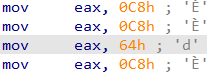
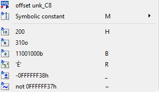
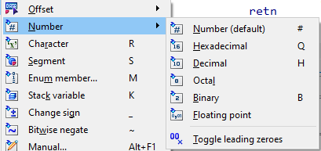
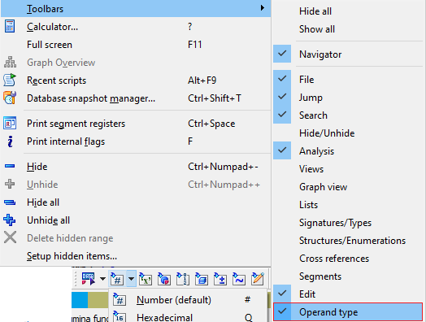
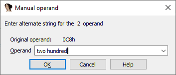

正如我们之前提到的，IDA 中的 “I” 代表 Interactive（交互式），我们已经介绍过反汇编视图中的一些交互功能，比如重命名或添加注释。 不过，还可以进行其他更改，例如更改 操作数表示法（在文档中有时称为操作数类型）。

### 这是什么？

大多数汇编器（和反汇编器）会用 助记符（表示指令的基本功能）和 操作数（指令作用的对象，通常用逗号分隔）来表示机器指令。

例如，考虑最常见的 x86 指令 `mov`，它将数据从一个操作数复制到另一个操作数：

- `mov rsp, r11` —— 将 `r11` 的值复制到 `rsp`
- `mov rcx, [rbx+8]` —— 从地址 (`rbx+8`) 处复制一个 64 位值到 `rcx` （C 语言等价形式：`rcx = *(int64*)(rbx+8);`）
- `mov [rbp+390h+var_380], 2000000h` —— 将常量 `2000000h`（C 语言写法 `0x2000000`）写入栈变量 `var_380`

前两个例子中，操作数分别是寄存器和带基址寄存器与位移的间接内存操作数；第三个例子中，一个操作数是内存位置，另一个是立即数（直接编码在指令中的常量）。

### 数字的多种表示

位移和立即数等数字可以有多种表示方式，例如：

```asm
mov eax, 64h
mov eax, 100
mov eax, 144o
mov eax, 1100100b
mov eax, 'd'
mov eax, offset byte_64
mov eax, mystruct.field_64
```

它们在二进制层面上的机器码完全相同：

```asm
B8 64 00 00 00
```

因此，改变操作数的表示方式只会影响显示效果，不会改变底层值或程序行为。 这让你可以选择最能体现代码意图的表示法，而无需在注释中写长篇解释。

### IDA 中可用的数字操作数表示法

（部分仅在特定情况下有意义）

- 默认数字表示（void）：快捷键：`#`。无特定覆盖时使用，具体格式取决于处理器模块，最常见是十六进制。 默认配色方案中为橙色。 如果值对应当前编码中的可打印字符，可能会显示字符注释（取决于处理器模块）。

  

- 十进制：快捷键：`H`
- 十六进制：快捷键：`Q`
- 二进制：快捷键：`B`
- 八进制：无默认快捷键，可通过右键菜单或 `Operand type` 工具栏选择。
- 字符常量：快捷键：`R`。如果可能，将操作数显示为字符常量。
- 结构体偏移：快捷键：`T`。将数字替换为匹配偏移的结构体成员引用。
- 枚举（符号常量）：快捷键：`M`。将数字替换为具有相同值的符号常量。
- 栈变量：快捷键：`K`。将数字替换为当前函数栈帧中的符号引用（通常用于涉及栈指针或帧指针的指令）。
- 浮点常量：仅在某些处理器和情况下有效，例如 `3F000000h` 实际是 IEEE-754 编码的 `0.5`。 无默认快捷键，可通过工具栏或主菜单转换。
- 偏移操作数： 快捷键：`O`、`Ctrl+O` 或 `Ctrl+R`（用于复杂偏移）。将数字替换为涉及程序中一个或多个地址的表达式。

所有快捷键如果再次应用，会恢复为默认表示。

除了快捷键外，最常见的转换可以通过右键菜单完成：



完整列表可在主菜单（`Edit > Operand Type`）中找到：


以及在 `Operand Type` 工具栏中找到：



除了改变数值基数外，还可以对操作数进行两种变换：

1. 取负（Negation）：快捷键：`_`（下划线） 例如，可以将 `0FFFFFFF8h` 显示为 `-8`（同一二进制值的两种表示）。
2. 按位取反（Bitwise negation，又称 inversion 或 binary NOT）：快捷键：`~`（波浪号） 例如，`0FFFFFFF8h` 可视为 `not 7` 。

最后，如果你想看到完全自定义的内容，而现有转换都不涵盖，可以使用手动操作数功能。 这允许你将操作数替换为任意文本；IDA 不会检查其正确性，因此需要你自己确保新表示与原值匹配。 快捷键：`Alt+F1` 。



原文地址：https://hex-rays.com/blog/igors-tip-of-the-week-46-disassembly-operand-representation
