Hints (aka tooltips) are popup windows with text which appear when you hover the mouse cursor over a particular item in IDA. They are available in many situations.  
提示（又称工具提示）是将鼠标光标悬停在 IDA 中特定项目上时出现的带有文本的弹出窗口。在许多情况下都可以使用。  

## Disassembly hints 反汇编提示

In the disassembly view, hints can be shown in the following cases:  
在反汇编视图中，提示可在以下情况下显示：

1.  When hovering over names or addresses, a fragment of disassembly at the destination is shown.   
    将鼠标悬停在名称或地址上时，会显示目的地的反汇编片段。  
    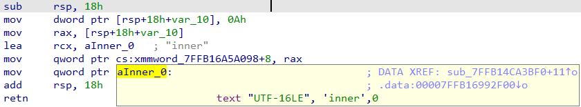
2.  When hovering over stack variables, a fragment of the stack frame layout is shown  
    将鼠标悬停在堆栈变量上时，会显示堆栈帧布局的片段  
    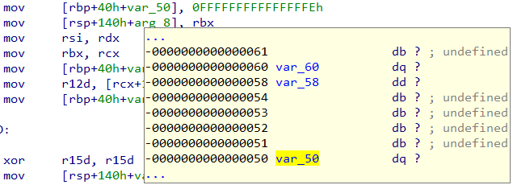
3.  When hovering  over structure offset operands, the fragment of the struct definition.  
    将鼠标悬停在结构偏移操作数上时，会显示结构定义的片段。  
    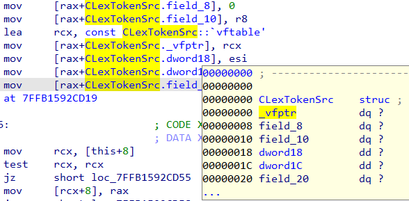
4.  For enum operands – the enum with the definition.  
    对于枚举操作数 - 包含定义的枚举。  
    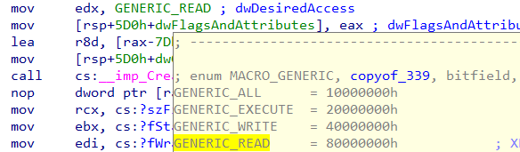
5.  For [renamed registers](https://hex-rays.com/blog/igors-tip-of-the-week-24-renaming-registers/), the hint shows the original register name  
    对于重命名的寄存器，提示会显示原来的寄存器名称  
    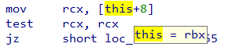

All these hints except the last one can be expanded or shrunk using the **mouse wheel**.  
除最后一个提示外，其他提示均可使用鼠标滚轮进行扩展或缩小。

## Decompiler hints 反编译器提示

In the pseudocode, the hints are shown for:  
在伪代码中，显示了以下提示：

1.  Local variables and current function arguments: type and location (register or stack).  
    局部变量和当前函数参数：类型和位置（寄存器或堆栈）。  
    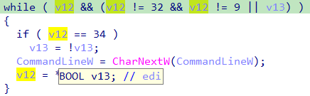
2.  global variables: type. 全局变量：类型。  
    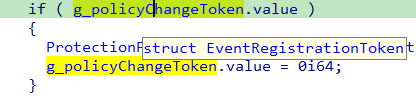
3.  structure or union members: member type and offset.  
    结构或联合成员：成员类型和偏移量。  
    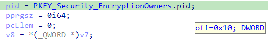
4.  function calls: prototype and information about arguments and return value.  
    函数调用：原型、参数信息和返回值。  
    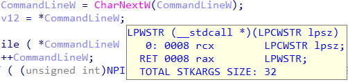
5.  other expressions and operators: type, signedness, etc.  
    其他表达式和运算符：类型、有符号性等。  
    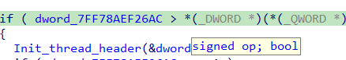

## Debugger hints 调试器提示

During debugging, the hints behave mostly in the same way but with addition of dynamic information:  
在调试过程中，提示的行为方式基本相同，但增加了动态信息：

1.  In the disassembly view, hovering on instruction operands shows a hint with their values and, if the value resolves to a valid address, a fragment of memory at that address.  
    在反汇编视图中，将鼠标悬停在指令操作数上会显示其值提示，如果该值解析为有效地址，则会显示该地址的内存片段。  
    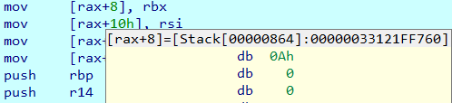
2.  In pseudocode, values of variables are shown in hints.  
    在伪代码中，变量值显示在提示中。  
    

## Configuring hints 配置提示

The way hints work can be configured via Options > General…, Browser tab. You can set how many lines are displayed by default and the delay before the hint is shown. The hints can be disabled completely by setting the number of lines to 0, or only disabled during the debugging (showing the hint during debugging may lead to memory reads which can be slow in some situations).  
提示的工作方式可通过 "选项">"常规..."，"浏览器 "选项卡进行配置。你可以设置默认显示多少行，以及显示提示前的延迟时间。可以通过将行数设置为 0 来完全禁用提示，也可以仅在调试期间禁用提示（在调试期间显示提示可能会导致内存读取，在某些情况下可能会很慢）。

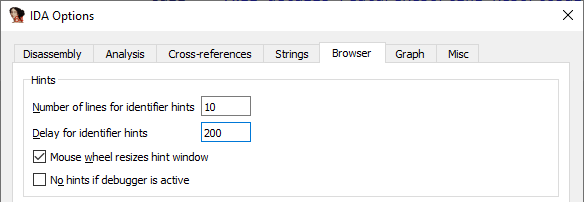

See also: [Browser options](https://hex-rays.com/products/ida/support/idadoc/1304.shtml)  
另请参见：浏览器选项

原文地址：