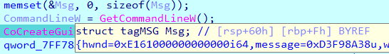

提示（也称为工具提示，tooltips）是在 IDA 中，当你将鼠标光标悬停在特定项目上时出现的带有文字的弹出窗口。它们在许多情况下都可用。

## 反汇编视图中的提示

在反汇编视图中，提示可能在以下情况下显示：

1. 当鼠标悬停在名称或地址上时，会显示目标位置的一段反汇编代码片段。

   

2. 当鼠标悬停在栈变量上时，会显示栈帧布局的一部分。

   

3. 当鼠标悬停在结构体偏移量操作数上时，会显示该结构体定义的片段。

   

4. 对于枚举操作数，会显示该枚举及其定义。

   

5. 对于已重命名的寄存器，提示会显示原始寄存器名称。

   

除最后一种情况外，所有这些提示都可以使用鼠标滚轮进行展开或收缩。

## 反编译视图（伪代码）中的提示

在伪代码视图中，提示会显示：

1. 局部变量和当前函数参数：类型以及位置（寄存器或栈）。

   

2. 全局变量：类型。

   

3. 结构体或联合体成员：成员类型和偏移量。

   

4. 函数调用：函数原型，以及参数和返回值的信息。

   

5. 其他表达式和运算符：类型、有符号/无符号等信息。

   

## 调试器中的提示

在调试过程中，提示的行为大体相同，但会增加动态信息：

1. 在反汇编视图中，将鼠标悬停在指令操作数上时，提示会显示它们的值；如果该值解析为有效地址，还会显示该地址处的一段内存内容。

   

2. 在伪代码视图中，提示会显示变量的当前值。

   

## 配置提示

提示的工作方式可以通过 `Options > General…` 菜单中的 `Browser` 选项卡进行配置。 你可以设置默认显示的行数，以及提示显示前的延迟时间。

- 将行数设置为 0 可以完全禁用提示。
- 也可以仅在调试期间禁用提示（因为调试期间显示提示可能会触发内存读取，在某些情况下会导致速度变慢）。

参见：[Browser options](https://hex-rays.com/products/ida/support/idadoc/1304.shtml)

原文地址：https://hex-rays.com/blog/igors-tip-of-the-week-47-hints-in-ida
