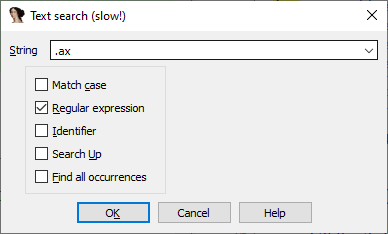
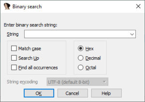
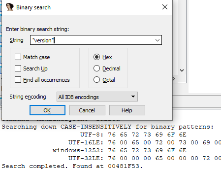
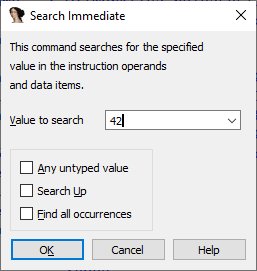
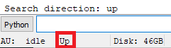
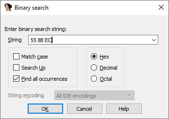
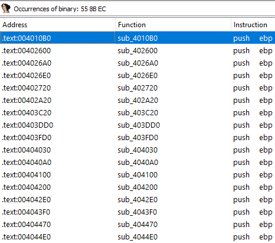

我们之前介绍过如何在选择器（列表视图）中搜索内容，但如果你需要在 IDA 的其他地方查找东西呢？

## 文本搜索（Text search）

当搜索文本内容时，相同的快捷键组合（`Alt+T` 开始搜索，`Ctrl+T` 继续搜索）几乎适用于 IDA 显示文本的任何地方：

- 反汇编视图（IDA View）
- 十六进制视图（Hex View）
- 反编译输出（伪代码）
- 输出窗口
- 结构体和枚举窗口
- 选择器（列表视图）

此搜索会匹配当前视图中任何位置的文本，例如指令和注释（如果存在）。 在主窗口中，也可以通过 `Search > Text…` 菜单访问此功能。



提示中的“(slow!)”表示文本搜索时，IDA 必须渲染搜索范围内的所有文本行，这在处理大型二进制文件时可能会很慢。不过，如果你需要正则匹配或在注释中搜索文本，这个等待可能是值得的。

## 二进制搜索（Binary search）

快捷键：`Alt+B` / `Ctrl+B`，或菜单 `Search > Sequence of bytes…`， 此功能允许在数据库中（包括调试时的进程内存）搜索字节序列（包括字符串字面量）和模式。



The input line accepts the following inputs:  
输入行接受以下输入：

1. 字节序列（空格分隔）：`01 02 03 04`

2. 带通配符的字节序列（`?` 表示任意字节）： 例如 `68 ? ? ? 0` 会匹配 `68 C4 1A 48 00` 和 `68 D8 1A 48 00`

3. 选定进制（十六进制、十进制或八进制）的一个或多个数字： 数字会根据当前处理器的字节序转换为最少的字节数。例如 `04469E0` 在 x86（小端）上会转换为 `E0 69 44`

4. 带引号的字符串字面量：例如 "Error"，会根据编码选择器的设置转换为字节。如果选择 `All Encodings` ，则会用所有已配置编码进行搜索

   

5. 宽字符字符串常量（如 L"test"）：仅使用 `UTF-16` 转换为原始字节

此功能适合查找数据区或指令中嵌入的值（立即数）。

## 立即数搜索（Immediate search）

如前所述，同一条指令的操作数在 IDA 中可能有不同表示方式。例如：

```
test dword ptr [eax], 10000h
test dword ptr [eax], 65536
test dword ptr [eax], AW_HIDE
```

如果用文本搜索 `10000h`，IDA 只会找到第一种形式，而不会匹配另外两种。

在 x86 上，你可以用二进制搜索 `10000`（会转换为字节序列 `00 00 01`），但对于非字节对齐编码的处理器，这种方法可能无效，或者会产生大量误报。

**立即数搜索的优势：**

- 只检查带数值操作数的指令或数据项，速度更快且减少误报
- 按数值比较操作数，不受表示方式变化影响，可以匹配上述三种形式

快捷键：`Alt+I` / `Ctrl+I`，或菜单 `Search > Immediate value…`



数值可用 C 语法输入任意进制（十进制、十六进制、八进制）。

## 搜索方向（Search direction）

默认情况下，所有搜索都是从当前位置向下（地址递增方向）进行。 你可以在搜索对话框中勾选 `Search Up` 来改变方向，或提前通过 `Search > Search direction` 设置。 当前设置会显示在菜单项和 IDA 状态栏中。



“搜索下一个”命令和快捷键（`Ctrl+T`, `Ctrl+B`, `Ctrl+I`）也会使用此设置。

### 查找所有匹配项（Find all occurrences）



勾选此选项，可以将整个数据库或视图的搜索结果一次性列出，方便逐一查看，而不是一个个跳转。



## 搜索类型选择建议

这不是完整指南，但有一些建议：

- **程序显示的文本（提示或错误信息）**：二进制搜索带引号的子串（注意：如果字符串不在硬编码中，而是在外部文件或资源流中，IDA 无法搜索到）
- **魔数或错误码**：立即数搜索（有时二进制搜索数值也可行）
- **没有明显交叉引用的地址**：二进制搜索该地址值（仅当引用直接使用该值时有效）
- **特定指令操作码模式**：二进制搜索字节序列（可带通配符）
- **没有固定编码的指令**：文本搜索助记符和/或操作数（可用正则表达式）

更多信息： [Search submenu](https://hex-rays.com/products/ida/support/idadoc/568.shtml)

原文地址：https://hex-rays.com/blog/igors-tip-of-the-week-48-searching-in-ida
