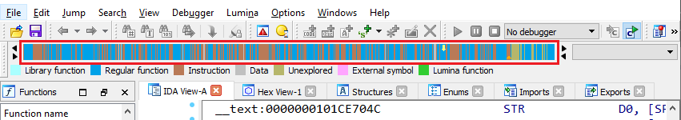
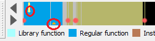
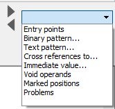
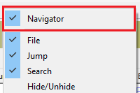
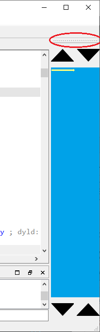
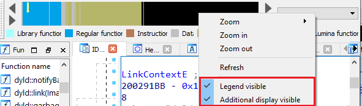
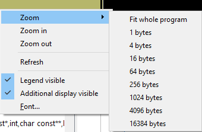

导航条（Navigation band），有时也称为 navigator 或 navbar，是 IDA 窗口顶部工具栏区域默认显示的 UI 元素。

它提供了被分析程序的全局概览，让你可以快速判断程序的分析完成度，以及哪些区域可能需要关注。

### 颜色说明

颜色含义可在图例（legend）中查看，默认配色方案如下：

- **青色/蓝绿色（Cyan/Turquoise）**：库函数（Library functions），即通过 FLIRT 签名识别出的函数。通常来自编译器或第三方库，而非程序员自己编写的代码，因此往往可以忽略。
- **蓝色（Blue）**：普通函数（Regular functions），即未被 FLIRT 或 Lumina 识别的函数。这些函数可能包含程序的自定义功能。
- **栗色/棕色（Maroon/Brown）**：不属于任何函数的指令（code）。可能是 IDA 未检测到或错误检测了函数边界，也可能是代码混淆导致无法正确创建函数，或者是数据被误当作代码。
- **灰色（Gray）**：数据（Data）。用于所有已定义的数据项（字符串字面量、数组、单个变量等）。
- **橄榄色（Olive）**：未探索字节（Unexplored bytes），即尚未被转换为代码或数据的区域。
- **洋红色（Magenta）**：从其他模块导入的函数或数据（包括导入函数的包装桩）。
- **黄绿色（Lime green）**：由 Lumina 识别的函数，可能是库函数，也可能是之前在其他二进制文件中见过并被用户上传到公共 Lumina 服务器的自定义函数。

颜色可在更改配色方案时统一调整，或在 `Options > Colors… > Navigation band` 中单独修改。

### 指示符（Indicators）

除了颜色，导航条上还可能出现额外的指示符：

- **黄色箭头**：当前反汇编视图（IDA View）中的光标位置。

- **小橙色三角形**：当前自动分析（autoanalysis）的位置，仅在自动分析进行中可见。

### 附加显示（Additional display）

导航条右侧的下拉框（combobox）可添加额外标记，例如：

- 入口点（导出函数）
- 二进制或文本模式搜索结果
- 立即数搜索结果
- 指向特定地址的交叉引用
- 书签位置

这些标记会显示为红色圆点，点击即可跳转。

### 配置（Configuration）

可通过 `View > Toolbars > Navigator` 或工具栏右键菜单显示/隐藏导航条。

可用拖动手柄将其放置在 IDA 窗口的四个边任意一侧。

在水平位置时，可通过右键菜单显示/隐藏图例和附加显示下拉框。

### 导航与缩放（Navigation and zooming）

- 默认情况下，导航条显示整个程序。
- 可通过 `Ctrl + 鼠标滚轮` 或右键菜单缩放，查看特定部分的更详细视图。
- 数值选项表示导航条上每个像素代表的程序字节数。
- 缩放后，可用鼠标滚轮或两端的箭头按钮滚动可见区域。
- 点击导航条任意位置可直接跳转到反汇编视图对应位置。

### 小结

这篇技巧介绍了 IDA 导航条 的作用、颜色含义、附加标记、配置方法以及缩放导航技巧。 它不仅能帮助你快速评估分析进度，还能通过颜色和标记快速定位潜在问题区域（如未识别的函数、混淆代码、未探索字节等），是逆向分析中非常高效的全局导航工具

原文地址：https://hex-rays.com/blog/igors-tip-of-the-week-49-navigation-band
