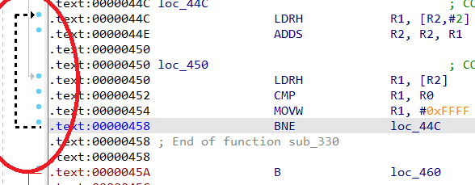
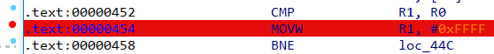

Although nowadays most IDA users probably use the [graph view](https://hex-rays.com/blog/igors-tip-of-the-week-23-graph-view/), the text view can still be useful in certain situations. In case you haven’t noticed, it has a UI element which can help you visualize code flow even without the full graph and even outside of functions (the graph view is available only for functions). This element is shown on the left of the disassembly listing:  
虽然现在大多数 IDA 用户可能都在使用图形视图，但在某些情况下，文本视图仍然很有用。如果你没有注意到，它有一个 UI 元素，即使没有完整的图形，甚至在函数之外（图形视图仅适用于函数），也能帮助你可视化代码流。该元素显示在反汇编列表的左侧：

The arrows represent code flow (cross-references) and the following types may be present:  
箭头代表代码流（交叉引用），可能存在以下类型：

-   Solid lines represent unconditional jumps/branches, dashed lines – conditional ones;  
    实线表示无条件跳转/分支，虚线表示有条件跳转/分支；
-   Thick arrows are used for jumps back to lower addresses (they indicate potential loops);  
    粗箭头用于跳回低地址（表示可能的循环）；
-   The current arrow is highlighted in black;  
    当前箭头以黑色高亮显示；
-   Red arrows are used when target and/or destination lies outside of the function boundaries   
    当目标和/或目的地位于函数边界之外时，使用红色箭头。

In addition to arrows, the blue dots indicate potential breakpoint location, so the breakpoint can be added by clicking on the dot, which will highlight the whole line red to indicate an active breakpoint.  
除箭头外，蓝色圆点还表示潜在的断点位置，因此可以通过点击圆点来添加断点，这样整行就会高亮显示为红色，表示活动断点。

