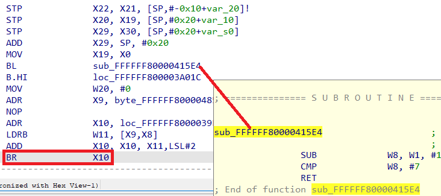
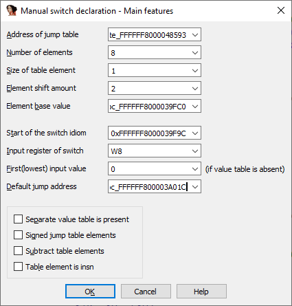
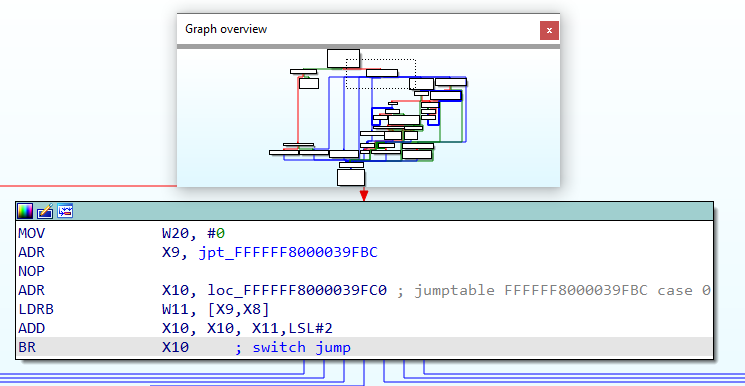
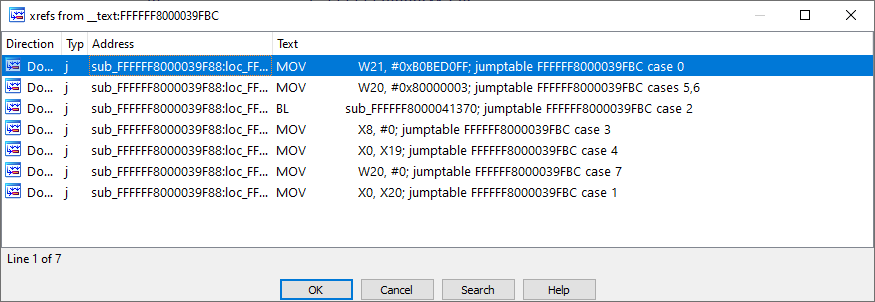

IDA supports most of the switch patterns produced by major compilers out-of-box and usually you don’t need to worry about them. However, occasionally you may encounter a code which has been produced by an unusual or a very recent compiler version, or some peculiarity of the code prevented IDA from recognizing the pattern, so it may become necessary to help IDA and tell it about the switch so a proper function graph can be presented and decompiler can produce nice pseudocode.  
IDA 支持大多数由主要编译器产生的开关模式，通常您不需要担心这些问题。不过，有时您可能会遇到不常见的编译器版本或最近的编译器版本产生的代码，或者代码的某些特殊性导致 IDA 无法识别该模式，因此有必要帮助 IDA 并告诉它有关切换的信息，这样就可以显示适当的函数图，反编译器也可以生成漂亮的伪代码。

### Switch pattern components  
开关模式组件

The common switch pattern is assumed to have the following components:  
普通开关模式假定由以下部分组成：

1.  indirect jump 间接跳跃  
    This is an instruction which actually performs the jump to the destination block handling the switch case; usually involves some register holding the address value;  
    这是一条实际执行跳转到目标块的指令，用于处理切换情况；通常涉及一些寄存器，用于保存地址值；
2.  jump table 跳转表  
    A table of values, containing either direct addresses of the destination blocks, or some other values allowing to calculate those addresses (e.g. offsets from some _base_ address). It has to be of a specific fixed _size_ (number of elements) and the values may be scaled with a _shift_ value. Some switches may use two tables, first containing indexes into the second one with addresses.  
    一个值表，包含目标块的直接地址，或其他一些可以计算这些地址的值（例如从某个基地址出发的偏移量）。跳转表必须具有特定的固定大小（元素数量），其值可通过移位值缩放。有些开关可能使用两个表，第一个表包含索引，第二个表包含地址。
3.  input register 输入寄存器  
    register containing the initial value which is being used to determine the destination block. Most commonly it is used to index the jump table.  
    包含初始值的寄存器，用于确定目标块。它通常用于索引跳转表。

### Switch formula 切换公式

The standard switches are assumed to use the following calculation for the destination address:  
标准开关假定使用以下方法计算目标地址：

```
target = base +/- (table_element &lt;&lt; shift)
```

`base` and `shift` can be set to zero if not used.  
`base` 和 `shift` 如果不使用，可设置为零。

### Example 示例

Here’s a snippet from an ARM64 firmware.  
下面是 ARM64 固件中的一个片段。



The indirect jump is highlighted with the red rectangle. Here’s the same code in text format:  
红色矩形突出显示了间接跳转。下面是文本格式的相同代码：

```
__text:FFFFFF8000039F88 STP X22, X21, [SP,#-0x10+var_20]!
__text:FFFFFF8000039F8C STP X20, X19, [SP,#0x20+var_10]
__text:FFFFFF8000039F90 STP X29, X30, [SP,#0x20+var_s0]
__text:FFFFFF8000039F94 ADD X29, SP, #0x20
__text:FFFFFF8000039F98 MOV X19, X0
__text:FFFFFF8000039F9C BL sub_FFFFFF80000415E4
__text:FFFFFF8000039FA0 B.HI loc_FFFFFF800003A01C
__text:FFFFFF8000039FA4 MOV W20, #0
__text:FFFFFF8000039FA8 ADR X9, byte_FFFFFF8000048593
__text:FFFFFF8000039FAC NOP
__text:FFFFFF8000039FB0 ADR X10, loc_FFFFFF8000039FC0
__text:FFFFFF8000039FB4 LDRB W11, [X9,X8]
__text:FFFFFF8000039FB8 ADD X10, X10, X11,LSL#2
__text:FFFFFF8000039FBC BR X10
```

We can see that the register used in the indirect branch (`X10`) is a result of some calculation so it is probably a switch pattern. However, because the code was compiled with size optimization (the range check is moved into a separate function used from several places), IDA was not able to match the pattern in the automatic fashion. Let’s see if we can find out components of the standard switch described above.  
我们可以看到，间接分支中使用的寄存器（ `X10` ）是某种计算的结果，因此很可能是一个开关模式。不过，由于代码在编译时进行了大小优化（范围检查被移到了一个单独的函数中，从多个地方使用），IDA 无法自动匹配该模式。让我们看看能否找出上述标准开关的组成部分。

The formula matches the instruction `ADD X10, X10, X11,LSL#2`(in C syntax: `X10 = X10+(X11<<2)`). We can see that the table element (`X11`) is shifted by 2 before being added to the base (`X10`). The value of `X11` comes from the  previous load of `W11` using `LDRB` (load _byte_) from the table at `X9` and index `X8`. Thus:  
该公式与指令 `ADD X10, X10, X11,LSL#2` （C 语言语法： `X10 = X10+(X11<<2)` ）相匹配。我们可以看到，表元素 ( `X11` ) 在加到基数 ( `X10` ) 前被移位 2。 `X11` 的值来自之前使用 `LDRB` （加载字节）从 `X9` 的表和索引 `X8` 中加载的 `W11` 。因此

1.  Indirect jump: yes, the `BR X10` instruction at `FFFFFF8000039FBC`.  
    间接跳转：是，在 `FFFFFF8000039FBC` 处的 `BR X10` 指令。
2.  jump table: yes, at `byte_FFFFFF8000048593`. Additionally, we have a _base_ at `loc_FFFFFF8000039FC0` and _shift_ value of **2**. It contains **eight** elements (this can be checked visually or deduced from the range check which uses **7** as the maximum allowed value).  
    跳转表：是，在 `byte_FFFFFF8000048593` 处。此外，我们在 `loc_FFFFFF8000039FC0` 处有一个基数，移位值为 2。它包含 8 个元素（可通过目视检查或范围检查推断，范围检查使用 7 作为允许的最大值）。
3.  input register: yes, `X8` is used to index the table (we can also use **W8** which is the 32-bit part of `X8` and is used by the range check function.  
    输入寄存器：是的， `X8` 用于索引表（我们也可以使用 W8，它是 `X8` 的 32 位部分，用于范围检查功能。

Now that we have everything, we can specify the pattern by putting the cursor on the indirect branch and invoking Edit > Other >  Specify switch idiom…  
现在一切就绪，我们可以将光标放在间接分支上，然后调用 "编辑">"其他">"指定开关习语 "来指定模式...



The values can be specified in C syntax (0x…) or as labels thanks to the [expression evaluation](https://hex-rays.com/blog/igors-tip-of-the-week-21-calculator-and-expression-evaluation-feature-in-ida/) feature. Once the dialog is confirmed, we can observe the switch nicely labeled and function graph updated to include newly reachable nodes.  
值可以用 C 语法（0x...）指定，也可以使用表达式评估功能以标签形式指定。对话框确认后，我们就可以看到开关被贴上了漂亮的标签，函数图也更新为包含新的可到达节点。



We can also use “List cross-references from…” (Ctrl–J) to see the list of targets from the indirect jump.  
我们还可以使用 "List cross-references from..."（ Ctrl - J ）查看间接跳转的目标列表。



#### Additional options 其他选项

Our example was pretty straightforward but in some cases you can make use of the additional options in the dialog.  
我们的示例非常简单，但在某些情况下，您可以使用对话框中的附加选项。

1.  separate value table is present: when a two-level table is used, i.e.:  
    存在单独的值表：当使用两级表时，即
    
    `table_element = jump_table[value_table[input_register]];` instead of the default `table_element = jump_table[input_register];`  
    `table_element = jump_table[value_table[input_register]];` 而不是默认的 `table_element = jump_table[input_register];`
    
2.  signed jump table elements: when table elements are loaded using a sign-extension instruction, for example `LDRSB` or `LDRSW` on ARM or `movsx` on x86.  
    带符号跳转表元素：使用符号扩展指令加载表元素时，例如 ARM 上的 `LDRSB` 或 `LDRSW` 或 x86 上的 `movsx` 。
3.  Subtract table elements: if the values are _subtracted_ from the base instead of being added (minus sign is used in the formula).  
    减去表元素：如果数值是从基数中减去，而不是相加（公式中使用减号）。
4.  Table element is insn: the “jump table” contains instructions instead of data values. This is used in some architectures which can perform relative jumps using a delta value from the instruction pointer. For example, the legacy ARM jumps using direct `PC` manipulation:  
    表元素为 insn："跳转表 "包含指令而不是数据值。这用于某些可以使用指令指针的 delta 值执行相对跳转的体系结构。例如，传统 ARM 跳转使用直接 `PC` 操作：  
    
    ```
                    CMP             R3, #7 ; SWITCH ; switch 8 cases             
                    ADDLS           PC, PC, R3,LSL#2 ; switch jump               
    ; ---------------------------------------------------------------------------
                                                                                 
    loc_6684                                ; CODE XREF: __pthread_manager+1BC↑j 
                    B               def_6680 ; jumptable 00006680 default case, c
    ; ---------------------------------------------------------------------------
                                                                                 
    loc_6688                                ; CODE XREF: __pthread_manager+1BC↑j 
                    B               loc_66A8 ; jumptable 00006680 case 0         
    ; ---------------------------------------------------------------------------
                                                                                 
    loc_668C                                ; CODE XREF: __pthread_manager+1BC↑j 
                    B               loc_6854 ; jumptable 00006680 case 1         
    ; ---------------------------------------------------------------------------
                                                                                 
    loc_6690                                ; CODE XREF: __pthread_manager+1BC↑j 
                    B               loc_68CC ; jumptable 00006680 case 2         
    ; ---------------------------------------------------------------------------
                                                                                 
    loc_6694                                ; CODE XREF: __pthread_manager+1BC↑j 
                    B               loc_695C ; jumptable 00006680 case 3         
    ; ---------------------------------------------------------------------------
                                                                                 
    loc_6698                                ; CODE XREF: __pthread_manager+1BC↑j 
                    B               loc_6990 ; jumptable 00006680 case 4         
    ; ---------------------------------------------------------------------------
                                                                                 
    loc_669C                                ; CODE XREF: __pthread_manager+1BC↑j 
                    B               loc_69FC ; jumptable 00006680 case 5         
    ; ---------------------------------------------------------------------------
                                                                                 
    loc_66A0                                ; CODE XREF: __pthread_manager+1BC↑j 
                    B               def_6680 ; jumptable 00006680 default case, c
    ; ---------------------------------------------------------------------------
                                                                                 
    loc_66A4                                ; CODE XREF: __pthread_manager+1BC↑j 
                    B               loc_699C ; jumptable 00006680 case 7         
    ; ---------------------------------------------------------------------------
    ```
    
    Usually in such situation the table “elements” are fixed-size branches to the actual destinations.  
    在这种情况下，表中的 "元素 "通常是指向实际目的地的固定大小分支。
    

#### Optional values 可选值

Some values can be omitted by default but you may also fill them for a more complete mapping to the original code:  
有些值默认可以省略，但也可以填写，以便更完整地映射原始代码：

1.  Input register of switch: can be omitted if you only need cross-references for the proper function flow graph but it has to be specified if you want decompiler to properly parse and represent the switch.  
    开关的输入寄存器：如果只需要交叉引用来绘制正确的函数流程图，可以省略，但如果希望反编译器正确解析和表示开关，则必须指定。
2.  First(lowest) input value: the value of the input register corresponding to the entry 0 of the jump table. In the example above we can see that the range check calculates `W8 = W1 - 1`, so we could specify lowest value of 1 (this would also update the comments at the destination addresses to be 1 to 8 instead of 0 to 7).  
    第一个（最低）输入值：与跳转表条目 0 相对应的输入寄存器的值。在上面的示例中，我们可以看到范围检查计算出了 `W8 = W1 - 1` ，因此我们可以指定最低值为 1（这也会将目标地址的注释更新为 1 至 8，而不是 0 至 7）。
3.  default jump address: the address executed when the input range check fails (in our example – destination of the `B.HI` instruction). Can make the listing and/or decompilation a little more neat but is not strictly required otherwise.  
    默认跳转地址：输入范围检查失败时执行的地址（在我们的例子中-- `B.HI` 指令的目标地址）。默认跳转地址：当输入范围检查失败时执行的地址（在我们的例子中-- `B.HI` 指令的目标地址）。

For even more detailed info about supported switch patterns, see the [`switch_info_t` structure](https://hex-rays.com/products/ida/support/sdkdoc/structswitch__info__t.html) and the `uiswitch` plugin source code in the SDK. If you encounter a switch which cannot be handled by the standard formula, you can also look into writing a [custom jump table handler](https://hex-rays.com/blog/jump-tables/).  
有关支持的开关模式的更多详细信息，请参阅 SDK 中的 `switch_info_t` 结构和 `uiswitch` 插件源代码。如果遇到标准公式无法处理的开关，也可以考虑编写自定义跳转表处理程序。