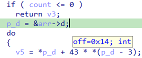

之前我们曾简要提到过 偏移指针（shifted pointers），但没有深入细节。 那么它们是什么？

偏移指针是对 C 语法的另一种自定义扩展。 它们由 IDA 和反编译器用于表示：指向某个对象的指针，但该指针相对于对象起始位置有一定的正或负偏移。

下面我们看看它的工作方式，以及它在实际分析中有用的几种场景。

### 偏移指针的描述与语法

偏移指针本质上是一个普通指针，但附加了两个信息：

- 父类型名称（通常是结构体）
- 相对于父类型起始位置的偏移量

示例：

```c
struct mystruct {
    char buf[16];
    int dummy;
    int value; // <- myptr 指向这里
    double fval;
};

int *__shifted(mystruct, 20) myptr;
```

这表示 `myptr` 是一个 `int*`，但如果将它减去 20 字节，就会得到一个 `mystruct*`。

注意：

- 偏移值不必限制在父结构体范围内，甚至可以为负数
- “父类型”不一定是结构体，可以是除 `void` 之外的任何类型

当偏移指针被使用时，IDA 会用一个伪操作符 ADJ 来表示它调整回父类型指针的过程。 例如，如果在 myptr 上加 4 字节后解引用，可以写作：

```
ADJ(myptr)->fval
```

### 结构体数组的循环优化

当编译器处理结构体数组时，如果只访问其中少数字段，它可能会优化循环，让“当前项”指针直接指向结构体中间的某个字段，而不是开头。

示例结构体和函数：

```c
struct mydata {
    int a, b, c;
    void *pad[2];
    int d, e, f;
    char path[260];
};

int sum_c_d(struct mydata *arr, int count) {
    int sum = 0;
    for (int i = 0; i < count; i++) {
        sum += arr[i].d + arr[i].c * 43;
    }
    return sum;
}
```

在 MSVC x86 编译后，可能生成的代码会直接让指针指向 `d` 字段，并通过负偏移访问 `c`。 初始反编译结果会出现 `p_d += 73` 这样的奇怪步长。

通过计算 `d` 在结构体中的偏移（0x14），我们可以将 `p_d` 类型改为：

```c
int *__shifted(mydata, 0x14) p_d;
```



这样反编译器就会生成更直观的代码：

```c
v5 = ADJ(p_d)->d + 43 * ADJ(p_d)->c;
```

### 前置元数据（Prepended metadata）

这种技术常用于在原始数据块前附加管理信息，例如堆分配器、托管字符串等。

示例：MFC 4.x `CString` 类 它在实际字符数组前放置一个 `CStringData` 结构：

```c
struct CStringData {
    long nRefs;
    int nDataLength;
    int nAllocLength;
    // TCHAR data[nAllocLength]
    TCHAR* data() { return (TCHAR*)(this + 1); }
};

class CString {
    LPTSTR m_pchData;
    CStringData* GetData() const;
};
```

`GetData()` 会将 `m_pchData` 转换为 `CStringData*` 并减去一个结构体大小。

在反编译中，如果将 `m_pchData` 类型改为：

```c
char *__shifted(CStringData, 0xC) m_pchData;
```

那么析构函数就会变得更易读：

```c
if (InterlockedDecrement(&ADJ(this->m_pchData)->nRefs) <= 0)
    operator delete(ADJ(this->m_pchData));
```

这样就能直观看出：当引用计数减到 0 时，释放 `CStringData` 实例。

### 小结

偏移指针（shifted pointers） 是 IDA/Hex-Rays 的一个强大扩展，用于表达指针相对于父对象的偏移关系。 它的优势在于：

- 让反编译结果更贴近原始逻辑
- 在编译器优化或特殊内存布局（如前置元数据）时，依然能保持可读性
- 适用于结构体中间字段指针、内存管理头部、特殊 ABI 等场景

More info: [IDA Help: Shifted pointers](https://hex-rays.com/products/ida/support/idadoc/1695.shtml)

原文地址：https://hex-rays.com/blog/igors-tip-of-the-week-54-shifted-pointers
