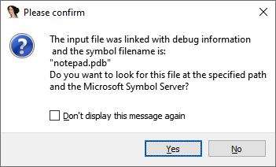
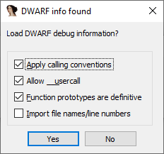
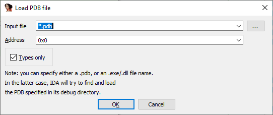
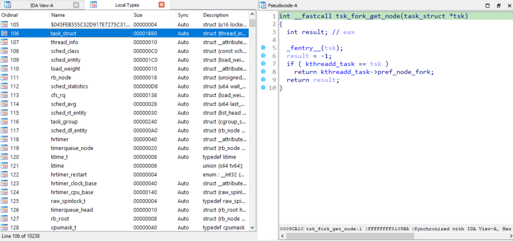

IDA 支持多种文件格式，其中包括三大主流操作系统使用的主要格式：

- PE（Portable Executable）：Windows
- ELF（Executable and Linkable Format）：Linux
- Mach-O（Mach object）：macOS

### 符号与调试信息

符号（Symbols） 用于将文件内部的位置（例如函数或变量的地址）与文本名称（通常是源码中的名称）关联起来。 存储这种关联的部分通常称为 符号表（symbol table）。

符号可以存储在文件本身，也可以单独存储。

- PE 文件：传统上不包含除导入/导出所需符号外的其他符号（用于模块间链接）。
- ELF 和 Mach-O：通常会保留全局函数的名称，但大部分信息可以被移除（strip）而不影响文件执行。

由于这些信息对调试非常有价值，它们可以存储在单独的调试信息文件中。

常见调试信息格式：

- PDB（Program Database）：Windows PE 常用
- TDS（Turbo Debugger Symbols）：Borland 编译器旧格式
- DBG：旧版 Visual Studio 使用
- DWARF：ELF 和 Mach-O 常用

这些格式不仅可以包含符号，还可以包含：

- 类型信息（结构体、枚举、typedef）
- 函数原型
- 局部变量信息
- 二进制代码与源文件的映射（文件名与行号）

虽然这些信息最初是为了提升调试体验，但它们显然也能极大地简化逆向工程过程。 IDA 内置支持这些格式，通过标准插件加载：

- pdb：PDB
- tds：TDS
- dbg：DBG
- dwarf：DWARF

### 自动加载调试信息

标准文件加载器会检测文件是否带有调试信息，并调用相应的调试信息加载器。 如果在输入文件、同目录或其他已知位置找到调试信息，IDA 会提示用户是否加载。

### 手动加载调试信息

如果单独的调试信息文件不在标准位置，或在文件加载后才找到，可以手动加载（目前仅支持 PDB 和 DWARF）：

- PDB：`File > Load file > PDB File…`
- DWARF：`Edit > Plugins > Load DWARF File`

PDB 加载器还支持直接指定 DLL 或 EXE 文件，IDA 会尝试查找并加载匹配的 PDB（必要时可从符号服务器下载）。

使用 `Types only` 选项，可以仅导入类型信息，而不必是当前文件的 PDB。 例如，Windows 内核（ntoskrnl.exe）的 PDB 包含大量内核模式代码（驱动等）使用的结构体，这在逆向无调试信息的文件时非常有用。

### 示例：Linux 内核调试信息

Linux 内核在构建时通常会被 strip，但许多发行版会提供单独的调试信息仓库，或者你可以自行编译带调试信息的内核。

- 自编译内核：`vmlinux` 是普通 ELF 文件，可直接加载到 IDA
- 预编译内核：通常以 `vmlinuz` 分发（PE 格式，便于 UEFI 启动），实际内核代码是压缩的负载
  - 可手动解压，或使用 [vmlinux-to-elf](https://github.com/marin-m/vmlinux-to-elf) 项目提取
  - 将解压后的内核加载到 IDA
  - 通过 `Edit > Plugins > Load DWARF File` 加载外部调试信息文件
  - 最终得到包含所有内核类型和正确函数原型的数据库

### 小结

这篇技巧介绍了 IDA 对 调试符号与调试信息 的支持，包括：

- 常见格式（PDB、TDS、DBG、DWARF）及其用途
- 自动与手动加载方法
- 如何利用外部 PDB 导入类型信息
- 在 Linux 内核分析中的实际应用

掌握这些方法，可以在逆向时充分利用调试信息，大幅提升分析效率与准确性。

原文地址：https://hex-rays.com/blog/igors-tip-of-the-week-55-using-debug-symbols
