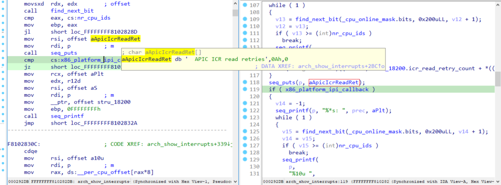
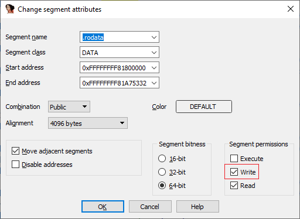
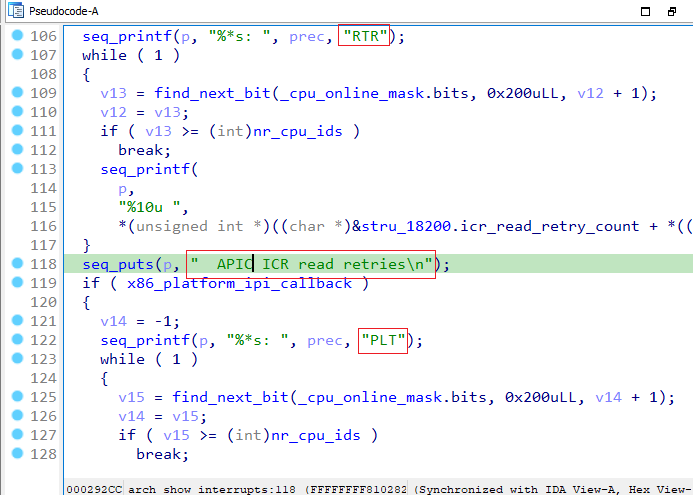
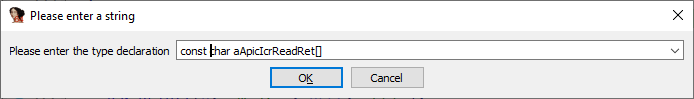
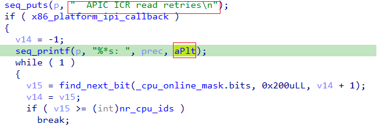
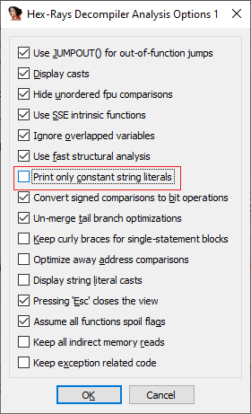

在二进制文件中，字符串对逆向工程师非常有用： 它们通常包含显示给用户的消息，有时甚至包含内部调试信息（如函数或变量名）。 因此，在反编译代码中直接显示这些字符串会非常方便。

然而，有时你会在伪代码中看到的是一个命名变量，而不是直接的字符串字面量，即使在反汇编中它显示得很正常。 为什么会这样？又该如何解决？

### 内存访问权限

决定是否内联显示字符串字面量的主要依据，是它所在内存区域的属性。 如果该内存是可写的，说明字符串并非真正的常量，可能会被修改，因此显示变量名更为正确。



在一个解压后的 Linux 内核函数中，默认伪代码中显示的是变量名 `aApicIcrReadRet`，而反汇编中却是一个正常的字符串。

如果跳转到它的定义（双击即可），并查看段属性（`Edit > Segment > Edit Segment…` 或 `Alt+S`），会发现该段被标记为可写。



为什么 `.rodata`（只读数据段）会有写权限？ 可能的原因是：在 ELF 头中，该段确实带有写标志（W），而在系统启动过程中才会被设为只读。

(`readelf` 输出)

```
Section Headers:
  [Nr] Name              Type             Address           Offset
       Size              EntSize          Flags  Link  Info  Align
  [ 0]                   NULL             0000000000000000  00000940
       0000000000000000  0000000000000000           0     0     0
  [ 1] .text             PROGBITS         ffffffff81000000  00001000
       0000000000628281  0000000000000000  AX       0     0     4096
  [ 2] .notes            NOTE             ffffffff81628284  00629284
       0000000000000204  0000000000000000  AX       0     0     4
  [ 3] __ex_table        PROGBITS         ffffffff81628490  00629488
       0000000000002cdc  0000000000000000   A       0     0     4
  [ 4] .rodata           PROGBITS         ffffffff81800000  0062d000
       0000000000275332  0000000000000000  WA       0     0     4096

<...skipped...>

Key to Flags:
  W (write), A (alloc), X (execute), M (merge), S (strings), I (info),
  L (link order), O (extra OS processing required), G (group), T (TLS),
  C (compressed), x (unknown), o (OS specific), E (exclude),
  l (large), p (processor specific)
```

将该段的权限改为只读（Read）或只读+可执行（Read+Execute），去掉写权限。 这样，该段中的字符串字面量就会在伪代码中内联显示。



### 覆盖访问权限（Override access permissions）

修改段属性虽然有效，但并不总是合适：

- 某些编译器会将字符串常量与可写数据放在同一段中，如果强行改为只读，反编译器可能会错误处理使用这些可写变量的函数。
- 反之，有些字符串虽然看似常量，但实际上只是有默认值，运行时会被修改，这种情况应当保留为变量。

可以单独修改某个字符串变量的类型属性，例如将 aApicIcrReadRet 的类型改为：



这样，只有被修改类型的字符串会内联显示，其他保持为变量。



### 显示所有字符串字面量

另一种方法是让反编译器直接依赖反汇编分析结果，显示所有被标记为字符串字面量的内容。

操作方法：

- 打开 反编译器选项：`Edit > Plugins > Hex-Rays Decompiler > Options > Analysis Options 1`
- 关闭 `Print only constant string literals` 选项



如果想对所有未来数据库生效，可在 `hexrays.cfg` 中修改 `HO_CONST_STRINGS` 选项。

更多信息可参考:

[Tips and tricks: Constant memory](https://hex-rays.com/products/decompiler/manual/tricks.shtml#02)

[Configuration](https://hex-rays.com/products/decompiler/manual/config.shtml)

原文地址：https://hex-rays.com/blog/igors-tip-of-the-week-56-string-literals-in-pseudocode
