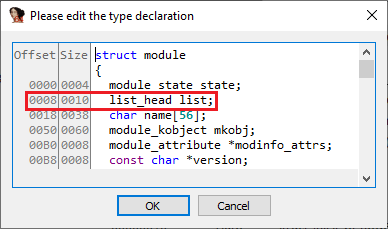
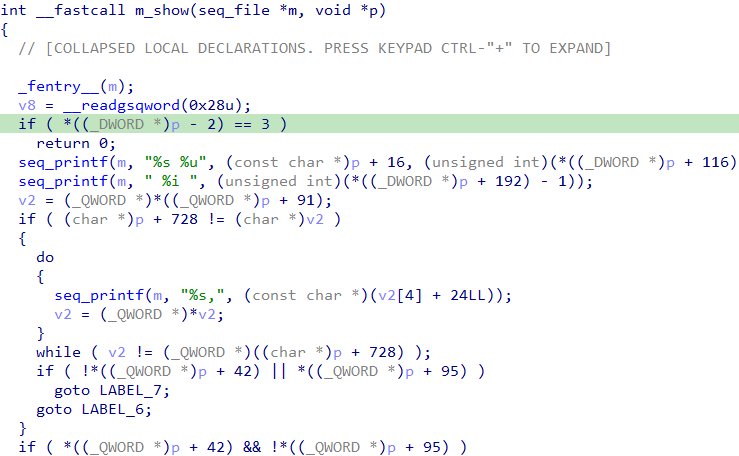
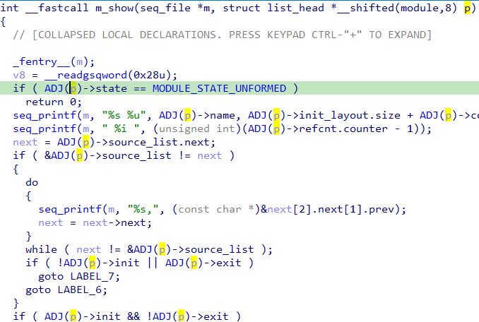
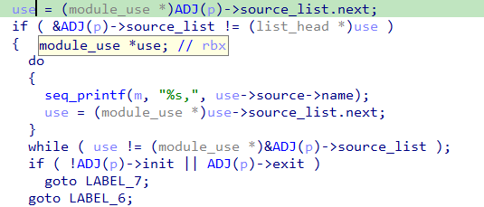
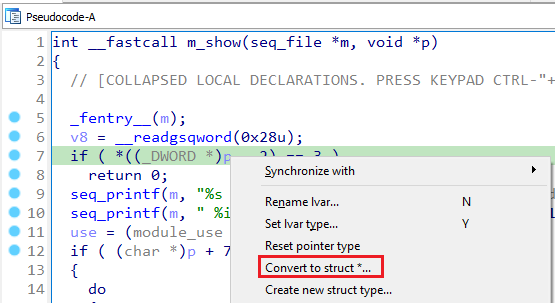
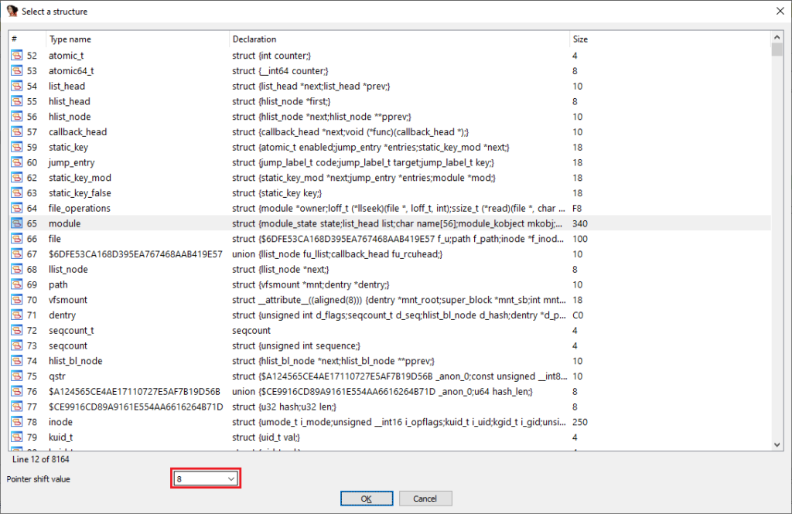
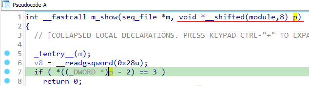

本周我们将介绍另一种偏移指针（shifted pointers）非常有用的场景。

### 内嵌链表（Intrusive linked lists）

这种方法在许多链表实现中都有使用。 以 Linux 内核中的实现为例，`list.h` 定义了链表结构：

```c
struct list_head {
    struct list_head *next, *prev;
};
```

在 `module.h` 中的 `struct module` 使用示例：

```c
struct module {
    enum module_state state;
    /* 模块链表成员 */
    struct list_head list;
    /* 模块唯一标识 */
    char name[MODULE_NAME_LEN];
    [..省略..]
} ____cacheline_aligned __randomize_layout;
```

其中 `struct list_head list;` 用于将多个 `struct module` 实例链接在一起。 由于 `next` 和 `prev` 指针并不指向 `struct module` 的起始位置，因此访问其字段时需要进行指针运算。

为此，`list.h` 中定义了多个宏，例如：

```c
#define list_entry(ptr, type, member) \
    container_of(ptr, type, member)

#define list_first_entry(ptr, type, member) \
    list_entry((ptr)->next, type, member)

#define list_last_entry(ptr, type, member) \
    list_entry((ptr)->prev, type, member)
```

让我们来看看 `module.c` 中的一些函数。例如， `m_show()` ：

```c
static int m_show(struct seq_file *m, void *p) {
    struct module *mod = list_entry(p, struct module, list);
    char buf[MODULE_FLAGS_BUF_SIZE];
    void *value;

    /* 忽略未初始化的模块 */
    if (mod->state == MODULE_STATE_UNFORMED)
        return 0;

    seq_printf(m, "%s %u", mod->name,
               mod->init_layout.size + mod->core_layout.size);
    print_unload_info(m, mod);

    /* 用户可见状态 */
    seq_printf(m, " %s",
               mod->state == MODULE_STATE_GOING ? "Unloading" :
               mod->state == MODULE_STATE_COMING ? "Loading" : "Live");

    /* oprofile 等工具使用 */
    value = m->private ? NULL : mod->core_layout.base;
    seq_printf(m, " 0x%px", value);

    /* 模块标志 */
    if (mod->taints)
        seq_printf(m, " %s", module_flags(mod, buf));

    seq_puts(m, "\\n");
    return 0;
}
```

虽然函数参数是 `void *p`，但从代码可知它实际上指向 `struct module` 中偏移 8 字节的 `list` 成员。





初始反编译结果可读性较差，但如果我们将 `p` 定义为偏移指针，例如：



反编译结果就会清晰很多。



### 结构体的偏移指针创建

虽然偏移指针不限于结构体成员，但这是最常见的用法，因此我们在 UI 中提供了简化创建的功能：

- 在反编译器中，对无类型变量或 `void*` 右键选择 `Convert to struct *…`
- 在弹出的对话框中选择结构体类型
- 在 `Pointer shift value` 字段中输入非零偏移值，即可直接创建偏移指针







**注意：**

如果原指针类型是 `void*`，创建的偏移指针也会保留该类型，可能需要手动改为目标类型，例如：

```c
struct list_head *__shifted(module, 8) p;
```

如果你想练习，可以使用提供的 [vmlinux_trimmed.elf.i64](assets/2021/09/vmlinux_trimmed.elf_.i64.zip) 数据库（仅包含该函数及直接依赖）。 完整带符号的内核可参考之前关于 DWARF 信息加载的文章。

原文地址：https://hex-rays.com/blog/igors-tip-of-the-week-57-shifted-pointers-2
