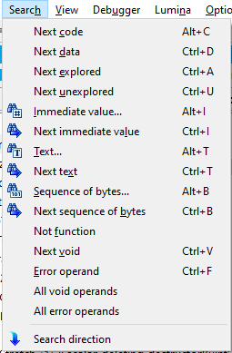

今天我们来看看如何在 IDA 中使用键盘修饰键（`Ctrl`、`Alt`、`Shift`）来改变某些操作的行为，或提供额外功能。

### 快捷键中的修饰键

显然，有些快捷键本身就包含修饰键，但有些规律可能并不那么显而易见。

例如，Search 菜单中的命令通常遵循这样的规律：

- Alt + 字母：开始搜索
- Ctrl + 字母：继续（下一个）搜索

| 搜索类型           | 开始搜索 | 继续搜索 |
| ------------------ | -------- | -------- |
| 二进制（字节）搜索 | Alt+B    | Ctrl+B   |
| 文本搜索           | Alt+T    | Ctrl+T   |
| 立即数搜索         | Alt+I    | Ctrl+I   |

数据格式化快捷键也有类似情况：

- `D` 定义字节/字/双字项
- `Alt+`D 用于额外类型和配置
- `A` 创建默认字符串字面量
- `Alt+A` 处理额外类型和配置

### 修饰键与鼠标

在某些情况下，修饰键也会改变鼠标操作的解释方式：

**文本视图（IDA View）**

- 按住 `Ctrl` 双击标签或地址：在新标签页中打开目标
- 按住 `Ctrl` 或 `Shift` 滚动鼠标滚轮：按页滚动（类似 `PgDn` / `PgUp`），同时加快提示弹窗的缩放速度

**图形视图（Graph View）**

- `Ctrl + 滚轮`：缩放图形
- `Alt + 滚轮`：水平滚动（触控板可用双指平移）

**导航条（Navigation band）**

- `Ctrl + 滚轮`：缩放导航条

### 其他用法

**文件菜单**

- 在 `File` 菜单中选择最近文件条目时按住 `Shift`：在新的 IDA 实例中打开文件

**Windows 专用**

- 按住 `Shift` 点击窗口关闭按钮（X）：直接关闭 IDA，不弹出确认对话框，并使用默认退出选项（保存数据库）
- 同时按住 `Ctrl + Shift`：直接退出且不保存

原文地址：https://hex-rays.com/blog/igors-tip-of-the-week-58-keyboard-modifiers
