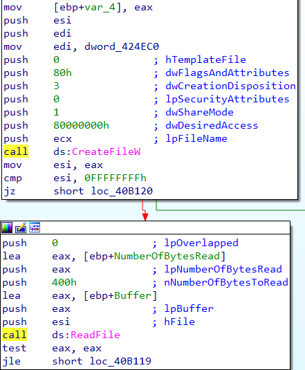
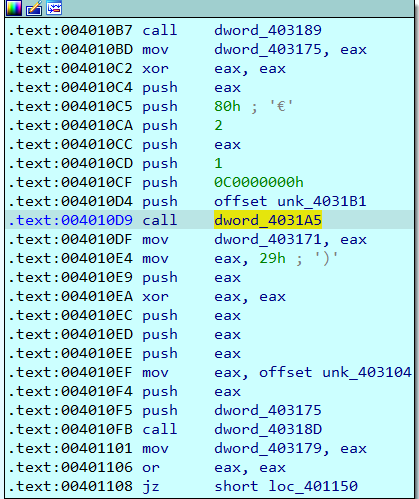
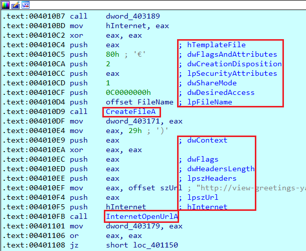

You may have observed that IDA knows about standard APIs or library functions and adds automatic function comments for the arguments passed to them.  
您可能已经注意到，IDA 可以了解标准 API 或库函数，并为传递给它们的参数自动添加函数注释。

For example, here’s a fragment of disassembly with commented arguments to Win32 APIs `CreateFileW` and `ReadFile`:  
例如，下面是一个反汇编片段，其中注释了 Win32 API `CreateFileW` 和 `ReadFile` 的参数：

This works well when functions are imported in a standard way and are known at load time. However, there may be cases when the actual function is only known after analysis (e.g. imported dynamically using  `GetProcAddress` or using a name hash). In that case, there may be only a call to some dummy name and no commented arguments:  
当函数以标准方式导入并在加载时已知时，这种方法效果很好。然而，在某些情况下，只有在分析后才能知道实际函数（例如，使用 `GetProcAddress` 或名称散列动态导入）。在这种情况下，可能只有对某个假名的调用，而没有注释参数：

You can of course add a comment that `dword_4031A5` is `CreateFileA`, and comment arguments manually, but this can be quite tedious. Is there a way to do it automatically?   
当然，您可以添加 `dword_4031A5` is `CreateFileA` 的注释，并手动注释参数，但这可能相当繁琐。有没有自动完成的方法？

In fact, it is sufficient to simply rename the pointer variable to the corresponding API name for IDA to pick up the prototype and comment the arguments:  
事实上，只需将指针变量重命名为相应的 API 名称，IDA 就能获取原型并注释参数：

A few notes about this feature:  
关于此功能的几点说明

1.  The function prototype must be present in one of the loaded type libraries;  
    函数原型必须存在于已加载的类型库中；
2.  The comments are added only for  code inside a function, so you may need to create one around the call (e.g. in case of decrypted or decompressed code);  
    注释仅添加到函数内部的代码中，因此您可能需要在调用周围创建一个注释（例如在解密或解压代码的情况下）；
3.  if the function is called in many places, it may take a few seconds for IDA to analyze and comment all call sites.  
    如果函数被多处调用，IDA 可能需要几秒钟来分析和注释所有调用点。