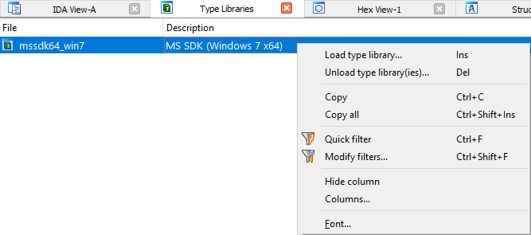
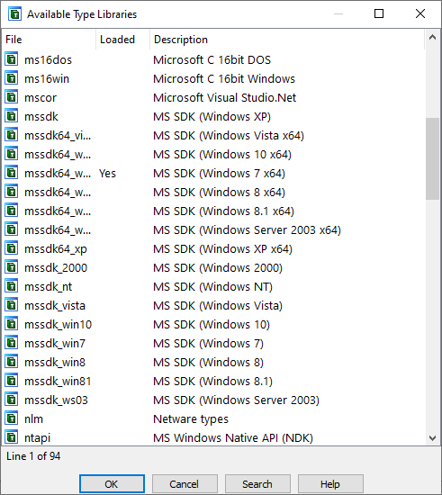
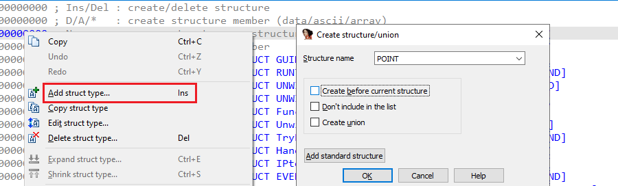
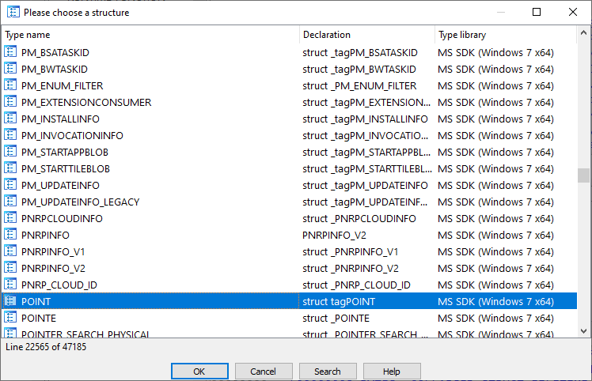
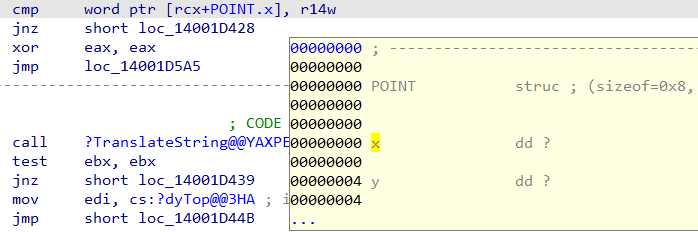

类型库是针对特定平台和编译器收集的高级类型信息集合，可供 IDA 和反编译器使用。

一个类型库可能包含：

函数原型（function prototypes），例如：

```c
void *__cdecl memcpy(void *, const void *Src, size_t Size);
BOOL __stdcall EnumWindows(WNDENUMPROC lpEnumFunc, LPARAM lParam);

```

类型定义（typedefs），例如：

```c
typedef unsigned long DWORD;
BOOL (__stdcall *WNDENUMPROC)(HWND, LPARAM);
```

标准结构体与枚举定义（standard structure and enum definitions），例如：

```c
struct tagPOINT {
    LONG x;
    LONG y;
};
enum tagSCRIPTGCTYPE {
    SCRIPTGCTYPE_NORMAL = 0x0,
    SCRIPTGCTYPE_EXHAUSTIVE = 0x1,
};
```

由预处理器宏分组生成的合成枚举（synthetic enums），例如：

```c
enum MACRO_WM {
    WM_NULL = 0x0,
    WM_CREATE = 0x1,
    WM_DESTROY = 0x2,
    WM_MOVE = 0x3,
    WM_SIZEWAIT = 0x4,
    WM_SIZE = 0x5,
    WM_ACTIVATE = 0x6,
    WM_SETFOCUS = 0x7,
    WM_KILLFOCUS = 0x8,
    WM_SETVISIBLE = 0x9,
    [...]
};
```

### 操作类型库（Manipulating type libraries）

当前已加载的类型库列表可在 `Type Libraries` 视图中查看（`View > Open subviews > Type Libraries` 或 `Shift+F11`）。



可通过右键菜单 `Load type library…` 或 `Ins` 键加载额外的类型库。



一旦加载，类型库中的定义即可在 IDA 和反编译器中使用：

- 在函数原型和全局变量类型中使用（快捷键 `Y`）
- 在 `Local Types` 中添加新定义时使用

### 将类型导入 IDB（Importing types into IDB）

反编译器可以直接使用已加载类型库中的类型，但若要在反汇编中使用，可能需要额外步骤。

对于标准结构体或枚举，必须先将其添加到对应视图的列表中：

1. 打开 `Structures`（`Shift+F9`）或 `Enums`（`Shift+F10`）窗口

2. 选择 `Add struct type…` 或 `Add enum`（或按 `Ins`）

3. 如果知道名称，直接输入并确认

   

4. 如果不记得确切名称，选择 `Add standard structure` 或 `Add standard enum`，从已加载类型库的列表中挑选

   

5. 在选择器中可使用增量搜索或过滤（`Ctrl+F`）

导入后，该结构体或枚举即可在反汇编视图中使用。



### 函数原型（Function prototypes）

- 当类型库被加载时，数据库中与类型库原型匹配的函数会自动应用相应原型。
- 也可以在加载类型库后重命名函数（参考上一期技巧），以触发原型应用。

原文地址：https://hex-rays.com/blog/igors-tip-of-the-week-60-type-libraries
