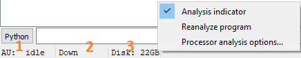
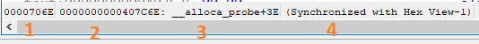
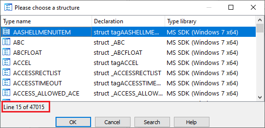
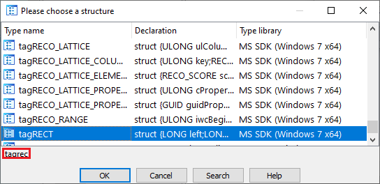

Many of IDA’s windows have status bars and they contain useful information and functionality which may not be always obvious.  
IDA 的许多窗口都有状态栏，其中包含的有用信息和功能可能并不总是很明显。

### Main window status bar  
主窗口状态栏

The status bar at the bottom of IDA’s main window contains:  
IDA 主窗口底部的状态栏包含以下内容

1.  Autoanalysis progress indicator. See [IDA Help: Analysis options](https://hex-rays.com/products/ida/support/idadoc/620.shtml) for possible values you may see there.  
    自动分析进度指示器。请参阅 IDA 帮助：分析选项中可能出现的值。
2.  Search direction indicator for [“Next search” commands](https://hex-rays.com/blog/igors-tip-of-the-week-58-keyboard-modifiers/) (Ctrl+Letter);  
    下一步搜索 "命令的搜索方向指示器（ Ctrl +字母）；
3.  Free disk space 可用磁盘空间

It also has a context menu offering quick access to analysis and processor-specific options (if supported by current processor module).  
它还有一个上下文菜单，可快速访问分析和处理器特定选项（如果当前处理器模块支持）。

### Disassembly view status bar  
反汇编视图状态栏

Each disassembly (IDA View) windows has a separate status bar too. In the text mode it contains:  
每个反汇编（IDA 视图）窗口都有一个单独的状态栏。在文本模式下，状态栏包括

1.  offset in the input file (for addresses which can be mapped directly to the input file);  
    输入文件中的偏移量（用于可直接映射到输入文件的地址）；
2.  address on the current cursor position   
    当前光标位置上的地址
3.  symbolic location (if available). for locations inside functions, a function name and offset from its start is printed;  
    符号位置（如果有）。对于函数内部的位置，将打印函数名称和从函数起点开始的偏移量；
4.  synchronization status. 同步状态。

Same status bar style is also used for Hex View and Pseudocode windows.  
六进制视图和伪代码窗口也使用相同的状态栏样式。

In the [Graph mode](https://hex-rays.com/blog/igors-tip-of-the-week-23-graph-view/), additional graph-related information is displayed (zoom level, mouse position etc.).  
在图形模式下，会显示更多与图形相关的信息（缩放级别、鼠标位置等）。

### Chooser (list view) status bar  
选择器（列表视图）状态栏

[List views’](https://hex-rays.com/blog/igors-tip-of-the-week-28-functions-list/) status bars by default display the current index and total number of items in the list  
列表视图的状态栏默认显示当前索引和列表中的项目总数。

However, when using incremental search (type the first letters of the item to jump to the matching item), the typed letters replace it.  
不过，在使用增量搜索（键入项目的首字母跳转到匹配项目）时，键入的字母会取代它。

