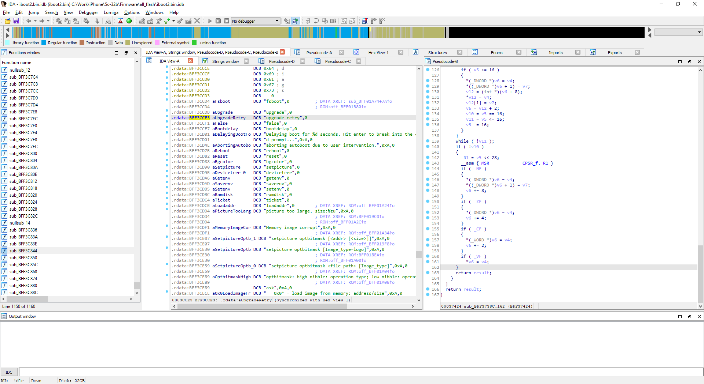

While not commonly used, full-screen mode can be useful on complex IDA layouts when working with a single monitor or on a laptop, for example when you need to read a long listing line but are tired of scrolling around.  
虽然全屏模式并不常用，但在使用单一显示器或笔记本电脑进行复杂的 IDA 布局时，全屏模式还是很有用的，例如，当你需要阅读长长的列表行，但又厌倦了四处滚动时。

The feature is somewhat hidden, but the action _is_ present in the View menu.  
该功能有些隐蔽，但在视图菜单中是可以操作的。

By pressing F11, the current view is temporarily expanded to full screen, and all other views and UI elements (toolbars, menus) are hidden to remove all distractions.  
按下 F11 后，当前视图会暂时扩展为全屏，所有其他视图和用户界面元素（工具栏、菜单）都会隐藏起来，以消除所有干扰。

⬇

To go back to the standard layout, just press F11 again.  
要返回标准布局，只需再次按下 F11 。