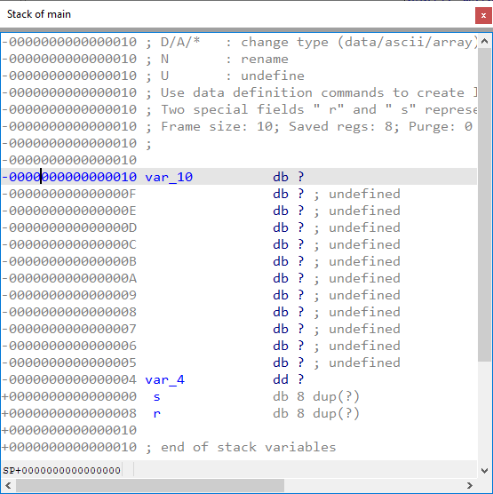

### 背景

Stack frame（栈帧）是由当前函数管理的栈的一部分，包含该函数使用的数据。 通常包括：

- 局部变量和临时变量
- 传入参数（对于使用栈传参的调用约定）
- 被保存的易失寄存器
- 其他簿记信息（例如 x86 上的返回地址）

由于栈在执行过程中可能不可预测地变化，栈帧及其成员没有固定地址。 因此，IDA 使用一个 伪结构（pseudo structure） 来表示它的布局。

与 Structures view 类似，但有一些区别：

- 栈帧结构没有名字，不会出现在全局结构列表中，只能从对应函数进入
- 偏移量不是从结构起始算起，而是相对于 frame pointer（帧指针），可能为正或负
- 可能包含特殊成员，用于表示保存的返回地址和/或保存的寄存器区

### 打开 Stack frame view

有两种方式：

- 菜单：`Edit > Functions > Stack variables…`
- 快捷键：在反汇编窗口（IDA View）中定位到函数后按 `Ctrl–K`
- 也可以在反汇编或伪代码中双击栈变量，或按 `Enter`

在该视图中，你可以执行与 `Structures view` 类似的操作：

- 定义或修改栈变量 (`D`)
- 重命名变量 (`N`)
- 创建数组 (`*`) 或结构实例 (`Alt–Q`)

### 示例

考虑以下存在漏洞的程序：

```
#include <stdio.h>
int main () {
    char username[8];
    int allow = 0;
    printf("Enter your username, please: ");
    gets(username); // 用户输入 "malicious"
    if (grantAccess(username)) {
        allow = 1;
    }
    if (allow != 0) {
        privilegedAction();
    }
    return 0;
}

```

Source: [CERN Computer Security](https://security.web.cern.ch/recommendations/en/codetools/c.shtml)

当用旧版 GCC 编译时，可能生成如下汇编：

```asm
.text:0000000000400580 main proc near                          ; DATA XREF: _start+1D↑o
.text:0000000000400580
.text:0000000000400580 var_10= byte ptr -10h
.text:0000000000400580 var_4= dword ptr -4
.text:0000000000400580
.text:0000000000400580 ; __unwind {
.text:0000000000400580     push    rbp
.text:0000000000400581     mov     rbp, rsp
.text:0000000000400584     sub     rsp, 10h
.text:0000000000400588     mov     [rbp+var_4], 0
.text:000000000040058F     mov     edi, offset format          ; "Enter your username, please: "
.text:0000000000400594     mov     eax, 0
.text:0000000000400599     call    _printf
.text:000000000040059E     lea     rax, [rbp+var_10]
.text:00000000004005A2     mov     rdi, rax
.text:00000000004005A5     call    _gets
.text:00000000004005AA     lea     rax, [rbp+var_10]
.text:00000000004005AE     mov     rdi, rax
.text:00000000004005B1     call    grantAccess
.text:00000000004005B6     test    eax, eax
.text:00000000004005B8     jz      short loc_4005C1
.text:00000000004005BA     mov     [rbp+var_4], 1
.text:00000000004005C1
.text:00000000004005C1 loc_4005C1:                             ; CODE XREF: main+38↑j
.text:00000000004005C1     cmp     [rbp+var_4], 0
.text:00000000004005C5     jz      short loc_4005D1
.text:00000000004005C7     mov     eax, 0
.text:00000000004005CC     call    privilegedAction
.text:00000000004005D1
.text:00000000004005D1 loc_4005D1:                             ; CODE XREF: main+45↑j
.text:00000000004005D1     mov     eax, 0
.text:00000000004005D6     leave
.text:00000000004005D7     retn
.text:00000000004005D7 ; } // starts at 400580
.text:00000000004005D7 main endp
```

在 `Stack frame view` 中，我们可以看到：

- `var_10` 对应 `username`
- `var_4` 对应 `allow`



由于代码只取了缓冲区起始地址，IDA 未能检测到完整大小，只创建了一个字节变量。 可以按 `*` 将 `var_10` 转换为 8 字节数组，并重命名变量。


IDA 按自然内存顺序显示栈帧（地址向下递增），因此很容易看出漏洞： `gets` 没有边界检查，长输入会溢出 `username`，覆盖 `allow`，从而绕过检查，执行 `privilegedAction`。

### Frame offsets 与栈变量

在 `Stack frame view` 中，偏移量是相对于 `frame pointer` 的。 在示例中，`frame pointer` 是寄存器 `RBP`。

例如：

```asm
.text:0000000000400580 allow= dword ptr -4
[...]
.text:0000000000400588 mov [rbp+allow], 0
[...]
```

按 `#` 或 `K` 可以切换显示原始形式：

```
.text:0000000000400588 mov dword ptr [rbp-4], 0
```

再次按 `K` 返回栈变量表示。

在某些情况下（如启用了 `frame pointer omission` 优化），`frame pointer` 可能只是一个方便的参考点。 IDA 会使用额外的 `delta` 来补偿不同位置的栈指针变化。

例如：

```asm
.text:10001030 sub_10001030 proc near                  ; DATA XREF: sub_100010B0:loc_100010E7↓o
.text:10001030
.text:10001030 LCData= byte ptr -0Ch
.text:10001030 var_4= dword ptr -4
.text:10001030
.text:10001030     sub     esp, 0Ch
.text:10001033     mov     eax, dword_100B2960
.text:10001038     push    esi
.text:10001039     mov     [esp+10h+var_4], eax
.text:1000103D     xor     esi, esi
.text:1000103F     call    ds:GetThreadLocale
.text:10001045     push    7                           ; cchData
.text:10001047     lea     ecx, [esp+14h+LCData]
.text:1000104B     push    ecx                         ; lpLCData
.text:1000104C     push    1004h                       ; LCType
.text:10001051     push    eax                         ; Locale
.text:10001052     call    ds:GetLocaleInfoA
.text:10001058     test    eax, eax
.text:1000105A     jz      short loc_1000107D
.text:1000105C     mov     al, [esp+10h+LCData]
.text:10001060     test    al, al
.text:10001062     lea     ecx, [esp+10h+LCData]
.text:10001066     jz      short loc_1000107D
```

IDA 将返回地址放在 offset 0，并通过调整偏移量（如 10h、14h）来保持一致。

```asm
-00000010 ; Frame size: 10; Saved regs: 0; Purge: 0
-00000010 ;
-00000010
-00000010     db ? ; undefined
-0000000F     db ? ; undefined
-0000000E     db ? ; undefined
-0000000D     db ? ; undefined
-0000000C LCData db ?
-0000000B     db ? ; undefined
-0000000A     db ? ; undefined
-00000009     db ? ; undefined
-00000008     db ? ; undefined
-00000007     db ? ; undefined
-00000006     db ? ; undefined
-00000005     db ? ; undefined
-00000004 var_4 dd ?
+00000000  r  db 4 dup(?)
+00000004
+00000004 ; end of stack variables
```

这样我们能看出 `[esp+8]` 和 `[esp+4]` 实际上引用的是同一个变量。

参考: [IDA Help: Stack Variables Window](https://www.hex-rays.com/products/ida/support/idadoc/488.shtml)

原文地址：https://hex-rays.com/blog/igors-tip-of-the-week-65-stack-frame-view
