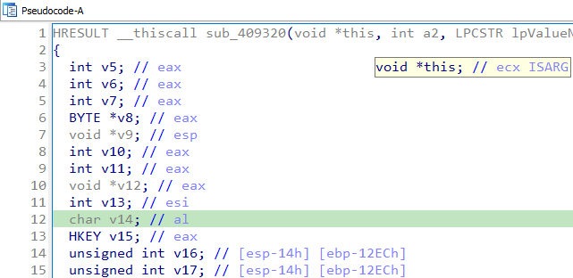
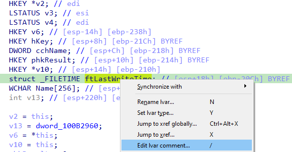
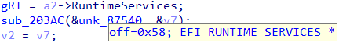
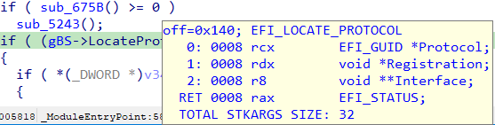

When working with pseudocode in the decompiler, you may have noticed that variable declarations and hints have comments with somewhat cryptic contents. What do they mean?  
在反编译器中处理伪代码时，你可能会注意到变量声明和提示的注释内容有些隐晦。它们是什么意思呢？



While meaning of some may be obvious, others less so, and a few appear only in rare situations.  
有些含义可能很明显，有些则不那么明显，还有一些只在极少数情况下才会出现。

### Variable location 变量位置

The fist part of the comment is the variable location. For stack variables, this includes its location relative to the stack and frame pointers. For register variables — the register(s) used for storing its value.  
注释的第一部分是变量的位置。对于堆栈变量，这包括其相对于堆栈和帧指针的位置。对于寄存器变量--用于存储其值的寄存器。

In some cases, you may also see the [scattered argloc](https://hex-rays.com/blog/igors-tip-of-the-week-51-custom-calling-conventions/) syntax. For example:  
在某些情况下，您可能还会看到分散的 argloc 语法。例如

```
struct12 v78; // 0:r2.8,8:^0.4
```

This denotes a 12-byte structure stored partially in registers (8 first bytes, beginning at `r2`), and on stack (4 last bytes, starting from stack offset 8).  
这表示一个 12 字节的结构，部分存储在寄存器中（前 8 个字节，从 `r2` 开始），部分存储在堆栈中（后 4 个字节，从堆栈偏移量 8 开始）。

### Variable attributes 变量属性

After the location, there may be additional attributes printed as uppercase keywords. Here are the most common possibilities:  
在位置之后，可能会以大写关键字的形式打印出其他属性。以下是最常见的几种可能性：

-   `BYREF`: address of this variable is taken somewhere in the current function (e.g. for passing to a function call);  
    `BYREF` ：该变量的地址在当前函数的某处（例如，用于传递给函数调用）；
-   `OVERLAPPED`: shown when the decompiler did not manage to separate all the variables so some of them ended up being stored in intersecting locations. Usually functions with such variables are also marked with the comment:  
    `OVERLAPPED` ：反编译器未能分离所有变量，因此其中一些变量最终被存储在了交叉位置。通常，带有此类变量的函数也会标注注释：  
    `// local variable allocation has failed, the output may be wrong!`
-   `MAPDST`: another variable has been [mapped](https://hex-rays.com/products/decompiler/manual/cmd_map_lvar.shtml) to this one;  
    `MAPDST` : 另一个变量已被映射到这个变量；
-   `FORCED`: this is an explicitly [forced variable](https://hex-rays.com/products/decompiler/manual/cmd_force_lvar.shtml).  
    `FORCED` : 这是一个显式强制变量。
-   `ISARG`: shown for function arguments (in mouse hint popups);  
    `ISARG` : 显示为函数参数（在鼠标提示弹出窗口中）；

### User comment 用户注释

Local variables may also have additional, user-defined comments which can be added using the / shortcut or the context menu:  
局部变量还可以添加用户自定义注释，可以使用 / 快捷键或上下文菜单添加：



If present, it will be printed at the end of the variable comment, after the annotations.  
如果有，将打印在变量注释的末尾，注释之后。

## Type annotations 类型注释

In addition to local variables, decompiler can also show annotations in the hints for:  
除局部变量外，反编译器还可以在提示中显示以下注释：

-   Structure and union fields. Offset and type is shown.  
    结构和联合字段。显示偏移和类型。  
    
-   Global variables. Only the type is shown.  
    全局变量。只显示类型。
-   functions and function calls. The list of arguments as well as their locations is printed:  
    函数和函数调用。会打印参数列表及其位置：

