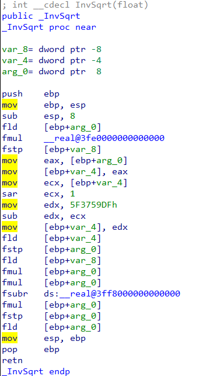
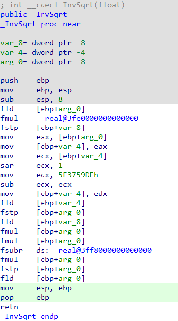

In compiled code, you can sometimes find instructions which do not directly represent the code written by the programmer but were added by the compiler for its own purposes or due to the requirements of the environment the program is executing in.  
在编译后的代码中，有时会发现一些指令并不直接代表程序员编写的代码，而是编译器出于自身目的或程序执行环境的要求而添加的。

### Skippable instruction kinds  
可跳过的指令种类

Compiled functions usually have  _prolog_ instructions at the start which perform various bookkeeping operations, for example:  
编译后的函数通常在开始时都有序言指令，执行各种簿记操作，例如

1.  preserve volatile registers used in the function’s body;  
    保存函数主体中使用的易失性寄存器；
2.  set up new stack frame for the current function;  
    为当前函数建立新的堆栈框架；
3.  allocate stack space for local stack variables;  
    为本地堆栈变量分配堆栈空间
4.  initialize the stack cookie to detect buffer overflows;  
    初始化栈 cookie，以检测缓冲区溢出；
5.  set up exception handlers for the current function.  
    为当前函数设置异常处理程序。

In a similar manner, a function’s _epilog_ performs the opposite actions before returning to the caller.  
类似地，函数的后记在返回调用者之前执行相反的操作。

In _switch_ patterns there may also be instructions which only perform additional manipulations to determine the destination of an indirect jump and do not represent the actual logic of the code.  
在开关模式中，也可能存在一些指令，它们只是执行额外的操作，以确定间接跳转的目的地，并不代表代码的实际逻辑。

To not spend time analyzing such boilerplate or uninteresting code and only show the “real” body of the function, the decompiler relies on processor modules to mark such instructions.   
为了不花时间分析这些模板或无趣的代码，而只显示函数的 "真正 "主体，反编译器依靠处理器模块来标记这些指令。

### Showing skippable instructions  
显示可跳过的指令

By default skipped instructions are not distinguished visually in any way. To enable their visualization, create a text file `idauser.cfg` with the following contents:  
默认情况下，跳过的指令不会以任何方式在视觉上加以区分。要使其可视化，请创建一个文本文件 `idauser.cfg` ，内容如下：

```
#ifdef __GUI__
PROLOG_COLOR = 0xE0E0E0 // grey
EPILOG_COLOR = 0xE0FFE0 // light green
SWITCH_COLOR = 0xE0E0FF // pink
#endif
```

Place the file in the user directory (`%appdata%\Hex-Rays\IDA Pro` on Windows, `$HOME/.idapro` on Unix) and restart IDA or reload the database to the observe the effect in the disassembly listing.  
将文件放入用户目录（Windows 下为 `%appdata%\Hex-Rays\IDA Pro` ，Unix 下为 `$HOME/.idapro` ），然后重启 IDA 或重新加载数据库，观察反汇编列表中的效果。

Original disassembly: 原始反汇编：



After creating the configuration file:  
创建配置文件后：



As you can see, the first three and last two instructions are highlighted in the specified colors. These instructions will be skipped during decompilation.  
可以看到，前三条指令和最后两条指令都用指定颜色突出显示。在反编译过程中，这些指令将被跳过。

### Modifying skippable instructions  
修改可跳过的指令

There may be situations where you need to adjust IDA’s idea of skipped instructions. For example, IDA may fail to mark some register saves as part of prolog (this may manifest as accesses to uninitialized variables in the pseudocode). In that case, you can fix it manually:  
在某些情况下，您可能需要调整 IDA 对跳过指令的理解。例如，IDA 可能无法将某些寄存器保存标记为 prolog 的一部分（这可能表现为访问伪代码中未初始化的变量）。在这种情况下，可以手动修复：

1.  In the disassembly view, select the instruction(s) which should be marked;  
    在反汇编视图中，选择应标记的指令；
2.  invoke Edit > Other > Toggle skippable instructions…;  
    调用编辑 > 其他 > 切换可跳过指令.....；
3.  select the category (prolog/epilog/switch) and click OK.  
    选择类别（prolog/epilog/switch）并单击 "确定"。

In case of an opposite problem (IDA erroneously marked some instructions which do necessary work), perform the same actions, except there won’t be a dialog at step 3 – the instructions will be unmarked directly.  
如果出现相反的问题（IDA 错误地标记了一些必要的指令），请执行相同的操作，只是在第 3 步不会出现对话框 - 这些指令将被直接取消标记。

More info: [Toggle skippable instructions (Decompiler Manual)](https://hex-rays.com/products/decompiler/manual/interactive.shtml#06)  
更多信息：切换可跳过的指令（《反编译器手册）